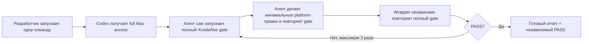

# Автоматическая проверка и исправление

## Самое короткое объяснение

Этот агент проверяет только саму `BroadAppsIOSPlatform`. Он не создаёт новое
приложение и не проверяет чужой app target. Его задача — найти и исправить
нарушения в onboarding, paywall, Adapty, RU Billing, архитектуре, code style,
документации и сборке платформы.

Разработчик запускает одну команду:

```bash
./Scripts/agent_review_and_fix.sh
```

После этого Codex сам:

1. читает правила платформы;
2. запускает Xcode, CoreSimulator и две live Adapty-сборки;
3. находит причину ошибки и исправляет только `BroadAppsIOSPlatform`;
4. повторяет полный gate после каждой коррекции;
5. wrapper независимо запускает тот же gate ещё раз и при необходимости даёт
   агенту новый заход — максимум три;
6. пишет отчёт: что проверил, что нашёл, что поменял и что осталось.

Обычная кнопка **Run** в Xcode агента не запускает. Автоматика начинает работу
только после явного запуска команды выше.

## Что входит в полный gate

| Проверка | Что она подтверждает |
|---|---|
| Contracts и architecture guardrails | Границы модулей и обязательные продуктовые правила не нарушены |
| Remote Config feature-gate matrix | Adapty/provider payload включает разрешённые флаги, platform cache их выключает, а purchase остаётся связан с внутренним product registry |
| Adapty experiment matrix | Variation, presentation, `main` fallback, cache, rehydration и единый assignment authority не расходятся |
| Privacy и documentation | Manifest валиден, README-assets и локальные ссылки существуют |
| SwiftFormat и SwiftLint | Код соответствует единому стилю |
| Package/example builds | Swift Package и iPhone example собираются в Debug/Release |
| Live Adapty compile | Две рабочие конфигурации компилируются без запуска финансовых операций |

Внутри architecture guardrails отдельно зафиксированы ATT/Rate Us, fallback на
`main`, отсутствие фильтрации Adapty products, безопасные purchase/restore,
optional special offer, recovery после переустановки и поведение при обрыве сети.
Отдельная experiment matrix проверяет attribution-контракт без запуска live SDK
operation; назначение вариантов конкретному профилю сверяется в Adapty dashboard.
Отдельная Remote Config matrix не обращается к Adapty по сети: она статически
проверяет, что `special_offer` и показ `ru_pay` доверяют текущему payload
провайдера, не включаются из собственного cache платформы, а Adapty purchase
по-прежнему использует exact raw product из внутреннего registry.

Это локальная инженерная проверка. Она намеренно не выполняет реальные
платежи, StoreKit sandbox, test targets, iPad-сборку, `.ipa` или проверки на
физическом устройстве.

## Как это устроено



Здесь два разных инструмента:

| Команда | Что делает | Меняет код |
|---|---|---|
| `./Scripts/agent_gate.sh` | Только запускает все проверки и live-config builds | Нет |
| `./Scripts/agent_review_and_fix.sh` | Запускает Codex, разрешает локальные исправления, затем перепроверяет | Да, если найдена проблема |

Для Xcode и CoreSimulatorService агенту нужен полный локальный доступ к Mac.
При этом `AGENTS.md` жёстко сохраняет границы: менять можно только
`BroadAppsIOSPlatform`, нельзя трогать reference-проекты или запускать настоящие
платежи.

Platform policy — только iPhone. Example хранит `TARGETED_DEVICE_FAMILY = 1`,
а validation отклоняет iPad, Mac, Mac Catalyst и visionOS configurations.

## Первый запуск на новом Mac

Проверьте, что Codex установлен и выполнен вход:

```bash
codex --version
codex login status
```

Затем проверьте готовность автоматики без запуска агента:

```bash
./Scripts/agent_review_and_fix.sh --doctor
```

Если doctor прошёл, запускайте полный цикл:

```bash
./Scripts/agent_review_and_fix.sh
```

Xcode 16+, XcodeGen `2.45.4`, SwiftLint `0.62.2` и локальный SwiftFormat
`0.62.1` всё равно обязательны: агент использует те же project scripts, что и
разработчик.

## Три способа запуска

### 1. Рекомендуемый: готовая автоматика без своего промпта

```bash
./Scripts/agent_review_and_fix.sh
```

Готовый prompt уже хранится в `AgentChecks/AUTOMATION_PROMPT.md`. Разработчику
не нужно придумывать формулировку: wrapper сам передаст prompt в Codex, дождётся
исправлений и независимо повторит gate.

### 2. Вручную из чата Codex или Claude

Откройте агенту корень `BroadAppsIOSPlatform`. Codex прочитает `AGENTS.md`
автоматически; Claude нужно явно попросить это сделать. Готовый copy-paste prompt
находится в разделе
[«Если вы изменили код платформы»](../README.md#automation).

В таком режиме агент должен запускать `bash Scripts/agent_gate.sh`, а не
`agent_review_and_fix.sh`, чтобы не создавать рекурсивный запуск агента.

### 3. Без агента

```bash
bash Scripts/agent_gate.sh
```

Gate ничего не исправляет и не создаёт agent-отчёт. Он только проверяет текущее
состояние. Если Swift-код пришлось исправить вручную, выполните
`bash Scripts/format.sh` и снова запустите полный gate.

## Где смотреть результат

### Что видно прямо в Terminal

Обычный успешный запуск выглядит как пять коротких этапов:

```text
BroadApps iOS Platform · полная проверка

[1/5] Правила, архитектура, privacy и документация
✓ Правила, архитектура, privacy и документация — готово

[2/5] Форматирование Swift-кода
✓ Форматирование Swift-кода — готово

[3/5] SwiftLint и границы архитектуры
✓ SwiftLint и границы архитектуры — готово

[4/5] Swift Package и iPhone-сборки Debug/Release
✓ Swift Package и iPhone-сборки Debug/Release — готово

[5/5] Две рабочие Adapty-конфигурации (только сборка)
✓ Две рабочие Adapty-конфигурации (только сборка) — готово

✓ PASS · BroadApps iOS Platform полностью проверена
```

Большой технический вывод не теряется, но и не заполняет весь экран. Для
каждого этапа сохраняется отдельный файл:

```text
.build/GateLogs/01-validation.log
.build/GateLogs/02-format.log
.build/GateLogs/03-lint.log
.build/GateLogs/04-build.log
.build/GateLogs/05-live-adapty.log
```

Если этап падает, Terminal показывает его название, код завершения, последние
строки ошибки и точный путь к полному логу. Пример:

```text
[2/5] Форматирование Swift-кода
✗ Форматирование Swift-кода — ошибка (код 1)

Последние строки ошибки:
    Sources/.../PaywallView.swift: file is not formatted

  → Полный лог: .build/GateLogs/02-format.log
  → Исправьте причину выше и повторите ту же команду.
```

Правило чтения простое: найдите первый красный `✗`, прочитайте короткую причину,
при необходимости откройте указанный лог, исправьте проблему и повторите ту же
команду. Зелёный `PASS` печатается только после всех пяти этапов.

### Где лежит отчёт агента

Последний успешный ответ лежит здесь:

```text
AgentChecks/AutomationReports/latest.md
```

Внутри всегда должны быть простые разделы: итог, проверено, найдено,
исправлено, изменённые файлы, команды, остаточные ограничения и следующий шаг.
Если агент ничего не менял, он обязан явно написать, что правки не
потребовались.

Если Codex аварийно завершился, незавершённый ответ может находиться в
`AgentChecks/AutomationReports/latest.pending.md`. Предыдущий успешный
`latest.md` при этом не подменяется новым PASS.

Полный технический log последней независимой wrapper-проверки находится в
`.build/AgentAutomation/gate.log`.

## Что агент имеет право исправлять

- Swift-код трёх platform modules;
- example и его project configuration;
- platform scripts, документацию и README;
- ошибки форматирования, lint, архитектурных контрактов и сборки.

## Чего агент не делает

- не трогает reference-проекты за пределами `BroadAppsIOSPlatform`;
- не добавляет тестовые targets;
- не удаляет tracked Adapty configurations;
- не запускает настоящие purchase, restore или RU-платежи;
- не требует StoreKit sandbox, device accessibility matrix, `.ipa` и host
  attestations;
- не ослабляет проверку ради красивого зелёного сообщения.

Полный доступ к Mac — это техническое разрешение, а не разрешение расширять
задачу. Нарушение scope считается ошибкой automation.

## Если команда не запускается

- `codex: command not found` — установите Codex CLI и повторите `--doctor`;
- `not authorized` — выполните `codex login`;
- macOS бесконечно показывает `“rg” Not Opened` — остановите текущую команду
  через `Control+C`, верните `rg`, если его переместили в Trash, затем сделайте
  по файлу `Control-click → Open → Open`. Wrapper предпочитает установленный
  `/opt/homebrew/bin/rg`, а `--doctor` заранее проверяет его запуск;
- doctor сообщает об отсутствующих instructions — верните `AGENTS.md` и
  `AgentChecks/AUTOMATION_PROMPT.md` из репозитория;
- gate сообщает о неправильной версии инструмента — установите точную версию,
  указанную в ошибке;
- агент написал `BLOCKED` — откройте `latest.md`: там должен быть конкретный
  внешний блокер, а не общий текст.

## Почему правила лежат в `AGENTS.md`

Codex читает `AGENTS.md` перед работой в репозитории. Поэтому ограничения не
нужно каждый раз копировать вручную: они применяются и к этой автоматике, и к
обычной работе Codex из корня платформы.
