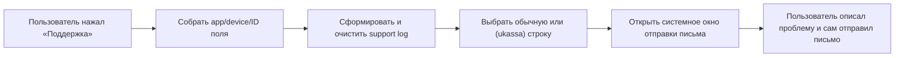

# Единая форма письма в поддержку

Этот шаблон используется во всех iPhone-приложениях BroadApps. Он нужен не
для красивого форматирования: по этой структуре бот распознаёт приложение,
версию и тип пользователя.

> [!IMPORTANT]
> Это машиночитаемый контракт. Не переводите заголовки, не меняйте порядок
> секций, разделители или первую строку. Пользователь добавляет свой текст
> только после `--- Describe the problem below ---`.

## Какой шаблон выбрать

| Ситуация | Первая строка |
|---|---|
| Обычный пользователь | `Hi! I need help with the app.` |
| Пользователь RU-контура с оплатой через ЮKassa | `Hi! I need help with the app. (ukassa)` |

По умолчанию всегда используйте обычную форму. Пометку `(ukassa)` добавляйте
только когда текущее обращение относится к уже определённому в приложении
RU/ЮKassa-сценарию. Экран поддержки не должен повторно угадывать тип пользователя:
он получает готовый результат из той же логики, по которой приложение выбрало
способ оплаты. `Locale` и `TimeZone` в письме нужны для диагностики, но сами по
себе не определяют тип письма.

## Шаблон для обычного пользователя

Скопируйте текст без изменения структуры и замените только значения в `<...>`:

```text
Hi! I need help with the app.

--- App info ---
App: <APP_NAME>
Version: <APP_STORE_VERSION> (App Store)
Installed: <INSTALLED_VERSION> (<BUILD_NUMBER>)
Bundle: <BUNDLE_ID>

--- Device ---
System: iOS <IOS_VERSION>
Device: <DEVICE_MODEL>
Locale: <LOCALE>
TimeZone: <TIME_ZONE>

--- IDs ---
Adapty profileID: <ADAPTY_PROFILE_ID>
Backend userID: <BACKEND_USER_ID>
Subscription: <SUBSCRIPTION_STATUS>

--- Diagnostics ---
A support log is attached.

--- Describe the problem below ---

```

## Шаблон для RU/ЮKassa-пользователя

Отличается **только первая строка**:

```text
Hi! I need help with the app. (ukassa)

--- App info ---
App: <APP_NAME>
Version: <APP_STORE_VERSION> (App Store)
Installed: <INSTALLED_VERSION> (<BUILD_NUMBER>)
Bundle: <BUNDLE_ID>

--- Device ---
System: iOS <IOS_VERSION>
Device: <DEVICE_MODEL>
Locale: <LOCALE>
TimeZone: <TIME_ZONE>

--- IDs ---
Adapty profileID: <ADAPTY_PROFILE_ID>
Backend userID: <BACKEND_USER_ID>
Subscription: <SUBSCRIPTION_STATUS>

--- Diagnostics ---
A support log is attached.

--- Describe the problem below ---

```

## Откуда брать значения

| Поле | Что показывает | Источник |
|---|---|---|
| `App` | Полное название бренда | Документ проекта; формат согласно регламенту Bundle ID |
| `Version` | Маркетинговая версия, опубликованная в App Store | Согласованная app configuration/App Store metadata |
| `Installed` | Установленная версия и build number | `CFBundleShortVersionString` + `CFBundleVersion` |
| `Bundle` | Bundle ID приложения | `Bundle.main.bundleIdentifier`; формат по регламенту Bundle ID |
| `System` | Версия iOS | `UIDevice.current.systemVersion` |
| `Device` | Модель устройства | Компонент приложения, который определяет модель iPhone |
| `Locale` | Локаль устройства | `Locale.current.identifier` |
| `TimeZone` | Часовой пояс | `TimeZone.current.identifier` |
| `Adapty profileID` | ID профиля Adapty | Текущий Adapty profile; не создавать новый ID для письма |
| `Backend userID` | ID текущего backend-пользователя | Авторизованный app account/backend session |
| `Subscription` | Статус подписки на момент обращения | Последний подтверждённый результат Adapty или backend |

`Subscription` должен использовать канонические значения, которые ожидает бот,
например `not_subscribed`. Если список значений не зафиксирован в документе
проекта, уточните его у тимлида-разработчика или ПМ. Не придумывайте синонимы:
бот может их не распознать.

## Что можно и нельзя менять

| Можно подставить | Нельзя менять |
|---|---|
| Значения после `App:`, `Version:` и остальных полей | Названия полей |
| Текст пользователя после последнего разделителя | Порядок секций и пустые строки |
| Обычную или RU-первую строку по готовому флагу | Текст первой строки или написание `(ukassa)` |
| Актуальные диагностические значения | `--- App info ---`, `--- Device ---`, `--- IDs ---`, `--- Diagnostics ---` и `--- Describe the problem below ---` |

## Порядок открытия письма



Письмо не отправляется в фоне. Приложение заполняет техническую часть, открывает
системную форму и оставляет пользователю место для описания проблемы.

## Готовая реализация в платформе

`BroadSupportEmailConfiguration` принимает адрес, subject, значения всех полей и
уже очищенный support log. `BroadSupportEmailRequestBuilder` возвращает `nil`,
если адрес, имя вложения или само вложение пусты: строка
`A support log is attached.` никогда не должна быть ложной.

`BroadSupportEmailComposer` открывает стандартный `MFMailComposeViewController`,
заполняет получателя, subject, точный plain-text body и прикрепляет
`support-log.txt`. Перед показом приложение проверяет
`BroadSupportEmailComposer.canSendMail`.

Если системная почта недоступна, host-приложение обязано показать alert с
действиями «Скопировать адрес» и «Закрыть». `mailto:` можно предлагать только
когда `UIApplication.canOpenURL` вернул `true`; внешний composer получает адрес и
subject, но не обещание о неприкреплённом логе. Пустой support email приводит к
отдельному понятному alert, а не к пустому или зависшему экрану.

Рабочий пример находится в `BroadAppTemplate` на карточке `Contact Us`. Там же
есть безопасный предпросмотр fixture-body и отдельный сценарий пустого адреса.
Usedesk этим действием не открывается.

## Support log

Перед открытием системного окна приложение должно создать и прикрепить support log.
Строка `A support log is attached.` должна быть правдивой.

Источник вложения — `BroadSupportLogRecorder` из BroadCore `1.2.0`:
`supportLogData: supportLogRecorder.makeSupportLogData()`. Recorder хранит те же
typed-строки, что уходят в Console, поэтому файл безопасен по построению.
Fixture-строка вместо лога допустима только в example/preview и никогда — в
production Contact Us. Подключение описано в
[Logging](Logging.md#как-прикрепить-лог-к-письму-в-поддержку).

В лог можно включать только ограниченную техническую диагностику: шаги запуска,
заранее определённые состояния, безопасные коды ошибок и время событий. Не прикладывайте:

- bearer, API/private keys и authorization headers;
- payment/checkout URL;
- receipt/JWS и raw StoreKit/Adapty/backend payload;
- тело сетевого ответа или raw `Error`;
- избыточные персональные данные.

ID из самого шаблона письма не нужно второй раз дублировать в support log.

## Когда обновлять

1. Во всех новых приложениях форма добавляется сразу.
2. В старых приложениях она заменяется по приоритетам.
3. Каждое следующее изменение формата синхронно вносится во все приложения.
4. Полное название бренда и Bundle ID всегда берутся по регламенту «Правило
   создания Bundle ID».

## Проверка перед сдачей

- [ ] Письмо открывается только после действия пользователя.
- [ ] Порядок секций и тексты заголовков точно совпадают с шаблоном.
- [ ] Обычное письмо не содержит `(ukassa)`.
- [ ] RU/ЮKassa-письмо содержит `(ukassa)` только в первой строке.
- [ ] `Version` и `Installed` не перепутаны.
- [ ] Bundle ID и ID относятся к текущему приложению/аккаунту.
- [ ] Статус подписки получен из последнего подтверждённого результата.
- [ ] Support log фактически прикреплён и не содержит секретов.
- [ ] После последнего разделителя есть место для текста пользователя.

## Готовый промпт для Codex или Claude

```text
Добавь в экран Settings текущего iPhone-приложения отдельное действие
письма в поддержку. Точно следуй Documentation/SupportEmail.md.

Не меняй первую строку, заголовки, порядок секций и разделители: их читает
бот. Для обычного пользователя используй стандартную первую строку. Для уже
определённого RU/ЮKassa-контура добавь (ukassa) только в первую строку. Не определяй
этот тип по одному Locale или TimeZone.

Заполни App, версию в App Store, установленную версию/build, Bundle ID, iOS,
модель устройства, locale, timezone, Adapty profileID, backend userID и статус
подписки из данных текущего пользователя. Прикрепи очищенный support log. Не
добавляй в лог токены, payment URL, receipt/JWS, необработанный ответ SDK/backend
или raw Error.

Открывай системную форму только после нажатия. Не отправляй письмо автоматически.
Проверь оба шаблона и в конце покажи сформированное body без реальных ID.
```

## Связанные инструкции

- [Usedesk: онлайн-чат из Settings](Usedesk.md)
- [RU Billing: как приложение выбирает RU/ЮKassa-сценарий](RUBilling.md)
- [Logging: какие данные можно писать в лог](Logging.md)
- [Security: границы чувствительных данных](Security.md)
