# Usedesk в iOS-приложении

Usedesk нужен, чтобы пользователь мог написать в поддержку прямо из приложения.
Точка входа стандартная:

```text
Настройки → Онлайн-чат → готовый экран Usedesk
```

<table>
  <tr>
    <td align="center" width="50%">
      <a href="Assets/README/Usedesk/settings-online-chat-highlighted.png">
        
      </a>
      <br><strong>1. Settings → Online Chat</strong>
    </td>
    <td align="center" width="50%">
      <a href="Assets/README/Usedesk/chat-screen.png">
        
      </a>
      <br><strong>2. Готовый экран Usedesk</strong>
    </td>
  </tr>
</table>

На первом скриншоте рамка добавлена только для README: в приложении строка
остаётся обычной строкой Settings. Второй скриншот показывает UI, который
открывает сам Usedesk SDK.

Чат открывается **только после нажатия пользователя**. Не запускайте Usedesk в
loader, bootstrap, `viewDidLoad()` или при старте приложения.

> [!IMPORTANT]
> Usedesk — опциональная интеграция конкретного приложения. Если ПМ подтвердил,
> что чат не нужен, не добавляйте CocoaPods, разрешения и строку «Онлайн-чат».

## Что запросить до начала

Данные запрашиваются у ответственного аккаунт-менеджера или проектного
менеджера. Обычно они отправляют их в общую dev-группу.

Скопируйте и отправьте сообщение:

```text
Нужны данные Usedesk для iOS-приложения <номер и название>:

1. Company ID.
2. Channel ID именно канала мобильного чата.
3. Нужна ли База знаний? Если да — её ID и согласованная схема доступа.
4. Есть ли у операторов доступ к этому каналу?
5. Нужны ли push-уведомления о новых ответах?
6. Backend-ручки для загрузки и сохранения chat token текущего
   авторизованного app account, например `/me/usedesk-chat-token`.
7. Нужен ли account-scoped Keychain cache для повтора синхронизации при
   временной ошибке backend.
```

Так может выглядеть ответ. Значения на изображении скрыты: живые токены и ID
из dev-группы не добавляются в документацию.

<p align="center">
  
</p>

| Что прислал менеджер | Для чего нужно | Куда записать |
|---|---|---|
| `Company ID` | Выбирает компанию Usedesk | В конфигурацию приложения |
| `Channel ID` | Выбирает канал, куда попадёт сообщение | В конфигурацию приложения |
| `Knowledge Base ID` | Открывает Базу знаний; нужен только если она согласована | В конфигурацию приложения |
| `Token` или script виджета | Может относиться к web/API-интеграции | Не вставлять в iOS вслепую; уточнить назначение у ПМ |

`Channel ID` мобильного чата и API-канал — не одно и то же. Если прислан только
script web-виджета, попросите ПМ отдельно подтвердить `Company ID` и `Channel ID`
для iOS SDK.

## Три разных токена — не перепутайте

| Название | Что это | Можно хранить в iOS-коде |
|---|---|---|
| Публичные `Company ID` и `Channel ID` | Идентификаторы подключения чата | Да, в одном app-owned config |
| Usedesk API token | Секрет для серверного API или отдельных сценариев Базы знаний | **Нет**; согласовать backend/ограничения |
| User chat token | Идентификатор переписки конкретного пользователя | Backend app account — основной источник; Keychain — только account-scoped cache |

Для обычного чата передавайте `api_token: nil`. Не подставляйте в приложение
токен из сообщения менеджера только потому, что поле называется `Token`.

## Почему нужен CocoaPods

Платформа подключается через Swift Package Manager, но готовый интерфейс
Usedesk распространяется иначе:

- CocoaPods — SDK с готовым экраном чата;
- SPM — SDK без готового GUI.

Поэтому `BroadAppsIOSPlatform` остаётся обычным Swift Package, а Usedesk
добавляется через CocoaPods **в target самого приложения**. Эти два менеджера
зависимостей нормально работают вместе.

На 16 августа 2026 года официальный podspec и рабочий reference используют
`UseDesk_SDK_Swift 3.4.20`. Перед новым приложением сверяйте версию с
[официальным podspec](https://raw.githubusercontent.com/usedesk/UseDeskSwift/master/UseDesk_SDK_Swift.podspec).

## Шаг 1. Установите SDK

В корне iOS-приложения создайте `Podfile`:

```ruby
platform :ios, '17.0'

target 'YourApp' do
  use_frameworks!

  pod 'UseDesk_SDK_Swift', '~> 3.4.20'
end
```

Замените `YourApp` точным именем app target, затем выполните:

```bash
pod install
```

После этого закрывайте `.xcodeproj` и открывайте только:

```text
YourApp.xcworkspace
```

**Готово, если:** workspace открывается, Pods отображаются в Xcode, а приложение
собирается на iPhone Simulator.

### Если `pod` не найден

Сначала проверьте:

```bash
pod --version
```

Если команды нет, установите CocoaPods принятым в команде способом. Не
копируйте папку `Pods` из reference-проекта: зависимости должны быть установлены
из `Podfile` и зафиксированы в `Podfile.lock` текущего приложения.

### Если CocoaPods «не видит» зафиксированную версию Alamofire

Например, `Podfile.lock` требует `Alamofire 5.12.0`, а `pod install`
сообщает, что не может найти совместимую версию. Это обычно значит,
что локальный каталог CocoaPods Specs устарел.

Выполните:

```bash
pod install --repo-update
```

Команда сначала обновит каталог спецификаций, затем установит версии,
уже зафиксированные в `Podfile.lock`. Не удаляйте `Podfile.lock` и не
меняйте версию Usedesk до этой проверки.

Предупреждение о неиспользуемом `master specs repo` не является
ошибкой, если установка закончилась строкой `Pod installation complete!`.

## Шаг 2. Храните значения в одном config

Не размещайте ID внутри SwiftUI View:

```swift
struct UsedeskConfiguration: Sendable {
    let companyID: String
    let channelID: String
    let knowledgeBaseID: String?

    static let production = UsedeskConfiguration(
        companyID: "COMPANY_ID_FROM_PM",
        channelID: "CHANNEL_ID_FROM_PM",
        knowledgeBaseID: nil
    )
}
```

Если данные нового приложения ещё не готовы, разрешены fixture либо
`Company ID`/`Channel ID` согласованного похожего live-приложения только когда
владелец продукта явно одобрил эти публичные client identifiers для development
load/show. Пометьте их как временные и замените перед выпуском. `api_token`,
user chat token, account data и backend credentials из reference не копируются.

## Шаг 3. Backend — источник, Keychain — локальный cache

Usedesk возвращает user chat token в `connectionStatus`. Этот токен связывает
пользователя с его перепиской. `additional_id`, app `userID` и device ID его не
заменяют.

Официальный SDK прямо предупреждает: локальное хранение не возвращает историю
на другом устройстве или платформе. Поэтому для account-based приложения
основная связь хранится на backend:

```text
authenticated app account → Usedesk user chat token
```

Keychain полезен как защищённая локальная копия для того же app account,
но не как единственный источник и не как device identity.

```mermaid
flowchart LR
    A["Тап «Онлайн-чат»"] --> B["Проверить current app account"]
    B --> C["Загрузить token из authenticated backend /me"]
    C --> D["Открыть Usedesk"]
    C -. "backend unavailable" .-> K["Keychain cache того же account"]
    K --> D
    D --> E["Callback вернул token"]
    E --> F["Сохранить в account-scoped Keychain"]
    F --> G["Синхронизировать в authenticated backend /me"]
    G -. "temporary error" .-> H["Оставить pending sync и повторить"]
```



Общий контракт скрывает backend/Keychain детали от SDK-сервиса:

```swift
enum UsedeskChatTokenPersistenceOutcome: Sendable {
    case synced
    case pendingBackendSync
    case failed
}

protocol UsedeskChatTokenRepository: Sendable {
    func resolveToken(forAuthenticatedUserID userID: String) async throws -> String?
    func persistCallbackToken(
        _ token: String,
        forAuthenticatedUserID userID: String
    ) async -> UsedeskChatTokenPersistenceOutcome
    func deactivateToken(forAuthenticatedUserID userID: String) async
}
```

Контракт `resolveToken`:

1. Backend endpoint определяет account по server authorization. Не доверяйте
   произвольному `userID` из URL/body.
2. Token с backend имеет приоритет и обновляет Keychain cache того же account.
3. Если backend временно недоступен, можно использовать Keychain token только
   для точного current `userID`.
4. При logout до удаления session вызовите `deactivateToken`: active/in-memory
   token очищается сразу. Синхронизированную cache-копию можно удалить;
   незавершённый pending sync остаётся зашифрованным и жёстко привязанным
   к этому account. Он не читается, пока не восстановлен тот же account.

Контракт `persistCallbackToken`:

1. Проверяет, что callback всё ещё относится к current authenticated account.
2. Сохраняет token в Keychain по точному account scope до сетевого `await`.
3. Синхронизирует token с authenticated backend endpoint.
4. При temporary backend error возвращает `.pendingBackendSync`, сохраняет
   durable pending marker и повторяет sync при следующем открытии/входе в account.
5. Ни Keychain, ни backend не печатают raw token в Console/analytics.

Общие правила:

1. `userID` — стабильный ID авторизованного пользователя приложения.
2. При первом открытии backend может вернуть `nil`.
3. После смены аккаунта нельзя передавать token предыдущего пользователя.
4. Device ID не является chat identity и не объединяет два устройства одного account.
5. В SDK укажите `isSaveTokensInUserDefaults: false`.

> [!IMPORTANT]
> Keychain-only интеграция допустима только если владелец продукта явно
> принял device-bound ограничение. Такое приложение не может обещать
> возврат истории на другом устройстве/платформе. Базовый platform flow для
> account-based app использует backend + Keychain cache.

[Usedesk iOS SDK: token storage и `isSaveTokensInUserDefaults`](https://github.com/usedesk/UseDeskSwift/blob/master/README_RU.md)

## Шаг 4. Создайте app-owned сервис

SDK должен жить в сервисе постоянно, а не создаваться внутри нажатия кнопки.
В CocoaPods-документации модуль подключается как `UseDesk`; некоторые рабочие
проекты используют сгенерированное имя `UseDesk_SDK_Swift`. Оставьте тот import,
который создаёт установленный pod в текущем workspace.

```swift
import UIKit

#if canImport(UseDesk)
import UseDesk
#elseif canImport(UseDesk_SDK_Swift)
import UseDesk_SDK_Swift
#endif

struct UsedeskUser: Sendable {
    let id: String
    let name: String?
    let email: String?
    let phone: String?
}

@MainActor
final class UsedeskSupportService {
    private let configuration: UsedeskConfiguration
    private let tokenRepository: any UsedeskChatTokenRepository

    #if canImport(UseDesk) || canImport(UseDesk_SDK_Swift)
    private let sdk = UseDeskSDK()
    #endif

    init(
        configuration: UsedeskConfiguration,
        tokenRepository: any UsedeskChatTokenRepository
    ) {
        self.configuration = configuration
        self.tokenRepository = tokenRepository
    }

    func openChat(
        from viewController: UIViewController,
        user: UsedeskUser
    ) async throws {
        let chatToken = try await tokenRepository.resolveToken(
            forAuthenticatedUserID: user.id
        )

        #if canImport(UseDesk) || canImport(UseDesk_SDK_Swift)
        sdk.start(
            withCompanyID: configuration.companyID,
            chanelId: configuration.channelID,
            url: "pubsubsec.usedesk.ru",
            port: "443",
            urlAPI: "secure.usedesk.ru",
            api_token: nil,
            urlToSendFile: "https://secure.usedesk.ru/uapi/v1/send_file",
            knowledgeBaseID: configuration.knowledgeBaseID,
            name: user.name,
            email: user.email,
            phone: user.phone,
            token: chatToken,
            additional_id: user.id,
            note: "Пользователь iOS-приложения",
            additionalFields: [:],
            additionalNestedFields: [],
            nameOperator: "Поддержка",
            nameChat: "Поддержка",
            firstMessage: nil,
            countMessagesOnInit: 30,
            localeIdentifier: Locale.current.language.languageCode?.identifier == "ru" ? "ru" : "en",
            storage: nil,
            isCacheMessagesWithFile: true,
            isSaveTokensInUserDefaults: false,
            isPresentDefaultControllers: true,
            presentIn: viewController,
            connectionStatus: { [tokenRepository] success, _, newToken in
                guard success, !newToken.isEmpty else { return }

                Task {
                    let persistence = await tokenRepository.persistCallbackToken(
                        newToken,
                        forAuthenticatedUserID: user.id
                    )
                    if case .failed = persistence {
                        // Покажите safe diagnostic state без raw token.
                        // Не выдавайте несохранённую identity за synced.
                    }
                }
            },
            errorStatus: { _, _ in
                // Преобразуйте SDK error в безопасное app-owned состояние.
            }
        )
        #else
        throw UsedeskIntegrationError.sdkIsNotInstalled
        #endif
    }
}

enum UsedeskIntegrationError: Error {
    case sdkIsNotInstalled
}
```

`chanelId` с одной буквой `n` — реальное имя параметра публичного SDK.

## Шаг 5. Добавьте вход из Settings

В Settings должна быть отдельная строка:

```swift
Button(action: openOnlineChat) {
    SettingsRowView(
        icon: .bubble,
        title: "Онлайн-чат",
        trailing: .chevron
    )
}
.buttonStyle(.plain)
```

Действие `openOnlineChat` выполняет ровно четыре шага:

1. Берёт текущего авторизованного пользователя.
2. Находит видимый `UIViewController`, из которого можно открыть экран.
3. Вызывает `UsedeskSupportService.openChat(...)`.
4. При ошибке показывает понятное сообщение и разрешает повторить.

Не объединяйте «Поддержку по email» и «Онлайн-чат» в одно неясное действие. Если
приложению нужны оба варианта, это две отдельные строки Settings.
Письмо должно заполняться по [единому шаблону Support Email](SupportEmail.md).

## Шаг 6. Добавьте только используемые разрешения

Если чат позволяет прикреплять фото, видео или использовать камеру, добавьте в
Info.plist понятные тексты:

```xml
<key>NSCameraUsageDescription</key>
<string>Камера используется для отправки фотографий в службу поддержки</string>

<key>NSMicrophoneUsageDescription</key>
<string>Микрофон используется при записи видео для службы поддержки</string>

<key>NSPhotoLibraryUsageDescription</key>
<string>Доступ к медиатеке нужен для прикрепления файлов к сообщению</string>

<key>NSPhotoLibraryAddUsageDescription</key>
<string>Доступ нужен для сохранения полученных изображений</string>
```

Не добавляйте разрешение «на будущее». Каждое описание должно соответствовать
реально включённой функции.

## База знаний и push — отдельные решения

- База знаний подключается только если ПМ подтвердил её наличие и выдал ID.
- Секретный API token для Базы знаний нельзя хранить в iOS-коде без отдельно
  согласованной схемы доступа.
- Push для ответов Usedesk подключается по отдельному запросу в Usedesk.
- Push клиентского чата и push мобильного приложения операторов — разные
  сценарии.

## Что делать при обрыве сети

- не закрывайте Settings и не зависайте в бесконечном loader;
- покажите «Онлайн-чат временно недоступен» и кнопку повтора;
- не создавайте новый chat token при каждом retry;
- не подменяйте backend token случайным ID устройства;
- не очищайте сохранённый token после timeout;
- не проглатывайте ошибку backend sync через `try?`: оставьте Keychain-копию
  и pending marker для ручного/следующего retry;
- не отправляйте сообщение автоматически после восстановления сети — SDK
  должен показать пользователю статус и возможность ручной повторной отправки.

## Проверка перед сдачей

- [ ] ПМ подтвердил, что Usedesk нужен этому приложению.
- [ ] `Company ID` и `Channel ID` относятся к нужному каналу.
- [ ] У операторов есть доступ к каналу.
- [ ] Выполнен `pod install`, приложение открывается через `.xcworkspace`.
- [ ] Чат открывается из `Настройки → Онлайн-чат`, а не при запуске.
- [ ] Сообщение попадает в правильный канал Usedesk.
- [ ] В тикете видны правильные `additional_id`, имя и контакты.
- [ ] User chat token сохраняется на backend текущего app account.
- [ ] Keychain cache привязан к точному account, не к device ID; logout очищает
  active token, а pending sync не становится доступен другому account.
- [ ] Temporary backend save оставляет pending sync; ошибка не проглатывается.
- [ ] После переустановки история возвращается после входа в тот же аккаунт.
- [ ] Два разных аккаунта не видят переписку друг друга.
- [ ] Фото/камера/файлы работают только с нужными privacy-разрешениями.
- [ ] При обрыве сети есть понятная ошибка и безопасный ручной retry.
- [ ] Секретный API token отсутствует в Swift-коде, plist и изображениях.
- [ ] Push и База знаний либо проверены отдельно, либо явно не входят в scope.

## Готовый промпт для Codex или Claude

```text
Интегрируй Usedesk в текущее iPhone-приложение по
Documentation/Usedesk.md.

Данные Company ID, Channel ID, необходимость Базы знаний и push возьми только
из документа проекта или сообщения ПМ. Если данных нет или непонятно, к чему
относится присланный Token/script, остановись и задай вопрос — не придумывай
значения.

Готовый UI чата установи через CocoaPods. Не меняй BroadAppsIOSPlatform и
reference-проект ради установки pod. В Settings добавь отдельную строку
«Онлайн-чат» и открывай SDK только после нажатия пользователя.

User chat token загружай из authenticated backend текущего app account.
Добавь account-scoped Keychain cache: backend имеет приоритет, cache никогда не
читается для другого userID или device ID. Callback token сначала сохрани
локально, затем синхронизируй с backend; temporary error оставляет
pending sync, а не проглатывается через `try?`.

Установи isSaveTokensInUserDefaults: false. Не передавай token другого
пользователя и не размещай секретный Usedesk API token в приложении.

Добавь только реально используемые privacy-разрешения. Проверь Debug и Release,
открытие чата, правильный канал, два аккаунта, переустановку, потерю сети и
ручной retry. В конце перечисли изменённые файлы, использованные данные,
временные значения и результаты проверок.
```

## Официальные источники

- [Usedesk: общая инструкция SDK](https://docs.usedesk.ru/article/9902)
- [Usedesk iOS SDK и параметры запуска](https://github.com/usedesk/UseDeskSwift/blob/master/README_RU.md)
- [Актуальный CocoaPods podspec](https://raw.githubusercontent.com/usedesk/UseDeskSwift/master/UseDesk_SDK_Swift.podspec)
- [Возможности мобильного чата](https://usedesk.ru/integration/sdk)
