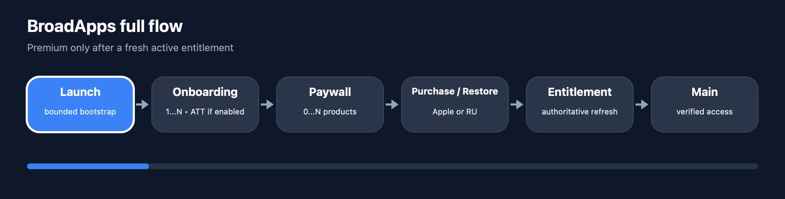
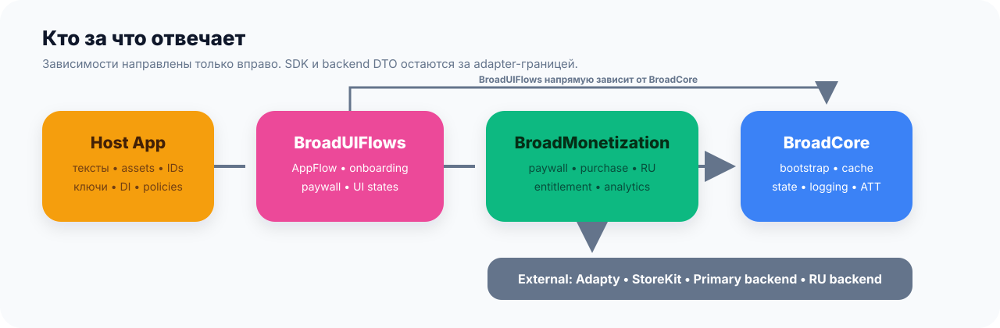
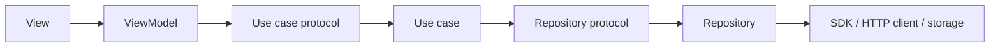

# Памятка разработчика

<p align="center">
  <strong>Куда положить код · как добавить экран или use case · что проверить перед передачей</strong>
</p>

Эта памятка нужна **во время разработки** приложения на BroadApps iOS Platform.
Главный [README](README.md) объясняет, как начать проект через агента или вручную,
а этот файл помогает не смешать слои, не потерять важный сценарий и провести
понятную проверку перед передачей.

> [!NOTE]
> Старые template/reference-проекты можно изучать как пример продукта и работы
> backend. Их конкретные папки, ключи, ID, StoreKit-конфигурацию и архитектурные
> решения не нужно автоматически переносить в новое приложение. Актуальные
> технические правила находятся в этом репозитории.

<p align="center">
  
</p>

<p align="center"><sub>Один вертикальный срез: запуск → onboarding → paywall → покупка или восстановление → повторная проверка доступа → основной экран.</sub></p>

## Как пользоваться памяткой

| Когда | Что открыть |
|---|---|
| Перед началом проекта | Основной [README](README.md): вариант с Codex/Claude или ручная сборка |
| До первого Swift-файла | [Поэтапный workflow](Documentation/AppCreationWorkflow.md) и [шаблон Integration Plan](Documentation/Templates/AppIntegrationPlan.md) |
| После `BLOCKED`, паузы или смены чата | Открыть Integration Plan, последний checkpoint и diff; продолжить остановленный stage, не повторяя принятые slices |
| Перед созданием нового экрана | Разделы [«Куда класть код»](#куда-класть-код) и [«Как добавить сцену»](#как-добавить-сцену) |
| Перед добавлением бизнес-действия | Раздел [«Как добавить use case»](#как-добавить-use-case) |
| Во время вёрстки | [UI-checklist](#ui-checklist) |
| Перед передачей | [Финальная проверка](#финальная-проверка) |

## Шесть терминов без сложных определений

| Термин | Что это значит здесь |
|---|---|
| Сцена | Отдельный экран или законченная часть пользовательского маршрута |
| `View` | Только рисует состояние и передаёт действия пользователя во `ViewModel` |
| `ViewModel` | Хранит состояние экрана и вызывает нужный use case |
| Use case | Одно действие приложения: загрузить, купить, восстановить, проверить или отправить |
| Repository | Граница получения/сохранения данных; UI не знает, пришли они из SDK, backend или кеша |
| Composition root | Одно место, где создаются и соединяются зависимости приложения |

Расширенный словарь находится в
[главном README](README.md#-словарь-что-означают-термины).

## Куда класть код

<picture>
  <source media="(prefers-color-scheme: dark)" srcset="Documentation/Assets/README/architecture-dark.svg">
  <source media="(prefers-color-scheme: light)" srcset="Documentation/Assets/README/architecture-light.svg">
  
</picture>

Не нужно запоминать сложную теорию. Для каждого нового файла задайте один вопрос:
**за что он отвечает?**

| Если файл… | Его место | Чего там быть не должно |
|---|---|---|
| Рисует экран и хранит его UI-состояние | `Presentation` | HTTP, Adapty, StoreKit, чтение базы |
| Описывает правило, модель или протокол | `Domain` | SwiftUI и конкретный SDK |
| Выполняет одно действие пользователя или собирает несколько правил | `Application` / use case | Вёрстка и прямой вызов из `View` |
| Реализует repository и преобразует внешние данные в доменные модели | `Data` | Экран и навигация |
| Общается с SDK, сетью, файловой системой или системным API | `Infrastructure` | Бизнес-решение о том, что показать пользователю |
| Запускает приложение и собирает зависимости | composition root | Полноценная сцена и бизнес-логика внутри DI-регистрации |
| Хранит повторяемые цвета, шрифты, размеры и небольшие UI-компоненты приложения | app `Core` / `DesignSystem` | Код, нужный только одному сложному экрану |

> [!IMPORTANT]
> Не создавайте один глобальный `AppConstants` для всех значений. Данные и
> поведение конкретного приложения держите в `AppConfiguration`, повторяемое
> оформление — в `AppTokens`, а служебную деталь одного файла — в локальном
> `private enum Constants`. Полная карта и примеры находятся в
> [шаге 5 основного README](README.md#app-configuration).

Короткая цепочка вызова выглядит так:



`View` получает готовую `ViewModel` через `init`. Она не создаёт repository,
не вызывает SDK и не ищет зависимости через `resolver.resolve(...)`.

Полные границы модулей: [Documentation/Architecture.md](Documentation/Architecture.md).

## Как добавить сцену

Под сценой понимается самостоятельный экран или законченная часть
пользовательского маршрута.

1. Создайте отдельную папку внутри `Presentation`.
2. Добавьте `FeatureView.swift` и `FeatureViewModel.swift`.
3. Большие строки, карточки и секции вынесите в `Components`, когда они перестают
   читаться как часть основного экрана.
4. Передайте use cases во `ViewModel` через `init`.
5. Зарегистрируйте зависимости в composition root.
6. Подключите сцену к маршруту приложения.
7. Тексты, ссылки, placement ID и настройки конкретного бренда держите в единой
   конфигурации приложения, а не внутри `View`.

**Сцена готова**, когда её можно открыть из реального flow, увидеть loading,
content, empty и error/retry, а повторный вход не запускает лишнюю операцию.

## Как добавить use case

**Use case** — это одно понятное действие приложения: загрузить тарифы, начать
генерацию, восстановить покупки, проверить доступ или отменить RU-подписку.

1. Сначала опишите вход, результат и безопасные ошибки в Domain-контракте.
2. Use case зависит от repository-протокола, а не от конкретного SDK-класса.
3. Реализация координирует шаги, но не рисует UI.
4. Repository превращает ответ SDK/backend в доменную модель.
5. ViewModel получает протокол use case через `init` и переводит результат в
   понятное состояние экрана.
6. Зарегистрируйте реализацию в composition root.

<details>
<summary><strong>Простой пример границы</strong></summary>

Названия `Feature` в примере условные: замените их моделью своей функции.

```swift
protocol LoadFeatureUseCaseProtocol: Sendable {
    func execute() async -> Result<Feature, AppError>
}

struct LoadFeatureUseCase: LoadFeatureUseCaseProtocol {
    let repository: any FeatureRepositoryProtocol

    func execute() async -> Result<Feature, AppError> {
        await repository.load()
    }
}

@MainActor
final class FeatureViewModel: ObservableObject {
    private let loadFeature: any LoadFeatureUseCaseProtocol

    init(loadFeature: any LoadFeatureUseCaseProtocol) {
        self.loadFeature = loadFeature
    }
}
```

</details>

Не создавайте use case или repository прямо внутри `View`. Если зависимость не
собирается, исправьте composition root — обход в UI только скроет проблему.

## UI-checklist

### Источник интерфейса

- Сначала прочитайте метку карточки проекта в Kaiten.
- Метка `no-code` есть — Figma у проекта нет; используйте согласованный preview
  из Pencil/Claude Design и материалы проекта.
- Метки `no-code` нет — это проект с Figma. Откройте ссылку из документа
  проекта; если ссылки или доступа нет, запросите их у проектного менеджера.
- Не определяйте no-code по пустому полю Figma: источником истины является
  метка карточки Kaiten.
- Проверяйте не только общий вид: font size, weight, line height, padding,
  spacing, icon size, button height, card size, corner radius, header, sheet и
  tab bar.

### Единые правила

- Размеры, отступы и радиусы проходят через общий `.scale`/scale-helper.
- Цвета и шрифты берутся из design tokens приложения.
- Брендовые шрифты регистрируются централизованно, а не отдельно в каждом экране.
- Assets имеют понятные имена и аккуратные группы внутри asset catalog.
- Если дизайн фиксирует тему, системное переключение Light/Dark не должно
  самопроизвольно менять экран.
- Ссылки открываются внутри приложения через системный браузерный экран или sheet.
- Кнопки продукта на paywall не мерцают и не затемняются при нажатии.

### Onboarding: сначала страницы, затем UI

1. Сопоставьте страницы из Kaiten, Figma/no-code материалов, технического
   задания и reference.
2. Если количество и содержимое понятны — создайте по одному
   `OnboardingPageConfiguration` на каждый слайд.
3. Если данные отсутствуют или противоречат друг другу — до реализации спросите
   разработчика/ПМ о количестве, заголовке, тексте, media и действии каждого
   слайда.
4. Не используйте три страницы `BroadAppTemplate` как значение по умолчанию.
5. Не создавайте отдельный `slidesCount`: длина onboarding всегда равна
   `OnboardingConfiguration.pages.count`.
6. Для стандартного layout используйте `BroadOnboardingView`, для полностью
   своего SwiftUI — `BroadOnboardingFlowHost`.

Logic-only host нужен, чтобы приложение не копировало ATT, scene/window
lifecycle, переход на последнюю страницу и безопасное завершение невалидной
конфигурации. Если onboarding отсутствует в продукте, отключите маршрут через
`.disabled`; пустой массив не является способом штатного отключения.

### Три размера iPhone

Проверьте минимум:

1. маленький iPhone;
2. обычный iPhone;
3. iPhone Pro Max.

Текст не обрезается, карточки не перекрывают друг друга, loader не прыгает,
клавиатура не закрывает основное действие, а нижняя кнопка остаётся доступной.
iPad не входит в scope платформы.

## Сценарии, которые легко сломать

<details open>
<summary><strong>Onboarding, ATT и Rate Us</strong></summary>

- Количество страниц берётся только из массива `pages`; один элемент равен
  одному слайду.
- ATT не вызывается на loader, при bootstrap или в `init` экрана.
- ATT разрешён только после фактического появления первого onboarding-слайда в
  активном видимом окне.
- Если onboarding отключён через `.disabled`, ATT из onboarding-flow не
  вызывается.
- Rate Us разрешён в приложении, но **не внутри onboarding**.
- Если обязательное согласие ещё не принято, оно снова появляется перед нужным
  действием после повторного входа или перезапуска.

[Точный контракт onboarding и ATT →](Documentation/OnboardingAndATT.md)

</details>

<details>
<summary><strong>Loader, генерация и повторные нажатия</strong></summary>

- Loader имеет стабильное положение и конечное ожидание.
- После тапа ViewModel сначала синхронно ставит `isInFlight = true`, и только
  затем создаёт `Task` и ждёт backend.
- Основная кнопка сразу показывает ромашку и блокируется. Нельзя оставлять её
  неподвижной до появления следующего экрана или ответа backend.
- Если paywall уже показан, сохраните его контент и выбор под blur, а spinner
  рисуйте отдельным overlay; карточка и CTA не должны мигать или затемняться.
- То же правило действует для paywall подписок и токен-пейвола.
- Повторный тап, уход со сцены и возврат не создают дубликат запроса.
- Долгая операция переживает переход в History и перезапуск: пользователь видит
  pending-ячейку до подтверждённого результата.
- Ошибка показывает понятное действие: повторить, закрыть или вернуться.

[Готовая кнопка, ViewModel и Debug-fixture →](Documentation/DebugToolsAndAsyncActions.md)

</details>

<details>
<summary><strong>Debug-настройки и очистка Keychain</strong></summary>

- Очистка Keychain доступна только в Debug и только после подтверждения.
- Перечислите точные app-owned `service` в `AppConfiguration`.
- Не делайте глобальный `SecItemDelete` без `service`/`accessGroup`.
- Не очищайте этой кнопкой payment pending, кеш и другие хранилища.
- После завершения покажите понятный результат и предложите войти заново.

[Готовая реализация →](Documentation/DebugToolsAndAsyncActions.md#очистка-keychain-во-время-разработки)

</details>

> [!IMPORTANT]
> Backend у похожих приложений обычно общий, но функционала reference может быть
> недостаточно для нового проекта. Поэтому разработчик обязан сопоставить
> **каждую функцию нового приложения** из Kaiten/Figma/технического задания с
> реальными API-ручками reference.

<details>
<summary><strong>Backend и данные</strong></summary>

- Перед интеграцией сравните ТЗ, Figma и документацию backend.
- Если в новом проекте функций больше, уточните у тимлида-разработчика или ПМ:
  согласованы ли они и нужно ли расширение backend.
- Не отбрасывайте поля или элементы ответа молча и не заменяйте их хардкодом.
- Неожиданный формат ответа фиксируется с безопасным примером и передаётся
  ответственному, а не «подгоняется» в декодере.
- Ограничения backend показываются пользователю понятным сообщением.

</details>

<details>
<summary><strong>Paywall, restore и специальные предложения</strong></summary>

- UI принимает 0, 1 или любое количество продуктов в порядке Adapty.
- Purchase и restore не открывают premium до новой подтверждённой проверки доступа.
- Success, fail, cancel, offline и timeout — разные конечные состояния.
- Special Offer существует только при конфигурации приложения и явном
  `special_offer = true` из текущего ответа SDK Adapty. Ответ может прийти из
  сети или внутреннего кеша Adapty; отдельный REST/repository не создаётся.
- Special Offer никогда не является первым paywall: сначала показывается
  обычный subscription paywall, resolver запускается только после его крестика
  без покупки, а подтверждённая purchase/restore ведёт в main без downsell.
- Если самостоятельный placement `special_offer` загрузился, gate читается из
  его payload. Gate резервного `main` используется только при фактическом
  fallback на `main`.
- `ru_pay` из того же ответа разрешает только показать RU-способы оплаты.
  В Release он всегда приходит из Adapty: network, внутренний SDK cache или
  официальный Dashboard-generated fallback. Локального production-default
  нет. Сохранённая копия из кеша `BroadMonetization` RU methods не включает.
- Debug имеет process-local `Как в Adapty` / `Включить` / `Выключить`.
  Release UI не содержит force-control, а default store заблокирован в
  `Как в Adapty`; Debug force не обходит device/backend/entitlement gates.
- Premium появляется только после новой подтверждённой проверки доступа со статусом
  `active`.
- Special Offer purchase использует raw product из того же внутреннего Adapty
  registry и не перезагружает paywall перед оплатой.
- Fixture доказывает flow, но не Dashboard: перед QA app-owned load/show без
  purchase должен подтвердить requested/resolved placement и присутствие
  каждого ожидаемого product ID.
- Restore доступен во всех согласованных точках и не запускается автоматически.
- В рамках проверки платформы не выполняются реальные покупки, RU-платежи или
  StoreKit sandbox-операции: используются fixture-сценарии и безопасные сборки.

[Paywall UI →](Documentation/PaywallUI.md) ·
[Монетизация →](Documentation/Monetization.md) ·
[Special Offer →](Documentation/SpecialOffer.md)

Для воспроизводимой ручной проверки используйте launch arguments
`-special-offer-enabled`, `-special-offer-disabled`,
`-special-offer-platform-cache`, `-special-offer-main-fallback`,
`-special-offer-looping-timer`, `-ru-pay-provider-enabled`,
`-ru-pay-provider-disabled`, `-ru-pay-adapty-fallback-rejected` и
`-ru-pay-platform-cache` из `Examples/BroadAppTemplate/README.md`.

</details>

<details>
<summary><strong>Обрыв сети и восстановление после переустановки</strong></summary>

- Пропавший интернет не превращает неизвестный результат оплаты в отказ или успех.
- Возвращение сети сначала запускает сверку статуса, а не повторную оплату.
- После переустановки подписка, токены и RU-покупки восстанавливаются по
  StoreKit/backend и стабильному аккаунту, а не из локального кеша.

[Обрыв сети →](Documentation/NetworkInterruptions.md) ·
[Восстановление аккаунта →](Documentation/AccountRecovery.md)

</details>

<details>
<summary><strong>Файлы, изображения и видео</strong></summary>

- File picker проверяется на реально разрешённых форматах проекта.
- Для изображений проверьте JPEG/PNG и файлы из Photos/Files.
- Для видео проверьте preview, первый кадр, aspect fit, открытие, play/stop и
  вертикальную запись с камеры.
- Большой или неподдерживаемый файл показывает понятную ошибку до отправки или
  после безопасного ответа backend.

</details>

## Проверка с агентом

Основной сценарий работы через Codex/Claude описан в
[варианте A главного README](README.md#-вариант-a-сделать-приложение-через-codex-или-claude).
Не отправляйте агенту один запрос «сделай всё приложение». Используйте
[`AgentPromptPack.md`](Documentation/AgentPromptPack.md) по одному этапу и
проверяйте `PLAN`, `SKELETON`, `SLICE`, `FUNCTIONAL` и `VISUAL REVIEW REQUIRED`
до перехода дальше.

Для уже существующего app этап 1 сначала фиксирует current state и gaps, а
skeleton stage проверяет существующие target/DI/routes вместо создания второго
проекта. После паузы используйте resume prompt из конца `AgentPromptPack.md`.

Для дополнительной проверки конкретной feature можно скопировать этот текст:

```text
Проверь текущую feature iPhone-приложения по README.dev.md и связанной
документации BroadApps iOS Platform.

Сначала опиши фактический flow и найди нарушения архитектуры, DI, UI-состояний,
работы backend, offline/retry и защиты от повторных действий. Отдельно проверь
правила onboarding/ATT/Rate Us и монетизации, если feature с ними связана.
Для каждой backend-кнопки проверь, что `isInFlight` меняется до первого `await`,
сразу появляется spinner и повторный тап не создаёт второй запрос. Если есть
Debug-очистка Keychain, она должна работать только с точными app-owned service.

Reference-проекты не изменяй. Не выполняй реальные покупки, restore или RU-платёж.
Исправляй только файлы текущего приложения или платформы, которые прямо входят
в задачу. После исправлений собери iPhone-приложение в Debug и Release. Если
менял код самой BroadApps iOS Platform, дополнительно запусти
bash Scripts/agent_gate.sh.

В конце простыми словами напиши: что проверил, что нашёл, что исправил,
какие команды прошли и что осталось проверить вручную.
```

## Проверка без агента

Без Codex/Claude требования не меняются. Разработчик самостоятельно:

1. заполняет `Documentation/AppIntegrationPlan.md` из
   [шаблона](Documentation/Templates/AppIntegrationPlan.md), отмечая неизвестные
   API и решения как `BLOCKED`;
2. реализует и проверяет один вертикальный срез за раз;
3. проходит цепочку `View → ViewModel → use case → repository → client` и
   убеждается, что слои не перепутаны;
4. собирает приложение в Debug и Release;
5. проверяет три размера iPhone;
6. проходит первый запуск, повторный вход, offline/error/retry и связанные с
   feature граничные состояния;
7. сверяет фактические backend-ответы с моделями без публикации приватных данных;
8. сверяет Debug Status и безопасные runtime-события командой
   `bash Scripts/stream_example_logs.sh` либо тем же logger/subsystem в host app;
9. заполняет checklist ниже и описывает тестировщику точные шаги проверки.

Если менялось только приложение, полный gate исходников платформы не нужен. Если
изменены файлы самой платформы, `Scripts/agent_gate.sh` обязателен и без агента.

## Финальная проверка

### Если меняли только приложение

- [ ] Debug и Release собираются для iPhone.
- [ ] Пройден первый запуск целиком.
- [ ] Проверены маленький, обычный и большой iPhone.
- [ ] Проверены loading/content/empty/error/retry.
- [ ] Каждая backend-кнопка сразу показывает spinner до перехода или ответа.
- [ ] Повторные тапы не создают дубликаты операций.
- [ ] Token recovery получает полный balance текущего авторизованного account;
      transaction/checkout IDs используются только для однократного начисления.
- [ ] Если подключён Usedesk, backend остаётся источником chat token, а
      account-scoped Keychain хранит только cache/pending sync без device ID.
- [ ] Debug-очистка Keychain отсутствует в Release и не трогает payment pending.
- [ ] Внезапный offline не блокирует экран навсегда.
- [ ] В QA описано, где включить нужный режим и как воспроизвести сценарий.
- [ ] Debug Status понятен без Console; runtime-логи подтверждают порядок flow и
      не содержат payload, email, token, receipt/JWS или raw SDK error.
- [ ] Записана проходка полного flow без ключей, токенов и персональных данных.

### Если меняли код платформы

Запустите одну команду:

```bash
bash Scripts/agent_gate.sh
```

Готовый результат заканчивается строкой:

```text
BroadApps iOS Platform agent gate passed.
```

Автоматическая проверка с исправлением подробно описана в
[Documentation/AgentAutomation.md](Documentation/AgentAutomation.md).

## Быстрые ссылки

- [Подключение платформы](Documentation/GettingStarted.md)
- [Архитектура](Documentation/Architecture.md)
- [Общие UI-состояния](Documentation/LoadableUI.md)
- [Debug и async-действия](Documentation/DebugToolsAndAsyncActions.md)
- [Безопасное логирование](Documentation/Logging.md)
- [Восстановление account и token balance](Documentation/AccountRecovery.md)
- [Форма письма в поддержку](Documentation/SupportEmail.md)
- [Онлайн-чат Usedesk](Documentation/Usedesk.md)
- [Карта всех возможностей](Documentation/Traceability.md)
