<div align="center">
  <picture>
    <source media="(prefers-color-scheme: dark)" srcset="Documentation/Assets/README/hero-dark.svg">
    <source media="(prefers-color-scheme: light)" srcset="Documentation/Assets/README/hero-light.svg">
    
  </picture>

  <p>
    
    
    
    
    
    
    
  </p>

  <p><strong>Один Swift Package для запуска приложения, монетизации и общих SwiftUI-флоу.</strong></p>

  <p>
    <a href="#showcase">📱 Живой example</a> ·
    <a href="#installation">📦 Подключение</a> ·
    <a href="#architecture">🧭 Архитектура</a> ·
    <a href="#monetization">💳 Монетизация</a> ·
    <a href="#automation">🤖 Автопроверка</a> ·
    <a href="#documentation">📚 Документация</a>
  </p>
</div>

> [!NOTE]
> Платформа опубликована в приватном репозитории
> [`BroadApps-official/BroadCore`](https://github.com/BroadApps-official/BroadCore).
> До появления version tag подключайте ветку `vers_niiaz`.
> Рабочие Adapty reference-configs 5013/5109Codex входят в tracked source. В
> package намеренно нет test targets — приёмка выполняется
> статическими проверками, сборкой и ручными fixture-сценариями example-приложения.
> Platform policy — **только iPhone**: example хранит
> `TARGETED_DEVICE_FAMILY = 1`; iPad, Mac, Mac Catalyst и visionOS не входят в
> поддерживаемый scope.

<a id="showcase"></a>
## Живой example

Это не макеты: все изображения ниже сняты с собранного
`BroadAppTemplate` в iPhone 17 Pro Simulator. Нажмите на экран, чтобы открыть
его в полном размере.

<table>
  <tr>
    <td align="center" width="33%">
      <a href="Documentation/Assets/README/Screenshots/onboarding-dark.png">
        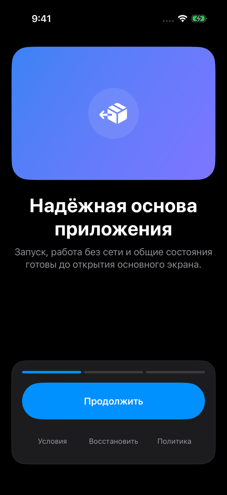
      </a>
      <br><strong>Onboarding</strong>
      <br><sub>App-owned контент · ATT только после первого слайда</sub>
    </td>
    <td align="center" width="33%">
      <a href="Documentation/Assets/README/Screenshots/paywall-light.png">
        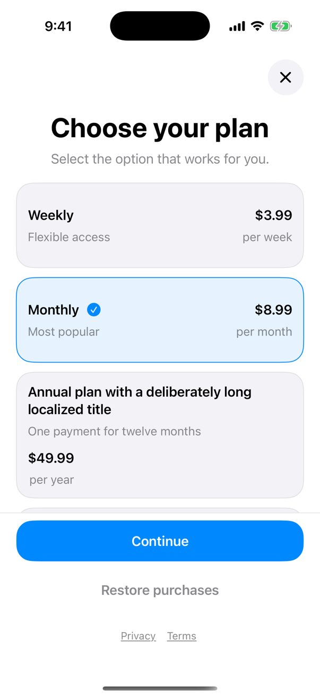
      </a>
      <br><strong>Adaptive paywall</strong>
      <br><sub>Provider order · длинные строки · sticky CTA</sub>
    </td>
    <td align="center" width="33%">
      <a href="Documentation/Assets/README/Screenshots/payment-methods-light.png">
        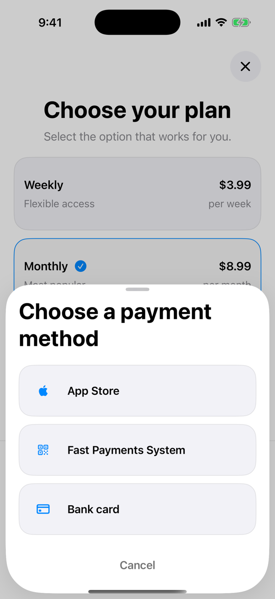
      </a>
      <br><strong>Payment methods</strong>
      <br><sub>App Store · СБП · банковская карта</sub>
    </td>
  </tr>
  <tr>
    <td align="center" width="33%">
      <a href="Documentation/Assets/README/Screenshots/paywall-empty-dark.png">
        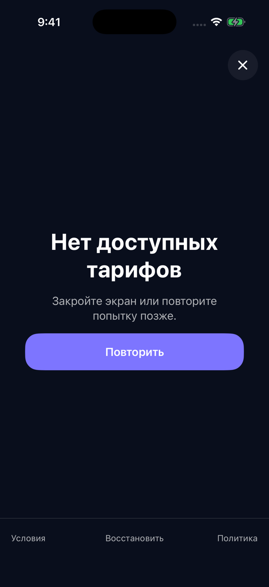
      </a>
      <br><strong>Empty</strong>
      <br><sub>0 продуктов · retry · restore · close</sub>
    </td>
    <td align="center" width="33%">
      <a href="Documentation/Assets/README/Screenshots/paywall-error-dark.png">
        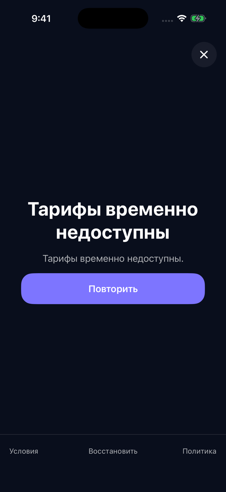
      </a>
      <br><strong>Error + retry</strong>
      <br><sub>Без raw SDK error и ложного premium</sub>
    </td>
    <td align="center" width="33%">
      <a href="Documentation/Assets/README/Screenshots/main-dark.png">
        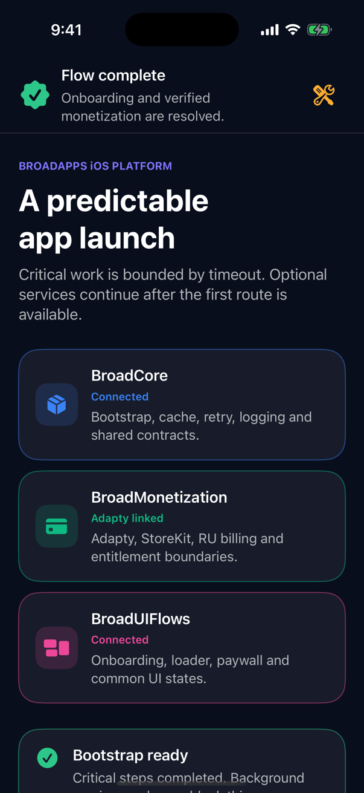
      </a>
      <br><strong>Verified main</strong>
      <br><sub>Доступ только после authoritative entitlement refresh</sub>
    </td>
  </tr>
</table>

> [!TIP]
> Хотите проверить конкретное состояние? Ниже есть готовые launch arguments
> для `empty`, `error`, `12 products`, payment sheet, pending purchase и
> entitlement-сценариев — без test target и без реального списания.

## Что получает приложение

| Задача | Готовое решение |
|---|---|
| Предсказуемо запустить приложение | bounded bootstrap, cache/offline и единые loading/error/retry states |
| Показать первый пользовательский flow | конфигурируемый onboarding → adaptive paywall → verified main |
| Подключить монетизацию | Adapty + StoreKit contracts, placements, experiments, RU billing и analytics |
| Не выдать доступ ошибочно | единый entitlement engine; `pending`, timeout и unresolved не становятся premium |
| Не копировать UI между проектами | общие SwiftUI-компоненты с app-owned текстами, assets, цветами и конфигами |
| Автоматически проверить результат | одна команда запускает Codex, полный iPhone/Xcode gate и независимую перепроверку |

## Текущая готовность

| Контур | Статус |
|---|---|
| Package и engineering gate | **PASS · 9 августа 2026** · два последовательных полных gate |
| Platform handoff | **READY** · локальная приёмка закрыта, интеграция приложений выполняется отдельно |
| Внедрение в реальные приложения | **OUT OF SCOPE** · выполнят app-разработчики после передачи |
| GitHub | **PUBLISHED** · [`vers_niiaz`](https://github.com/BroadApps-official/BroadCore/tree/vers_niiaz) |
| Version tag | **AFTER APPROVAL** · пока используйте branch dependency |

[Подробная матрица требований и доказательств →](Documentation/Traceability.md) ·
[Статус автоматической проверки →](AgentChecks/STATUS.md) ·
[История изменений →](CHANGELOG.md)

<a id="installation"></a>
## Подключить из GitHub

В Xcode откройте `File → Add Package Dependencies…`, вставьте:

```text
https://github.com/BroadApps-official/BroadCore.git
```

Выберите dependency rule `Branch`, укажите
`vers_niiaz` и добавьте нужному iPhone target три продукта:

- `BroadCore`;
- `BroadMonetization`;
- `BroadUIFlows`.

Если host сам описан через `Package.swift`:

```swift
dependencies: [
    .package(
        url: "https://github.com/BroadApps-official/BroadCore.git",
        branch: "vers_niiaz"
    )
]
```

Репозиторий приватный: у GitHub-аккаунта разработчика должен быть доступ к
организации `BroadApps-official`. После согласования version tag branch rule
будет заменён на обычную версию `from: "1.0.0"`.

## Запустить example за три команды

Требуются Xcode 16+ и Swift 6 toolchain. Скрипты точно фиксируют и отклоняют другие версии XcodeGen `2.45.4`, SwiftLint `0.62.2` и SwiftFormat `0.62.1`. Исходники компилируются в Swift 5 language mode, минимальная версия — iOS 17.

```bash
cd BroadAppsIOSPlatform
./Scripts/generate_example.sh
open Examples/BroadAppTemplate/BroadAppTemplate.xcodeproj
```

Запустите схему `BroadAppTemplate` на любом iPhone Simulator. Первый чистый
запуск показывает полный сценарий:

```text
launch → onboarding (3 слайда) → paywall → purchase / restore → main
```

Проверить весь package и example одной командой:

```bash
./Scripts/release_gate.sh
```

[Пошаговое подключение к приложению →](Documentation/GettingStarted.md)

<a id="automation"></a>
## 🤖 Один запуск: агент проверит и исправит

Если нужен не просто список ошибок, а готовый цикл «проверить → исправить →
перепроверить → объяснить», запустите:

```bash
./Scripts/agent_review_and_fix.sh
```

Дальше всё происходит автоматически:

1. Codex запускается с **полным доступом к Mac** — так
   Xcode и CoreSimulatorService работают без искусственных ограничений.
2. Агент читает постоянные правила из `AGENTS.md`, сам запускает полный local
   engineering gate и обе live Adapty-сборки — 5013 и 5109Codex.
3. Если что-то упало, агент находит причину, делает минимальное исправление
   только в `BroadAppsIOSPlatform` и снова запускает весь gate.
4. После ответа агента wrapper независимо повторяет Xcode/live gate. Если
   ошибка осталась, агент получает ещё один заход — максимум три.
5. После PASS сохраняется простой отчёт в
   `AgentChecks/AutomationReports/latest.md`: что найдено, что исправлено, какие
   файлы изменились и чем подтверждён результат.

Полный доступ нужен инструментам Xcode, но не расширяет рабочий scope агента:
референсные проекты и другие файлы Mac менять запрещено. Одного красивого
ответа агента для PASS недостаточно — wrapper подтверждает результат отдельно.

Обычный **Run** приложения в Xcode ничего из этого не запускает. Агент начинает
работу только по команде разработчика. Проверить установку и авторизацию без
изменения кода можно так:

```bash
./Scripts/agent_review_and_fix.sh --doctor
```

[Очень простая инструкция, схема и разбор ошибок →](Documentation/AgentAutomation.md)

<a id="architecture"></a>
## Цветовая карта

| Цвет | Владелец | Что находится внутри |
|---|---|---|
|  `#3B82F6` | `BroadCore` | bootstrap, cache/offline, retry, typed logging, общие состояния, ATT adapter |
|  `#10B981` | `BroadMonetization` | Adapty, StoreKit, entitlement, placements, remote config, RU billing, experiment attribution |
|  `#EC4899` | `BroadUIFlows` | AppFlow, onboarding, loader/error/retry, адаптивный paywall |
|  `#F59E0B` | Приложение | тексты, assets, реальные placement ID, URL, ключи, feature-флаги и composition root |
|  `#64748B` | Внешние системы | Adapty, StoreKit, основной backend и RU billing backend |

<picture>
  <source media="(prefers-color-scheme: dark)" srcset="Documentation/Assets/README/architecture-dark.svg">
  <source media="(prefers-color-scheme: light)" srcset="Documentation/Assets/README/architecture-light.svg">
  
</picture>

Полный граф зависимостей:

```text
Host App → BroadUIFlows
BroadUIFlows → BroadMonetization
BroadUIFlows → BroadCore
BroadMonetization → BroadCore
```

- `BroadCore` не знает о UI и монетизации.
- `BroadMonetization` не выпускает типы Adapty, StoreKit или HTTP DTO за границу Infrastructure.
- `BroadUIFlows` получает готовые use cases и ViewModel через `init`; внутри View нет SDK и DI-container.
- Приложение остаётся владельцем продуктовых решений и собирает зависимости через Swinject.

[Архитектура подробнее →](Documentation/Architecture.md) · [ADR о границах модулей →](Documentation/ADR/0001-module-boundaries.md)

## Где что лежит

<pre>
BroadAppsIOSPlatform
├── 🔵 <a href="Sources/BroadCore">Sources/BroadCore</a>                 domain-основа, bootstrap, cache, ATT, logging
├── 🟢 <a href="Sources/BroadMonetization">Sources/BroadMonetization</a>         paywall, purchase, entitlement, Adapty, RU billing
├── 🩷 <a href="Sources/BroadUIFlows">Sources/BroadUIFlows</a>              AppFlow, onboarding, loadable UI, adaptive paywall
├── 🟠 <a href="Examples/BroadAppTemplate">Examples/BroadAppTemplate</a>          локальное fixture-приложение без production credentials
├── 📘 <a href="Documentation">Documentation</a>                       подключение, контракты, ADR и manual QA
├── 🤖 <a href="AgentChecks">AgentChecks</a>                         инструкция auto-fix агента и его актуальный статус
├── 🛠️ <a href="Scripts">Scripts</a>                             agent cycle, format, lint, build и gates
├── 📝 <a href="CHANGELOG.md">CHANGELOG.md</a>                        изменения до будущего релиза 1.0.0
└── 📦 <a href="Package.swift">Package.swift</a>                       три library products и exact dependencies
</pre>

Внутри каждого модуля идите от правил к деталям: `Domain → Application → Data/Infrastructure`; UI и DI появляются только на внешней границе.

## Полный рабочий flow

<div align="center">
  
</div>

1. `BroadCore` выполняет критичные bootstrap-шаги с конечным timeout и открывает первый маршрут.
2. `BroadUIFlows` показывает конфигурируемый onboarding.
3. После onboarding загружается paywall для логического placement.
4. Пользователь выбирает любой eligible-продукт из реально пришедшего списка и доступный Apple/RU способ оплаты.
5. Purchase или restore сами по себе **не открывают premium**.
6. `EntitlementEngine` заново проверяет все настроенные авторитетные источники.
7. Только подтверждённый `.active` переводит flow на `main` с premium-доступом.

`.unresolved`, timeout, offline, pending и `completedButUnverified` не превращаются в `.inactive` и не выдают доступ.

<details open>
  <summary>Статическая версия схемы</summary>
  <br>
  <picture>
    <source media="(prefers-color-scheme: dark)" srcset="Documentation/Assets/README/full-flow-dark.svg">
    <source media="(prefers-color-scheme: light)" srcset="Documentation/Assets/README/full-flow-light.svg">
    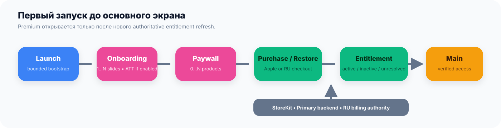
  </picture>
</details>

[AppFlow →](Documentation/AppFlow.md) · [Entitlement →](Documentation/Entitlements.md) · [ADR о доступе →](Documentation/ADR/0003-entitlement-authority.md)

## Три модуля

### 🔵 BroadCore

- ограниченный по времени bootstrap: critical и background шаги;
- typed cache с `fresh / stale / missing` и версионированием схемы;
- единый `LoadableState` для `idle / loading / loaded / empty / stale / error`;
- retry/timeout policies;
- закрытый typed logger без произвольных payload и raw errors;
- ATT repository + use case, но без автоматического вызова из loader.

### 🟢 BroadMonetization

- typed registry логических placements;
- загрузка Adapty paywall и remote config;
- все продукты в исходном порядке, включая одинаковые SKU;
- Apple purchase/restore contract с обязательной entitlement-проверкой;
- durable Apple pending/recovery и один app-wide financial gate для Apple/RU;
- трёхсоставный Entitlement Engine: Apple, основной backend, RU billing;
- storefront-gated RU billing;
- Adapty-managed обычные и cross-placement experiments;
- полностью опциональный special offer;
- typed analytics с дедупликацией lifecycle-событий.

### 🩷 BroadUIFlows

- корневой `launch → onboarding → initialPaywall → main`;
- onboarding с любым app-owned media;
- loader/error/empty/stale/retry компоненты;
- адаптивный paywall для 0, 1, 2, 12 или любого другого количества продуктов;
- sticky close/CTA/restore/legal actions;
- semantic accessibility hooks, light/dark tokens, Reduce Motion и адаптивный layout.

## Готовые recipe

<details>
  <summary><strong>🎨 Покрасить paywall в цвета приложения</strong></summary>

```swift
let base = BroadPaywallTheme.standard
let paywallTheme = BroadPaywallTheme(
    palette: .init(
        background: Color(uiColor: .systemBackground),
        surface: Color(uiColor: .secondarySystemBackground),
        primaryText: .primary,
        secondaryText: .secondary,
        accent: Color("BrandAccent"),
        actionForeground: .white,
        border: Color(uiColor: .separator),
        selectedBorder: Color("BrandAccent"),
        selectedSurface: Color("BrandAccent").opacity(0.12)
    ),
    typography: base.typography,
    metrics: base.metrics
)

BroadPaywallView(
    viewModel: paywallViewModel,
    theme: paywallTheme,
    productFormatter: BroadPaywallProductFormatter(),
    onClose: close,
    onCompleted: finish
)
```

Цвета остаются semantic и app-owned; бизнес-логика, press-effect и layout не меняются.
</details>

<details>
  <summary><strong>📱 Собрать onboarding из app-owned слайдов</strong></summary>

```swift
let onboarding = OnboardingConfiguration(
    pages: [
        OnboardingPageConfiguration(
            id: "welcome",
            title: String(localized: "onboarding.welcome.title"),
            subtitle: String(localized: "onboarding.welcome.subtitle"),
            media: OnboardingMediaDescriptor(identifier: "welcome-animation")
        ),
        OnboardingPageConfiguration(
            id: "benefit",
            title: String(localized: "onboarding.benefit.title"),
            media: OnboardingMediaDescriptor(identifier: "benefit-image")
        )
    ],
    continueTitle: String(localized: "common.continue"),
    completionTitle: String(localized: "onboarding.finish"),
    progressAccessibilityLabel: String(localized: "onboarding.progress"),
    trackingAuthorizationPolicy: .afterFirstSlide()
)
```

`identifier` только связывает Domain с app-owned renderer. ATT запросится после фактического появления первого слайда; Rate Us в этот массив не добавляется.
</details>

<details>
  <summary><strong>📊 Подключить monetization analytics без дублей</strong></summary>

```swift
let fanOut = CompositeMonetizationAnalytics(
    destinations: [
        AppProductAnalytics(),
        AppAttributionAnalytics()
    ]
)

let analytics = NonBlockingMonetizationAnalytics(
    destination: DeduplicatingMonetizationAnalytics(
        destination: fanOut
    )
)
```

Один `analytics` передаётся в paywall, purchase, restore, entitlement и RU composition. Deduplication стоит до fan-out, поэтому каждый destination получает одну и ту же очищенную последовательность. `AdaptyPaywallPresentationLifecycle` подключается отдельно: это provider show/release lifecycle, а не продуктовая аналитика приложения.

[Все события, поля, PII-правила и recording fixture →](Documentation/Analytics.md)
</details>

<a id="monetization"></a>
## Placements и общий резерв `main`

Платформа оперирует логическими идентификаторами:

```swift
.onboarding
.main
.settings
.feature
.tokens
.discount
.specialOffer
.custom("my-feature")
```

Конкретные Adapty placement ID задаёт приложение. В UI они не хардкодятся:

```swift
let placements = AdaptyPlacementRegistry(
    main: AdaptyPlacementID(rawValue: "app-main"),
    mappings: [
        .onboarding: AdaptyPlacementID(rawValue: "app-onboarding"),
        .settings: AdaptyPlacementID(rawValue: "app-settings"),
        .tokens: AdaptyPlacementID(rawValue: "app-tokens")
    ]
)
```

Для каждого запроса порядок строго такой:

```text
requested remote → requested cache → main remote → main cache → safe unavailable/empty
```

- `main` — единый fallback placement, а не копия requested placement.
- Requested и resolved placement всегда сохраняются раздельно для UI и аналитики.
- Кеши placements не смешиваются.
- При запросе самого `main` второй fallback не запускается.
- Источник резерва не обязан быть Adapty: контракт `PaywallRepositoryProtocol` допускает другой adapter.

[Вся схема монетизации →](Documentation/Monetization.md)

## Любое количество Adapty products

Платформа не фильтрует, не сортирует и не дедуплицирует продукты:

```text
provider products [A, B, A, C, ...]
                  ↓ 1:1
UI rows          [A, B, A, C, ...]
```

`ProductID` — SKU, а `ProductPresentationID` — уникальность конкретной строки. Поэтому два одинаковых SKU остаются двумя независимыми карточками. Выбор и purchase используют точный opaque `ProductReference`, а не пытаются заново найти продукт по SKU.
Если provider вернул malformed SKU, occurrence не исчезает: он получает
детерминированный bounded opaque surrogate без raw ID, `Money == nil` и
остаётся видимым, но disabled до исправления provider-конфига.

<div align="center">
  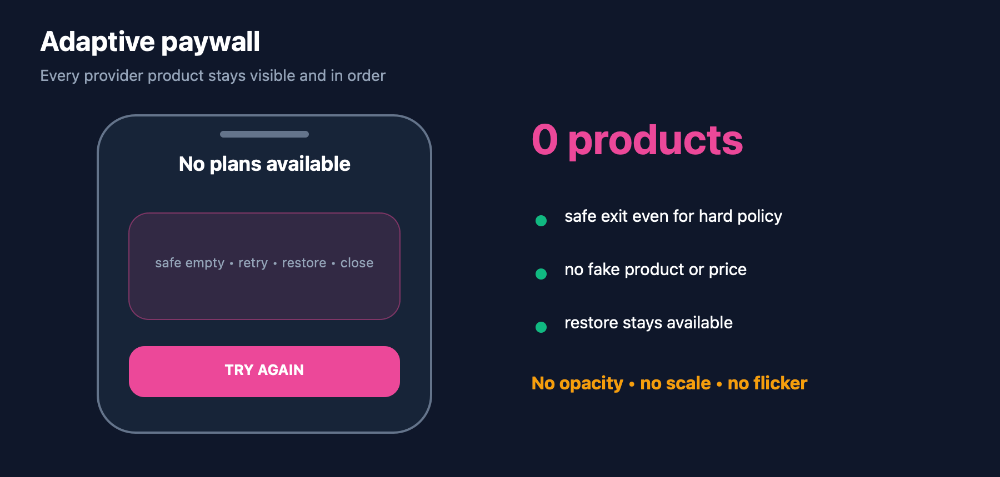
</div>

<table>
  <tr>
    <td align="center" width="25%">
      <a href="Documentation/Assets/README/Screenshots/paywall-empty-dark.png">
        
      </a>
      <br><strong>0 продуктов</strong>
      <br><sub>empty · retry · restore</sub>
    </td>
    <td align="center" width="25%">
      <a href="Documentation/Assets/README/Screenshots/paywall-one-light.png">
        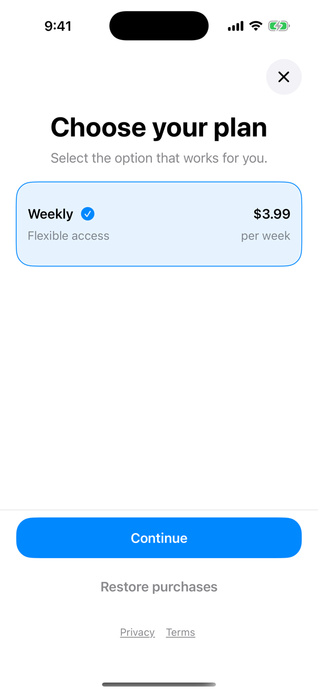
      </a>
      <br><strong>1 продукт</strong>
      <br><sub>выбирается автоматически</sub>
    </td>
    <td align="center" width="25%">
      <a href="Documentation/Assets/README/Screenshots/paywall-two-dark.png">
        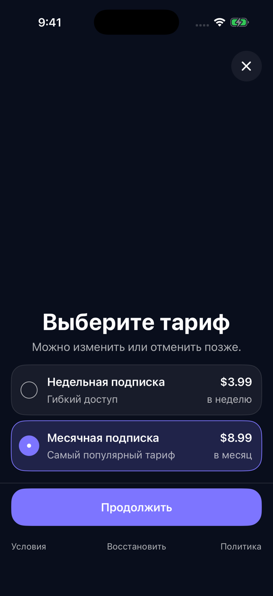
      </a>
      <br><strong>2 продукта</strong>
      <br><sub>provider order сохранён</sub>
    </td>
    <td align="center" width="25%">
      <a href="Documentation/Assets/README/Screenshots/paywall-many-dark.png">
        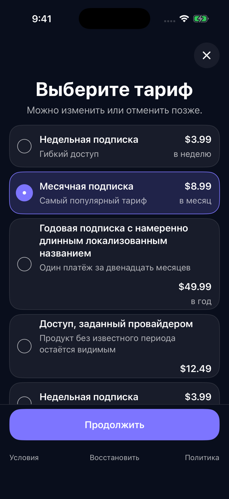
      </a>
      <br><strong>12 продуктов</strong>
      <br><sub>scroll + sticky footer</sub>
    </td>
  </tr>
</table>

На карточках и CTA нет `opacity`, `scale`, затемнения или мерцания при tap/purchase. Повторные касания блокируются логикой, а progress отображается отдельным индикатором.
Все product/actions/legal/close hit-area clamp-ятся минимум до `44×44`
немасштабируемых points; busy и durable pending делают product rows
semantic disabled без визуального dimming.

Массив может содержать продукты без корректной числовой цены, consumables и
unknown kinds — UI их не скрывает. Такая строка остаётся на своём месте и показывает
`Price unavailable`, но не выбирается автоматически, недоступна для выбора и не
активирует CTA. Generic checkout повторно проверяет eligibility до любого Apple/RU
вызова. Для tokens нужен отдельный host-owned durable exactly-once
fulfillment/ledger. Cached Adapty product также нельзя молча подменить: rehydration
требует exact variation, provider index, SKU и opaque commercial fingerprint
цены/периода/offer terms.

<details open>
  <summary>Статическая версия адаптивного paywall</summary>
  <br>
  <picture>
    <source media="(prefers-color-scheme: dark)" srcset="Documentation/Assets/README/adaptive-paywall-dark.svg">
    <source media="(prefers-color-scheme: light)" srcset="Documentation/Assets/README/adaptive-paywall-light.svg">
    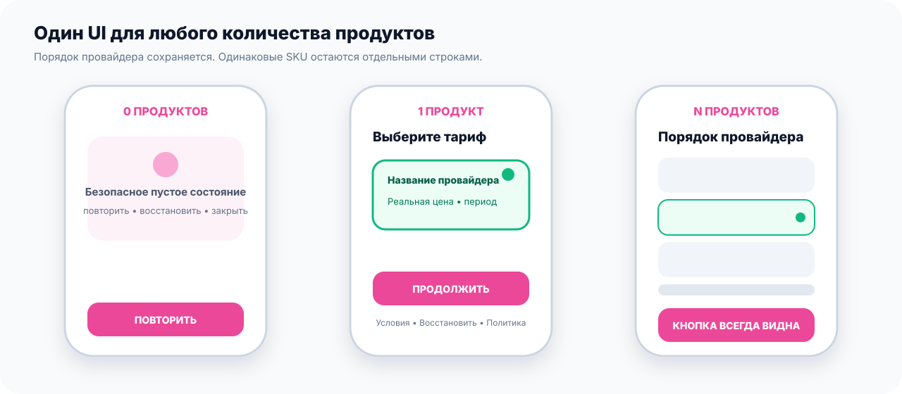
  </picture>
</details>

[Контракт paywall UI →](Documentation/PaywallUI.md)

## Ключевые правила, которые нельзя сломать

<details>
  <summary><strong>🎁 Special offer может полностью отсутствовать</strong></summary>

<br>

```swift
let specialOffer: SpecialOfferConfiguration? = nil
```

`nil` означает, что feature в приложении **не существует**. В этом режиме платформа:

- не запрашивает special-offer placement;
- не читает и не пишет cache/persistence;
- не запускает timer;
- не строит UI;
- не подставляет значения из `main` или старого remote config.

Если feature включена, fallback на `main` допустим только при enabled gate и `.verifiedFreshRemote` origin. Default Adapty API может скрыто вернуть SDK cache, поэтому он помечается `.providerCacheFallbackPossible`: обычный paywall показывается, но offer fail-closed. Для campaign проект подключает host-controlled fresh-remote repository. Crossed price/value, multiplier, badge, period и длительности остаются optional — платформа ничего не придумывает.

Если window duration отсутствует и в remote, и в host config, resolver возвращает `.eligible` **вместе с paywall**: offer можно показать без выдуманного countdown. Timed offer требует app-owned `SpecialOfferClock` с server-synchronized/rollback-safe временем; default намеренно fail-closed и не доверяет `Date()`. Trusted server `Date` захватывается вместе с monotonic instant, поэтому async persistence не добавляет время к campaign. Готовый payload передаётся в `PaywallViewModel(initialPayload:)`, поэтому placement не загружается второй раз. В `BroadPaywallConfiguration` передаётся только opaque `result.presentationAuthorization`, привязанный к конкретному `PaywallPresentationID`. UI показывает только реально пришедшие badge/crossed/multiplier/period, а countdown использует monotonic deadline и не продлевается переводом часов. Ошибка time source, чтения или записи lifecycle-state скрывает offer.

[Special offer →](Documentation/SpecialOffer.md) · [Remote config →](Documentation/RemoteConfig.md)

</details>

<details>
  <summary><strong>🛡️ ATT и Rate Us — разные правила</strong></summary>

<br>

> [!IMPORTANT]
> ATT никогда не вызывается в loader/bootstrap. Запрос возможен только после того, как первый onboarding-слайд уже появился, окно видно, приложение активно и системный статус остаётся `.notDetermined`.

- `Rate Us` экран и системный review prompt **разрешены вне onboarding**.
- Внутри onboarding нет ни Rate Us слайда, ни review prompt.
- Если ATT не нужен, используется `.disabled`; это default.
- Если включён `.afterFirstSlide`, приложение обязано добавить локализованный `NSUserTrackingUsageDescription`.
- Неположительный ATT delay без краша fail-closed превращает policy
  в `.disabled`; после валидного delay окно повторно проверяется live по
  `isHidden`, `alpha` и foreground-active scene прямо перед request.

[Onboarding и ATT →](Documentation/OnboardingAndATT.md) · [ADR с точным решением →](Documentation/ADR/0002-att-and-rate-us.md)

</details>

<details>
  <summary><strong>🇷🇺 RU billing включается только через App Store storefront</strong></summary>

<br>

RU способы оплаты появляются только когда одновременно выполнены три условия:

1. приложение явно включило RU billing;
2. verified-fresh remote decision равен `.enabled` **или** decision действительно `.absent` и приложение явно выбрало host-owned fallback-policy `.enabled`;
3. текущий **App Store storefront** равен `RU` или `RUS`.

Язык, `Locale.current`, регион устройства, IP и timezone не участвуют в eligibility. `Locale(identifier: "ru_RU")` используется только для форматирования уже полученной цены в RUB.

RU parser проверяет все aliases: любой `false` — kill switch `.disabled`,
malformed/conflicting значения без `false` — `.invalid`; оба состояния fail-closed.
Cached/unqualified `.enabled` не авторизует оплату и не включает host fallback.
Fallback `.enabled` применяется только когда ни одного RU alias действительно нет.

Открытие внешней страницы оплаты не выдаёт premium. После возврата приложение опрашивает backend и запускает новый общий entitlement refresh. Если RU billing отключён или не настроен, `.ruBilling` source вообще не добавляется в engine.

Production-chain собирается через `RUBillingCompositionFactory`. Example намеренно использует `DisabledRUBillingCheckoutMethodsUseCase` и не добавляет RU source: никаких fake URL, keys или вечного unresolved.

Apple purchase, restore и RU checkout обязаны использовать один `MonetizationOperationGate`, созданный приложением на весь процесс. Перед открытием Apple sheet или RU browser flow platform атомарно сохраняет app-wide pending record. Ask-to-Buy, неизвестный результат provider-а, cold launch и смена login identity не освобождают этот blocker и не разрешают второй платёж. Подробная production-сборка и StoreKit recovery описаны в [Monetization](Documentation/Monetization.md#6-purchase-restore-и-durable-recovery).

[RU billing →](Documentation/RUBilling.md) · [ADR о безопасных fallback →](Documentation/ADR/0004-ru-billing-fallback.md)

</details>

<details>
  <summary><strong>🔐 Безопасность по умолчанию</strong></summary>

<br>

- В tracked example configs лежат рабочие client-visible Adapty public SDK key,
  bundle ID, access level и placements 5013/5109.
- Backend credentials, bearer, private keys и payment URL приходят из host app
  и не кешируются платформой.
- HTTP adapters требуют HTTPS, запрещают redirects/cookies/URL credentials и ограничивают размер ответа.
- Authorization привязан к конкретному entitlement subject и скрыт от reflection.
- Typed logger и analytics не принимают raw payload, email, bearer, payment URL и SDK error text.
- `active` нельзя получить из timeout, stale inactive, непроверенной StoreKit transaction или одного факта оплаты.

[Security guide →](Documentation/Security.md)

</details>

## Example и ручные сценарии

Обычный чистый запуск показывает три onboarding-слайда, adaptive paywall и main после подтверждённой fixture-покупки. Progress сохраняется; чтобы снова увидеть первый запуск, удалите приложение из Simulator.

<details>
  <summary><strong>🧪 Все launch arguments и команда запуска</strong></summary>

<br>

Основные launch arguments:

| Аргумент | Что проверить |
|---|---|
| `-app-flow-main-only` | только main, без onboarding/paywall |
| `-app-flow-paywall-only` | paywall без onboarding |
| `-live-adapty` | реальный Adapty catalog; purchase/restore fail-before-charge по company policy |
| `-analytics-fixture` | paywall-only flow и bounded typed recorder в debug-панели main |
| `-tracking-disabled` | полный onboarding без системного ATT prompt для UI smoke |
| `-paywall-empty` | ноль продуктов, safe empty + retry/restore/close |
| `-paywall-one-product` | один продукт и безопасный automatic selection |
| `-paywall-two-products` | два продукта в исходном provider order |
| `-paywall-many-products` | 12 продуктов и sticky controls |
| `-paywall-payment-methods` | UI-only sheet Apple/SBP/Card; RU checkout остаётся безопасно выключен |
| `-paywall-failure` | safe error без raw SDK text |
| `-paywall-hard` | remote hard policy и close rules |
| `-purchase-cancelled` | cancelled не считается ошибкой или покупкой |
| `-purchase-pending` | pending не выдаёт premium |
| `-purchase-failure` | безопасная retryable ошибка |
| `-restore-nothing` | restore без найденного доступа |
| `-restore-failure` | безопасная ошибка restore |
| `-entitlement-active` | authoritative active → main |
| `-entitlement-inactive` | все источники inactive → paywall |
| `-entitlement-unknown` | unresolved → без ложного premium |
| `-entitlement-store-kit-fallback` | Adapty unresolved, StoreKit active |
| `-entitlement-timeout` | поздний active игнорируется после deadline |

Пример запуска уже установленного приложения:

```bash
xcrun simctl terminate booted com.broadapps.platform.template
xcrun simctl launch booted com.broadapps.platform.template \
  -app-flow-paywall-only \
  -paywall-many-products
```

Bootstrap fixtures (`-bootstrap-degraded`, `-bootstrap-failed-once`, `-bootstrap-seed-cache`, `-bootstrap-stale-cache`) подробно описаны в [Bootstrap.md](Documentation/Bootstrap.md).

</details>

### Рабочие Adapty-конфигурации в Git

Рабочие bundle ID, Adapty public SDK key, access level и placements для обоих
references хранятся в project configuration и
попадают в Git. Ничего импортировать перед запуском не нужно.

В Xcode выберите одну из схем:

- `BroadAppTemplateLiveAdapty5013`;
- `BroadAppTemplateLiveAdapty5109Codex`.

Этот режим проверяет activation/load/show настоящего Adapty catalog. StoreKit
purchase и restore недоступны по правилам компании и возвращают безопасную
ошибку до финансового SDK-вызова. Default `BroadAppTemplate` продолжает
использовать локальные purchase/restore fixtures.

[Полная процедура передачи и ограничения →](Documentation/PlatformHandoff.md)

[Короткая памятка именно по example →](Examples/BroadAppTemplate/README.md)

## Если что-то пошло не так

| Симптом | Безопасное поведение платформы | Что проверить в host app |
|---|---|---|
| Paywall пуст | Empty-state, retry, restore и safe close policy | requested/main placement mappings, Adapty products и network |
| Paywall не загрузился | Safe localized error; raw SDK text не показывается | SDK activation, `main` fallback, cache policy, safe message catalog |
| Purchase возвращает pending | Premium не выдаётся, paywall остаётся | StoreKit approval/RU pending session и lifecycle return |
| После cold launch Apple purchase остаётся pending | Второй purchase/restore/RU checkout заблокирован | app-wide gate, durable cache, `Transaction.updates` bridge и foreground recovery |
| SDK завершил purchase, premium нет | `completedButUnverified`, без перехода на main | свежесть и subject в Apple/backend/RU entitlement authorities |
| Entitlement unresolved | Не притворяется inactive и не выдаёт premium | authorization, timeout, network и registered sources |
| RU методы не видны | Остаётся Apple-only checkout | live App Store storefront, host gate, remote gate и exact catalog mapping |
| Critical bootstrap не готов | Typed failed/degraded state с retry | finite timeout, dependency availability и safe cache |

<details>
  <summary><strong>Troubleshooting для сборки</strong></summary>

- `XcodeGen version mismatch` — нужен ровно `2.45.4`; сверьте `xcodegen --version`.
- `SwiftLint version mismatch` — нужен ровно `0.62.2`; сверьте `swiftlint version`.
- SwiftFormat не найден — один раз запустите `./Scripts/install_swiftformat.sh`; installer проверит checksum.
- macOS бесконечно показывает `“rg” Not Opened` — остановите команду через
  `Control+C`, верните файл из Trash, если удалили его, и выберите для него
  `Control-click → Open → Open`. Наша автоматика предпочитает рабочий
  `/opt/homebrew/bin/rg`; проверить это можно через `./Scripts/agent_review_and_fix.sh --doctor`.
- `PrivacyInfo.xcprivacy` не найден в `.app` — не копируйте файл вручную; убедитесь, что host подключает `BroadCore` как package product, и повторите device build.
- ATT prompt не появился — проверьте `.afterFirstSlide`, `NSUserTrackingUsageDescription`, status `.notDetermined`, active scene и видимое window; loader не должен его вызывать.
- RU checkout не возобновился после Safari — передайте transition `.active` в `RUPaymentReturnCoordinator.applicationDidBecomeActive()` и убедитесь, что return coordinator/PaywallViewModel получили один `MonetizationOperationGate`; terminal status сам обновит CTA, но premium открывает только `.active`.
- Ask-to-Buy/неопределённый Apple result не восстановился — listener `Transaction.updates` должен стартовать до активации Adapty, а `PendingApplePurchaseCoordinator.applicationDidBecomeActive()` вызываться при launch и каждом переходе сцены в `.active`; bridge не должен вызывать `finish()`.
- SwiftPM показывает старый dependency graph — в Xcode выполните `File → Packages → Resolve Package Versions`, затем снова `./Scripts/build.sh`.

</details>

<a id="documentation"></a>
## Карта документации

| Хочу сделать | Открыть |
|---|---|
| Подключить package впервые | [Getting Started](Documentation/GettingStarted.md) |
| Запустить авто-проверку и исправление | [Agent Automation](Documentation/AgentAutomation.md) |
| Понять слои и зависимости | [Architecture](Documentation/Architecture.md) · [ADR-0001](Documentation/ADR/0001-module-boundaries.md) |
| Собрать monetization composition root | [Monetization](Documentation/Monetization.md) |
| Настроить placements/remote keys | [Remote Config](Documentation/RemoteConfig.md) |
| Настроить purchase entitlement | [Entitlements](Documentation/Entitlements.md) · [Monetization Domain](Documentation/MonetizationDomain.md) |
| Подключить RU backend | [RU Billing](Documentation/RUBilling.md) |
| Настроить onboarding и ATT | [Onboarding & ATT](Documentation/OnboardingAndATT.md) |
| Собрать adaptive paywall | [Paywall UI](Documentation/PaywallUI.md) |
| Включить special offer | [Special Offer](Documentation/SpecialOffer.md) |
| Настроить Adapty experiments | [Experiments](Documentation/Experiments.md) |
| Подключить monetization analytics | [Analytics](Documentation/Analytics.md) |
| Перенести существующий проект | [Migration Guide](Documentation/MigrationGuide.md) |
| Провести security review | [Security](Documentation/Security.md) |
| Подготовить платформу к передаче | [Platform Handoff](Documentation/PlatformHandoff.md) |
| Сверить требования и текущую готовность | [Traceability](Documentation/Traceability.md) |
| Проверить cache/offline | [Caching & Offline](Documentation/CachingAndOffline.md) |
| Проверить loader/error/retry | [Loadable State](Documentation/LoadableState.md) · [Loadable UI](Documentation/LoadableUI.md) |

## Перед передачей проекта

```bash
./Scripts/install_swiftformat.sh # один раз: локальный SwiftFormat 0.62.1 с checksum-проверкой
./Scripts/format.sh --lint       # проверка форматирования без изменения файлов
./Scripts/format.sh              # применить форматирование
./Scripts/lint.sh                # exact SwiftLint 0.62.2 + architecture
./Scripts/build.sh               # strict package + Debug/Release simulator + Release iphoneos
./Scripts/release_gate.sh        # весь local engineering gate одной командой
./Scripts/agent_gate.sh          # local gate + обе live Adapty configurations, без исправлений
./Scripts/agent_review_and_fix.sh # Codex проверит, исправит, перепроверит и напишет отчёт
```

После автоматических проверок пройдите manual fixtures из соответствующих документов. Ни один этап не требует test target, StoreKit sandbox, physical-device accessibility matrix, signed `.ipa` или host attestation. Реальный scope передачи описан в [Platform Handoff](Documentation/PlatformHandoff.md).
