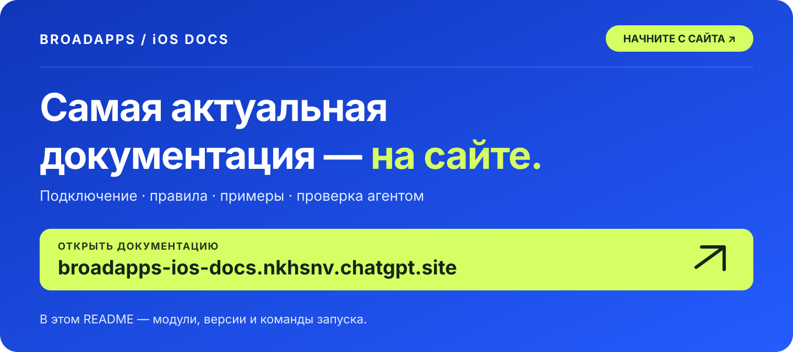
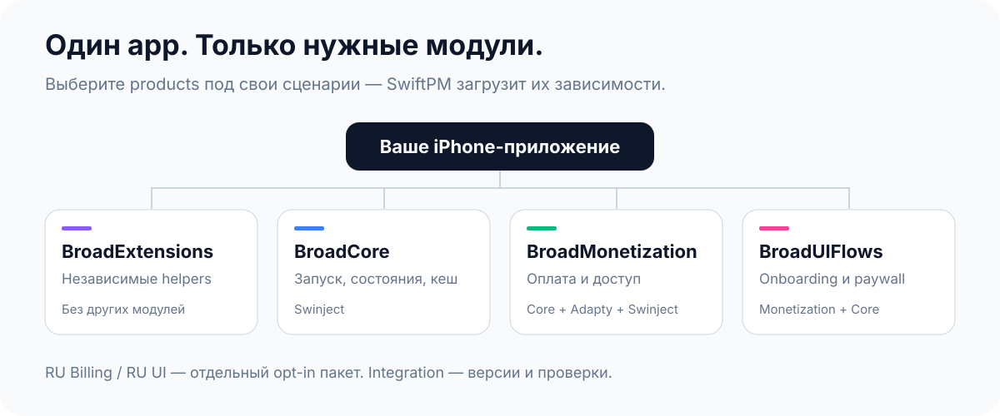
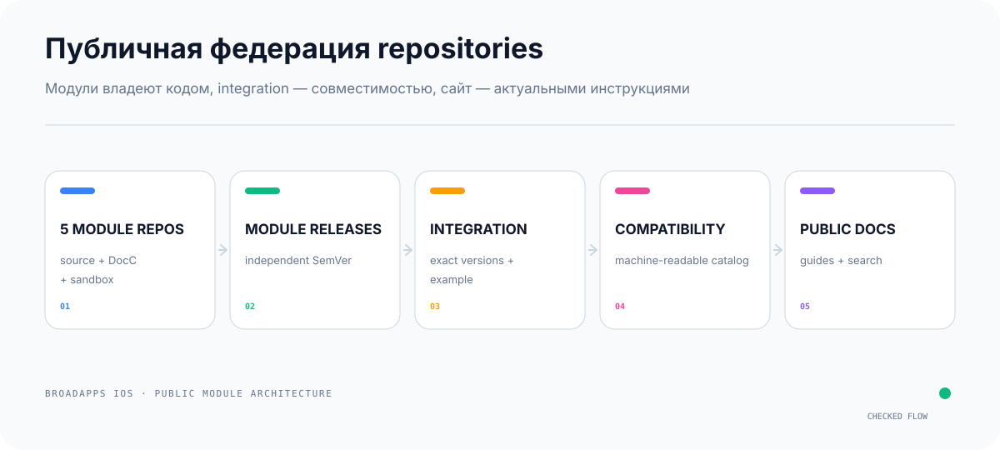
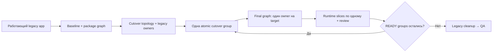
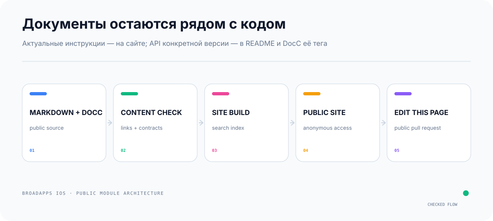
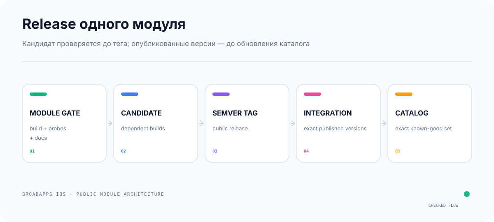
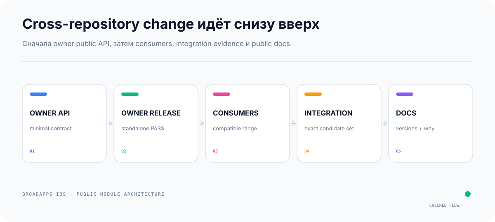

# BroadApps iOS Platform

<p align="center">
  <strong>Публичные Swift-модули для iPhone-приложений</strong><br>
  Core · Monetization · UI Flows · Extensions
</p>

<p align="center">
  <a href="https://broadapps-ios-docs.nkhsnv.chatgpt.site" title="Открыть BroadApps iOS Docs">
    <picture>
      <source media="(prefers-color-scheme: dark)" srcset="Documentation/Assets/README/hero-dark.svg">
      <source media="(prefers-color-scheme: light)" srcset="Documentation/Assets/README/hero-light.svg">
      
    </picture>
  </a>
</p>

<p align="center">
  <a href="https://broadapps-ios-docs.nkhsnv.chatgpt.site"></a>
  <a href="https://broadapps-ios-docs.nkhsnv.chatgpt.site/search"></a>
  <a href="https://broadapps-ios-docs.nkhsnv.chatgpt.site/docs/getting-started"></a>
</p>

> [!TIP]
> **🌐 Посмотрите публичный сайт:** на нём есть выбор модулей, compatibility,
> migration guides и поиск по всей документации.

<p align="center">
  <a href="Documentation/GettingStarted.md">Быстрый старт</a>
  ·
  <a href="Documentation/FederatedRepositories.md">Карта repositories</a>
  ·
  <a href="CHANGELOG.md">Changelog</a>
</p>

> [!IMPORTANT]
> Host app подключает **любой нужный модуль**. Обязательного
> `BroadPlatform` или другого umbrella package нет.

BroadApps iOS Platform даёт проверяемую основу для запуска,
состояний, onboarding, paywall, Adapty, StoreKit, entitlement, RU Billing,
покупок и готовых SwiftUI-flow. Тексты, assets, real IDs, keys, URLs,
backend-ручки и product decisions остаются в конкретном приложении.

---

## С чего начать

| Если вам нужно | Откройте |
|---|---|
| За 5 минут понять, какой product подключать | раздел [«Что подключать»](#что-подключать) ниже |
| Подключить первый модуль к host app | [Getting Started на сайте](https://broadapps-ios-docs.nkhsnv.chatgpt.site/docs/getting-started) |
| Xcode просит GitHub password или доступ к Keychain | [Public package access](https://broadapps-ios-docs.nkhsnv.chatgpt.site/docs/public-package-access) |
| Найти правило по Special Offer, entitlement, cache или release | [поиск по публичной документации](https://broadapps-ios-docs.nkhsnv.chatgpt.site/search) |
| Перенести существующее приложение со старой платформы | [Legacy migration](https://broadapps-ios-docs.nkhsnv.chatgpt.site/docs/legacy-app-migration) |
| Проверить совместимые версии | [Compatibility catalog](https://broadapps-ios-docs.nkhsnv.chatgpt.site/docs/compatibility) |
| Изменить API конкретного модуля | README и DocC в repository этого модуля |

> [!TIP]
> Начиная с platform set `1.0.0`, Core, Extensions, Monetization и UIFlows
> выпускаются отдельно. Integration repository хранит проверенный набор
> версий, но host app не подключает его как dependency.

### Swift 5 и SwiftPM 6.0 — это не одно и то же

- production sources собираются в **Swift 5 language mode**;
- host example явно использует `SWIFT_VERSION = 5.0`;
- `// swift-tools-version: 6.0` в `Package.swift` — версия формата manifest и
  SwiftPM toolchain, а не перевод исходников на Swift 6 language mode;
- для package resolve нужен toolchain, понимающий SwiftPM 6.0, но app target
  остаётся в Swift 5 mode.

Точные значения для проверенного набора хранятся в
[`Compatibility/current.yml`](Compatibility/current.yml): отдельно
`swift_language_mode` и `swift_tools`.

---

## Что подключать

<picture>
  <source media="(prefers-color-scheme: dark)" srcset="Documentation/Assets/README/platform-module-selection-dark.svg">
  <source media="(prefers-color-scheme: light)" srcset="Documentation/Assets/README/platform-module-selection-light.svg">
  
</picture>

### Идея новой архитектуры

Host app больше не зависит от общего изменяемого «комбайна». Код принадлежит
маленьким module repositories: каждый module можно ревьюить и выпускать
отдельно, а integration repository доказывает, что конкретные версии работают
вместе. Documentation repository добавляет поиск по cross-module guides, но не
забирает API docs у владельца модуля.

| Раньше | Теперь | Почему лучше |
|---|---|---|
| Одна большая область изменений | Core, Extensions, Monetization и UIFlows разделены | Review можно ограничить изменяемым module repository |
| Release затрагивает всю платформу | У каждого module свой SemVer | Backward-compatible fix можно выпустить в owner module; dependent gates всё равно повторяются |
| Host получает весь umbrella | Host выбирает нужные products напрямую | Меньше dependencies и скрытых side effects |
| Совместимость приходилось угадывать | Integration фиксирует exact known-good set | Есть воспроизводимый пример и clean-runner evidence |
| Документацию трудно найти | README направляет, сайт ищет, DocC описывает tag | Нет одной огромной инструкции и второй копии API |

Главная идея: **module repository владеет кодом и release, host app — своими
решениями, integration — совместимостью, сайт — навигацией и поиском**.

| Задача host app | Подключить | Что придёт транзитивно |
|---|---|---|
| Hex Color, fonts, keyboard dismiss, swipe-back | `BroadExtensions` | ничего |
| Bootstrap, cache, state, retry, logging, ATT boundary | `BroadCore` | Swinject |
| Свой UI поверх purchase/entitlement | `BroadMonetization` | Core, Adapty, Swinject |
| Готовые onboarding, AppFlow и paywall | `BroadUIFlows` | Monetization, Core, Adapty, Swinject |
| Extensions плюс любой flow | нужный product + `BroadExtensions` | по graph выше |

Если app импортирует public API нижележащего модуля напрямую,
этот product тоже указывается в app target.

[Полная матрица выбора модуля →](https://broadapps-ios-docs.nkhsnv.chatgpt.site/docs/module-selection)

## Целевые public repositories

<picture>
  <source media="(prefers-color-scheme: dark)" srcset="Documentation/Assets/README/federated-repositories-dark.svg">
  <source media="(prefers-color-scheme: light)" srcset="Documentation/Assets/README/federated-repositories-light.svg">
  
</picture>

| Repository | Роль | Подключается host app |
|---|---|---:|
| [`broad-extensions-ios`](https://github.com/BroadApps-official/broad-extensions-ios) | `BroadExtensions` · [`1.0.0`](https://github.com/BroadApps-official/broad-extensions-ios/releases/tag/1.0.0) | да, по надобности |
| [`broad-core-ios`](https://github.com/BroadApps-official/broad-core-ios) | `BroadCore` · [`1.0.0`](https://github.com/BroadApps-official/broad-core-ios/releases/tag/1.0.0) | да, по надобности |
| [`broad-monetization-ios`](https://github.com/BroadApps-official/broad-monetization-ios) | `BroadMonetization` · [`1.0.0`](https://github.com/BroadApps-official/broad-monetization-ios/releases/tag/1.0.0) | да, по надобности |
| [`broad-ui-flows-ios`](https://github.com/BroadApps-official/broad-ui-flows-ios) | `BroadUIFlows` · [`1.0.0`](https://github.com/BroadApps-official/broad-ui-flows-ios/releases/tag/1.0.0) | да, по надобности |
| [`broad-platform-integration`](https://github.com/BroadApps-official/broad-platform-integration) | exact versions, example, cross-module gate · [`1.0.0`](https://github.com/BroadApps-official/broad-platform-integration/releases/tag/1.0.0) | нет, это catalog/evidence |
| [`broad-docs`](https://github.com/BroadApps-official/broad-docs) | публичный сайт и cross-module guides | нет |

> [!NOTE]
> Этот repository является integration-контуром: он фиксирует проверенные
> exact versions, собирает целостный example и не является обязательной
> dependency host-приложения. Актуальный набор лежит в
> [`Compatibility/current.yml`](Compatibility/current.yml).

[Архитектурное решение и почему мы так делаем →](Documentation/ADR/0006-federated-public-repositories.md)

---

## Быстрый старт

### 1. Выберите product

Начните с таблицы выше. Не добавляйте Monetization или UIFlows «на будущее»:
это увеличивает graph, SDK scope и область review.

### 2. Добавьте repository в Xcode

```text
File → Add Package Dependencies…
```

Выберите URL repository модуля и version из compatibility catalog.
Добавьте product нужному iPhone target.

Если host — Swift Package:

```swift
dependencies: [
    .package(
        url: "https://github.com/BroadApps-official/broad-core-ios.git",
        from: "1.0.0"
    )
]
```

Public module repositories читаются по HTTPS **без GitHub account, password,
token или API key**. Окно `git-credential-osxkeychain` обычно означает, что
host project всё ещё ссылается на старый private URL
`BroadApps-official/BroadCore` или использует сохранённое Git-перенаправление.
Не добавляйте секрет в app: отмените запрос и замените package reference на
нужный `broad-*-ios` URL. [Диагностика и clean-machine проверка →](https://broadapps-ios-docs.nkhsnv.chatgpt.site/docs/public-package-access)

Release-проект должен ссылаться на опубликованный SemVer tag из
compatibility catalog, а не на branch или локальную checkout-папку.

`from: "1.0.0"` разрешает совместимые версии до следующего major. Для точного
воспроизведения verified set или на время legacy migration выберите exact
catalog version; фактический результат resolve фиксирует `Package.resolved`.

### 3. Оставьте app-owned данные в app

| В host app | В shared module |
|---|---|
| real API keys и public SDK keys | typed configuration contracts |
| provider placement IDs | logical placements и fallback policy |
| bundle ID, SKU catalog, legal URLs | provider-neutral models |
| strings, assets, design tokens | reusable state/flow |
| backend paths, auth и DTO adapters | repository/use case boundaries |
| feature switches и product decisions | safe default/fail-closed behavior |

Secrets, bearer tokens, payment URLs, receipts/JWS и user data не попадают
ни в public repository, ни в README, ни в fixture-логи.

<a id="app-configuration"></a>
### 4. Соберите composition root

Composition root — единственное место, где host app:

1. читает app-owned configuration;
2. создаёт adapters, repositories и use cases;
3. регистрирует assemblies только подключённых модулей;
4. передаёт ViewModel в View через `init`.

Порядок, если все три assemblies нужны:

```swift
let assembler = Assembler([
    BroadCoreAssembly(/* app-owned dependencies */),
    BroadMonetizationAssembly(/* engine and services */),
    BroadUIFlowsAssembly()
])
```

View не вызывает `resolver.resolve(...)`, не создаёт repository и не общается
с Adapty/StoreKit/backend напрямую.

### 5. Соберите iPhone app

```bash
xcodebuild \
  -project MyApp.xcodeproj \
  -scheme MyApp \
  -sdk iphonesimulator \
  -configuration Debug \
  CODE_SIGNING_ALLOWED=NO \
  build
```

Platform scope:

- iOS 17+;
- iPhone-only, `TARGETED_DEVICE_FAMILY = 1`;
- iPad, Mac, Mac Catalyst и visionOS не входят в обязательную матрицу;
- Signing Team не нужен для Simulator/generic unsigned compile.

[Полный Getting Started →](Documentation/GettingStarted.md)

---

## Если приложение уже сделано на старой платформе

Не создавайте новое приложение и не переписывайте рабочий flow целиком.
Сначала снимите baseline и классифицируйте package graph. Затем переключайте
одну cutover group: это либо независимый boundary, либо минимальная atomic
group из нескольких конфликтующих references. Runtime behavior после cutover
всё равно переносится по одному вертикальному срезу.



| Подход | Когда выбирать | Отдельная инструкция |
|---|---|---|
| Вручную | Разработчик сам анализирует graph, меняет package references и проверяет каждый flow | [Ручная миграция старого приложения](Documentation/MigrationGuide.md) |
| Через ИИ | Нужен агент, который сам проведёт audit/plan/switch/slice/cleanup, но будет останавливаться на review | [Конкретная staged-инструкция для Codex/Claude](Documentation/LegacyAppMigrationAgent.md) |

Общие правила: не линковать old/new packages с одинаковым Swift module, не
переносить app-owned configuration в public package, брать версии из
`Compatibility/current.yml` и удалять legacy source только после поиска usages,
сборок и developer review.

[Открыть legacy migration на сайте →](https://broadapps-ios-docs.nkhsnv.chatgpt.site/docs/legacy-app-migration)

---

<a id="agent-setup"></a>
## 🤖 Вариант A: сделать приложение через Codex или Claude

Этот раздел — общий staged workflow для нового приложения/нового feature. Для
перехода уже работающего legacy app используйте отдельную AI-инструкцию выше.

Агент не должен получать один монолитный prompt «сделай всё». Работа идёт
по проверяемым stages:

```text
0 PREFLIGHT → 1 PLAN → 2 SKELETON → 3 ONE SLICE
            → 4 FUNCTIONAL → 5 VISUAL → 6 ACCEPTANCE
```

| Документ | Единственная роль |
|---|---|
| [Agent Preflight](Documentation/AgentPreflight.md) | Canonical правила и единственный Stage 0 prompt |
| [Integration Plan](Documentation/Templates/AppIntegrationPlan.md) | Screens, API, ownership и `BLOCKED` до кода |
| [App Creation Workflow](Documentation/AppCreationWorkflow.md) | Порядок stages, stop rules и checkpoints |
| [Agent Prompt Pack](Documentation/AgentPromptPack.md) | Дословное зеркало Stage 0 плюс prompts stages 1–6 и resume |

Обязательные checkpoints:

- `PLAN REVIEW REQUIRED`;
- `SKELETON REVIEW REQUIRED`;
- `SLICE REVIEW REQUIRED`;
- `FUNCTIONAL REVIEW REQUIRED`;
- `VISUAL REVIEW REQUIRED`;
- `READY FOR QA`.

Reference-проекты можно изучать, но нельзя менять, копировать из них
credentials или переносить их архитектуру без аудита.

<a id="manual-setup"></a>
## 🛠️ Вариант B: собрать приложение вручную

Требования те же, меняется только исполнитель:

1. заполнить Integration Plan;
2. создать skeleton с одним composition root;
3. делать один vertical slice за раз;
4. проверять loading/content/empty/error/retry и duplicate actions;
5. собирать Debug и Release для iPhone;
6. пройти functional, visual и acceptance review;
7. подготовить [Project Delivery](Documentation/ProjectDelivery.md) для QA.

[Памятка разработчика по слоям, UI и handoff →](README.dev.md)

---

## Критические runtime-правила

### Onboarding, ATT и Rate Us

- количество слайдов равно `OnboardingConfiguration.pages.count`;
- Три слайда в `BroadAppTemplate` — только демонстрационный пример, а не лимит;
- ATT не вызывается на loader, в bootstrap или `init`;
- ATT разрешён только после фактического появления первого слайда;
- Rate Us разрешён в app, но не внутри onboarding;
- `.disabled` отключает flow без ATT.

[Полный contract →](Documentation/OnboardingAndATT.md)

### Paywall, purchase и entitlement

- paywall принимает 0, 1 или любое число products;
- products не фильтруются, не сортируются и не объединяются;
- product card не мерцает, не затемняется и не уменьшается при тапе;
- purchase/restore response сам не открывает premium;
- premium даёт только новая подтверждённая entitlement-проверка;
- timeout/offline/invalid/unverified оставляют статус `unresolved`;
- pending не превращается в success или fail по timeout.

[Монетизация →](Documentation/Monetization.md) ·
[Доступ →](Documentation/Entitlements.md) ·
[Обрыв сети →](Documentation/NetworkInterruptions.md)

### 🎁 Special Offer — только второй paywall

```text
subscription paywall
        ↓ крестик без purchase
Special Offer resolver
        ↓ special_offer = true из resolved provider payload
second paywall
```

Confirmed purchase/restore первого paywall ведёт в main и обходит downsell.

Претензия «блок идёт до парсинга subscriptions» обработана разделением capability:

- `special_offer` может быть разрешён текущим provider-managed Adapty payload,
  включая SDK cache и Dashboard fallback;
- `ru_pay` сохраняет более строгое финансовое правило и требует
  `.verifiedFreshRemote`;
- persistent cache `BroadMonetization` не может заново включить ни один
  чувствительный gate;
- gate читается из фактически resolved placement; `main` участвует только
  при реальном fallback;
- purchase использует raw product из того же registry и не перезагружает
  paywall перед оплатой.

[Полное объяснение Special Offer на публичном сайте →](https://broadapps-ios-docs.nkhsnv.chatgpt.site/docs/special-offer)

### RU Billing

Показ RU methods требует все условия:

1. host сконфигурировал RU Billing;
2. provider вернул verified-fresh `ru_pay = true`;
3. region iPhone — `RU/RUS` **или** preferred language — Russian;
4. RU catalog не пуст;
5. backend authorization/kill switch разрешает flow;
6. entitlement не доказывает уже активный premium.

SDK cache, Dashboard fallback и platform cache не авторизуют RU methods.

[Полный RU contract →](Documentation/RUBilling.md)

### Account recovery и Usedesk

```text
login → backend current app account → full token balance snapshot
purchase evidence → unique operation ID → exactly-once fulfillment
```

Transaction/checkout ID нужен для duplicate-safe начисления, а не как вход обычного
balance recovery.

```text
backend current app account = source Usedesk chat token
account-scoped Keychain      = local cache + pending sync
device ID                    = не identity пользователя/чата
```

[Восстановление →](Documentation/AccountRecovery.md) ·
[Usedesk →](Documentation/Usedesk.md)

---

## Документация: repository плюс сайт

<picture>
  <source media="(prefers-color-scheme: dark)" srcset="Documentation/Assets/README/documentation-pipeline-dark.svg">
  <source media="(prefers-color-scheme: light)" srcset="Documentation/Assets/README/documentation-pipeline-light.svg">
  
</picture>

Документы не переносятся в закрытую CMS и не исчезают из Git. У каждого
формата своя задача:

| Где читать | Когда использовать | Что там canonical |
|---|---|---|
| Этот README | Первое знакомство, выбор product, быстрый запуск и обязательные platform rules | Короткая карта текущего integration repository |
| [Публичный сайт](https://broadapps-ios-docs.nkhsnv.chatgpt.site) | Поиск по ключевым словам, cross-module сценарии, migration, compatibility и release | Страницы из public repository `broad-docs` |
| README и DocC модуля | Реализация или review конкретного Core/Extensions/Monetization/UIFlows tag | Public API и usage именно этого module release |
| `Compatibility/current.yml` | Выбор набора версий перед подключением или release | Exact versions и evidence integration gate |

README не копирует подробные статьи сайта: он объясняет, **куда идти**.
Сайт не заменяет module README/DocC: он связывает repositories и позволяет
искать по cross-module документации. Integration-specific инструкции остаются
в `Documentation/` этого repository и перечислены в карте ниже.

### Как открыть сайт локально

Нужны Node.js `22.13+` и pnpm `10.15.1`. Сайт живёт в отдельном public
repository:

```bash
git clone https://github.com/BroadApps-official/broad-docs.git
cd broad-docs
pnpm install --frozen-lockfile
pnpm run dev
```

Откройте адрес `Local`, который напечатает команда; по умолчанию это
`http://localhost:3000`. Перед pull request выполните:

```bash
pnpm run check
```

Команда проверяет content contract, lint и production build. Unit tests и test
targets здесь намеренно не добавляются. Для маленькой правки можно открыть
нужную страницу сайта и нажать `Edit this page`; ссылка ведёт прямо в
canonical Markdown на GitHub. Полные правила лежат в
[`broad-docs/CONTRIBUTING.md`](https://github.com/BroadApps-official/broad-docs/blob/main/CONTRIBUTING.md).

Всё публично и редактируемо. Авторизация не нужна для чтения сайта.

---

## Release и compatibility

<picture>
  <source media="(prefers-color-scheme: dark)" srcset="Documentation/Assets/README/module-release-flow-dark.svg">
  <source media="(prefers-color-scheme: light)" srcset="Documentation/Assets/README/module-release-flow-light.svg">
  
</picture>

Единица release — один module repository. Каждый имеет свой `CHANGELOG.md`
и SemVer tags.

| Изменение | Version bump |
|---|---|
| Backward-compatible fix | patch |
| Backward-compatible public API | minor |
| Breaking public API или behavior | major |

Module dependencies задают `upToNextMajor` от минимальной проверенной
версии. Integration repository фиксирует exact versions для reproducible acceptance.

<picture>
  <source media="(prefers-color-scheme: dark)" srcset="Documentation/Assets/README/cross-repo-change-dark.svg">
  <source media="(prefers-color-scheme: light)" srcset="Documentation/Assets/README/cross-repo-change-light.svg">
  
</picture>

Cross-repository change идёт снизу вверх:

1. owner public API;
2. standalone module gate;
3. SemVer tag owner repository;
4. dependent module ranges и gates;
5. exact integration candidate;
6. full integration gate;
7. compatibility catalog и docs.

Changelog каждого release объясняет **что** изменилось и **почему**.

[Политика release →](Documentation/ModuleReleasePolicy.md)

---

<a id="automation"></a>
## ✅ Если вы изменили код платформы

### Обычная проверка в открытом агенте

```bash
bash Scripts/agent_gate.sh
```

Gate проверяет:

- package/repository structure;
- federation, architecture и product boundaries;
- onboarding, Remote Config, Special Offer и experiment contracts;
- privacy manifest, logging и secrets;
- SwiftFormat и SwiftLint;
- Swift Package build;
- iPhone Simulator Debug/Release;
- generic iOS compile без signing;
- executable fixture/probe-сценарии;
- docs, links, SVG/GIF/assets;
- две live Adapty configurations только компиляцией.

Успех заканчивается строкой:

```text
BroadApps iOS Platform agent gate passed.
```

### Автоматический review-and-fix из Terminal

```bash
./Scripts/agent_review_and_fix.sh --doctor
./Scripts/agent_review_and_fix.sh
```

Внутри уже открытого Codex/Claude запускайте `agent_gate.sh`, а не
`agent_review_and_fix.sh`, чтобы один агент не запускал другого.

[Полная инструкция →](Documentation/AgentAutomation.md)

### Без unit tests

По решению владельца не добавляются:

- `Tests/`;
- SwiftPM test targets;
- Xcode unit/UI test targets;
- XCTest;
- Swift Testing.

Вместо них обязательны static contracts, warnings-as-errors builds,
generic iOS compile, executable probes, iPhone sandboxes и integration example. Gate не
просто «не запускает» tests, а отклоняет их появление.

### Что gate не делает

- не выполняет настоящие purchase, restore и RU-платежи;
- не публикует app в App Store;
- не подписывает `.ipa`;
- не заменяет QA конкретного host app;
- не переносит platform PASS автоматически на app.

---

## BroadAppTemplate

`Examples/BroadAppTemplate` — технический example подключения, а не product design.
Он показывает:

- bootstrap и AppFlow;
- onboarding 1/2/3/4/8 pages и custom UI;
- adaptive paywall для 0/1/2/много products;
- purchase/restore/entitlement fixtures;
- Special Offer и RU Billing matrices;
- token flow, analytics и safe typed logs;
- Debug и Release configurations.

```bash
./Scripts/generate_example.sh
open Examples/BroadAppTemplate/BroadAppTemplate.xcodeproj
```

Запускайте только безопасные fixture/load/show-сценарии. Реальные
финансовые операции в platform gate не входят.

[Инструкция example →](Examples/BroadAppTemplate/README.md) ·
[Ручная acceptance →](Documentation/TemplateAcceptance.md)

---

## Карта документации

| Задача | Точка входа |
|---|---|
| Подключить module | [Getting Started](Documentation/GettingStarted.md) · [Архитектура](Documentation/Architecture.md) · [Памятка разработчика](README.dev.md) |
| Создать новый app/feature | [Agent Preflight](Documentation/AgentPreflight.md) · [Workflow](Documentation/AppCreationWorkflow.md) · [Prompt Pack](Documentation/AgentPromptPack.md) · [Integration Plan](Documentation/Templates/AppIntegrationPlan.md) |
| Мигрировать старый app вручную | [Manual migration](Documentation/MigrationGuide.md) |
| Мигрировать старый app через ИИ | [AI migration instruction](Documentation/LegacyAppMigrationAgent.md) |
| Найти runtime/monetization правило | [Поиск по публичной базе](https://broadapps-ios-docs.nkhsnv.chatgpt.site/search) · локальная папка `Documentation/` |
| Проверить или выпустить platform change | [Agent Automation](Documentation/AgentAutomation.md) · [Platform Handoff](Documentation/PlatformHandoff.md) · [Release Policy](Documentation/ModuleReleasePolicy.md) |
| Сверить готовность | [Traceability](Documentation/Traceability.md) · [Compatibility catalog](Compatibility/current.yml) · [Changelog](CHANGELOG.md) |

[Поиск по всей публичной базе →](https://broadapps-ios-docs.nkhsnv.chatgpt.site/search)

---

## Словарь

| Термин | Значение |
|---|---|
| Host app | Конкретное iPhone-приложение, которое выбирает модули |
| Product | Library, которую app target добавляет через SwiftPM |
| Composition root | Одно место сборки configuration и dependencies |
| Placement | Логическое место показа paywall |
| Entitlement | Подтверждённое право на premium |
| Provider cache | Кеш внутри внешнего SDK, не созданный платформой |
| Platform cache | Persistent provider-neutral копия без чувствительных gates |
| Pending | Операция началась, но её итог ещё не доказан |
| Gate | Детерминированная проверка контрактов и сборок |
| Compatibility catalog | Exact набор версий, прошедший integration acceptance |

---

## Перед завершением задачи

- Если меняли только host app, соберите его Debug/Release и пройдите app-owned QA.
- Если меняли module repository, запустите его standalone `module_gate.sh`.
- Если меняли cross-module contract, обновите consumers снизу вверх.
- Если меняли integration repository, запустите `bash Scripts/agent_gate.sh`.
- Compatibility catalog получает `passed` только после clean-clone acceptance.
- Changelog объясняет, что сделано и почему.

Текущий исполняемый план: [Federated Repositories](Documentation/FederatedRepositories.md).
Последний подтверждённый local result: [AgentChecks/STATUS.md](AgentChecks/STATUS.md).
