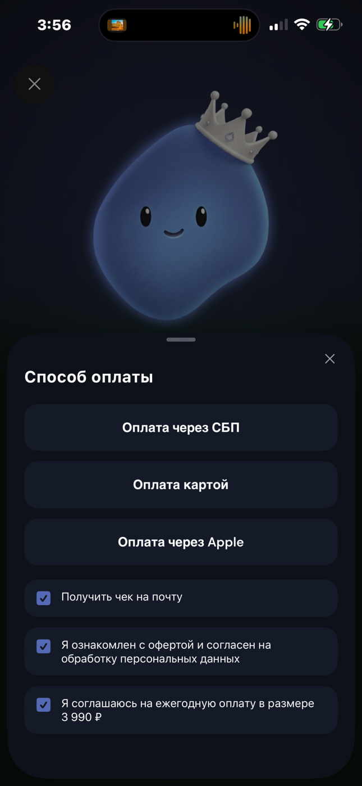
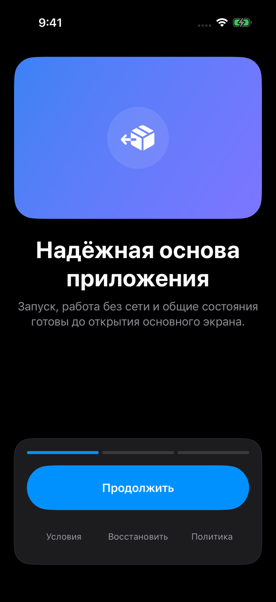
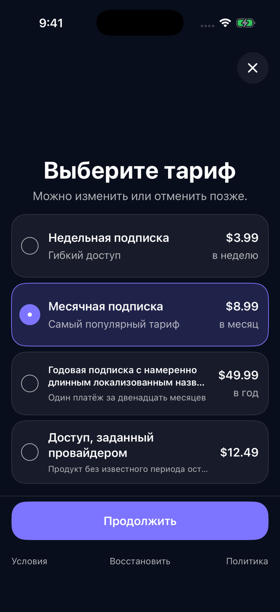
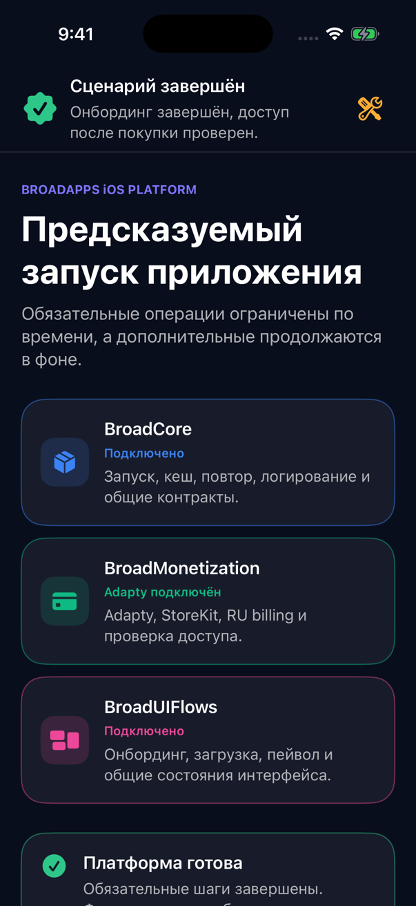

<div align="center">
  <picture>
    <source media="(prefers-color-scheme: dark)" srcset="Documentation/Assets/README/hero-dark.svg">
    <source media="(prefers-color-scheme: light)" srcset="Documentation/Assets/README/hero-light.svg">
    
  </picture>

  <p>
    
    
    
    
    
    
  </p>

  <p><strong>Готовая основа для запуска, onboarding, paywall, покупок, RU Billing и общих SwiftUI-сценариев.</strong></p>

  <p>
    <a href="#start">💡 Что это</a> ·
    <a href="#agent-setup">🤖 С Codex / Claude</a> ·
    <a href="#manual-setup">🛠️ Без агента</a> ·
    <a href="#visual-reference">✨ Визуальный flow</a> ·
    <a href="#showcase">📱 BroadAppTemplate</a> ·
    <a href="#architecture">🧭 Модули</a> ·
    <a href="#automation">✅ Как проверить</a> ·
    <a href="#reliability">🛡️ Надёжность</a> ·
    <a href="#documentation">📚 Документация</a>
  </p>
</div>

<a id="start"></a>
## Что это такое — за 30 секунд

`BroadAppsIOSPlatform` — это Swift Package, который убирает из каждого нового
iPhone-проекта одинаковую работу: запуск, общие состояния, onboarding,
paywall, Adapty, StoreKit, RU Billing, purchase/restore и проверку доступа.

`BroadAppTemplate` — это не приложение, которое нужно отдать в App Store. Это
**запускаемая шпаргалка**: в ней видно, как собрать модули, передать конфиги,
запустить flow и без реальной оплаты проверить сложные состояния.

| Платформа уже даёт | Разработчик приложения передаёт |
|---|---|
| Clean Architecture + MVVM границы | Тексты, цвета, шрифты и assets |
| Bootstrap, cache, offline, loading/error/retry | Bundle ID, minimum iOS target и точку входа приложения |
| Onboarding, paywall и общие SwiftUI-флоу | Слайды onboarding и свой main screen |
| Adapty, StoreKit, placements и experiments | Public Adapty key, access level и placement ID |
| Purchase/restore с повторной entitlement-проверкой | Свои product IDs и авторитетные источники доступа |
| Опциональные RU Billing, tokens и special offer | Backend-контракты и feature-решения своего приложения |

<div align="center">
  
</div>

## Выберите свой путь

<table>
  <tr>
    <td width="50%" valign="top">
      <h3 align="center">🤖 С Codex или Claude</h3>
      <p align="center"><strong>Рекомендуется для обычного внедрения</strong></p>
      <p>Вы даёте агенту папку приложения, конфиги и готовый промпт. Агент сам изучает проект, подключает package, собирает composition и проверяет сборку.</p>
      <p align="center"><a href="#agent-setup"><strong>Открыть инструкцию с агентом →</strong></a></p>
    </td>
    <td width="50%" valign="top">
      <h3 align="center">🛠️ Вручную</h3>
      <p align="center"><strong>Для точечной или нетиповой интеграции</strong></p>
      <p>Вы сами добавляете SPM dependency, собираете composition root, передаёте app-owned конфиги и подключаете lifecycle. Ниже есть порядок шагов и ссылки на полные контракты.</p>
      <p align="center"><a href="#manual-setup"><strong>Открыть ручную инструкцию →</strong></a></p>
    </td>
  </tr>
</table>

<a id="agent-setup"></a>
## 🤖 Вариант A: подключить через Codex или Claude

### 1. Откройте агенту два проекта

Агент должен видеть:

1. ваше iPhone-приложение, в которое нужно внедрить платформу;
2. этот repository или его SPM URL:

```text
https://github.com/BroadApps-official/BroadCore.git
branch: vers_niiaz
```

Codex автоматически читает `AGENTS.md`, когда рабочая папка его включает. Claude
нужно прямо попросить прочитать `AGENTS.md`, `README.md` и релевантные файлы из
`Documentation` до правок. Для Xcode и Simulator агенту нужен доступ к Mac в рамках
ваших корпоративных правил.

### 2. Подготовьте «паспорт интеграции»

| Что передать | Пример | Обязательно |
|---|---|:---:|
| Путь к project/workspace и нужный target | `MyApp/MyApp.xcworkspace`, scheme `MyApp` | ✅ |
| Bundle ID и minimum iOS | `com.company.myapp`, iOS 17+ | ✅ |
| Где создаётся root UI | `App`, `SceneDelegate` или coordinator | ✅ |
| Onboarding | Тексты, assets, количество слайдов, ATT on/off | ✅ |
| Adapty | Public SDK key, access level ID | ✅ |
| Placements | `main`, `onboarding`, `settings`, `feature`, `tokens`, `discount`, custom | ✅ |
| Paywall | Политика/Условия, локализация, цвета, hard/soft close policy | ✅ |
| Premium ownership | Текущие и исторические Apple product IDs, backend source | ✅ |
| Стабильный account ID | Как узнаём того же user после переустановки | Для tokens/RU |
| RU Billing | Включён или нет; API endpoints, auth adapter, catalog mapping | Если нужен |
| Tokens | Только subscriptions или subscriptions + tokens; backend ledger API | Если нужны |
| Special offer | Есть config или feature полностью отсутствует | Если нужен |
| Analytics | Куда отправлять typed monetization events | Если нужна |

Public Adapty SDK key может храниться в app configuration. Backend bearer, private keys,
платёжные URL и другие server secrets не вставляйте в промпт или README: агенту
нужно указать точку получения защищённой авторизации в host app.

### 3. Скопируйте промпт

```text
Ты подключаешь BroadApps iOS Platform к моему iPhone-приложению.

Приложение:
- project/workspace: <ПУТЬ>
- scheme/target: <SCHEME И TARGET>
- bundle ID: <BUNDLE_ID>
- deployment target: iOS <VERSION>, только iPhone

Платформа:
- repository: https://github.com/BroadApps-official/BroadCore.git
- branch: vers_niiaz
- локальный путь, если есть: <ПУТЬ К BroadAppsIOSPlatform>

Мои данные:
- Adapty public SDK key: <KEY ИЛИ ПУТЬ К CONFIG>
- access level: <ACCESS_LEVEL>
- placements: main=<ID>, onboarding=<ID>, settings=<ID>,
  feature=<ID ИЛИ НЕТ>, tokens=<ID ИЛИ НЕТ>, discount=<ID ИЛИ НЕТ>
- Apple premium product IDs, включая исторические: <IDS>
- onboarding: <СЛАЙДЫ / ASSETS / ATT ON ИЛИ OFF>
- paywall links: Условия=<URL>, Политика=<URL>
- RU Billing: <OFF ИЛИ API/AUTH/CATALOG КОНТРАКТЫ>
- purchase manager: <SUBSCRIPTIONS ONLY ИЛИ SUBSCRIPTIONS + TOKENS>
- special offer: <OFF ИЛИ CONFIG>
- analytics destination: <НЕТ ИЛИ АДАПТЕР>
- stable app account / entitlement subject: <КАК ПОЛУЧИТЬ>

Перед изменениями:
1. Прочитай AGENTS.md, README.md и нужные файлы Documentation.
2. Изучи архитектуру моего приложения и не ломай её границы.
3. Не копируй UI BroadAppTemplate как дизайн продукта: используй его как пример composition и fixtures.

Что сделать:
1. Подключи package products BroadCore, BroadMonetization, BroadUIFlows
   и BroadExtensions, если он нужен.
2. Создай один app composition root и собери зависимости в порядке Core → Monetization → UIFlows.
3. Подключи launch → onboarding → paywall → fresh entitlement → main.
4. Подключи lifecycle recovery для Apple pending и RU return, если RU Billing включён.
5. Не фильтруй и не переупорядочивай Adapty products; main обязан быть fallback placement.
6. ATT запрашивай только после появления первого onboarding-слайда; Rate Us в onboarding не добавляй.
7. Purchase/restore/pending не должны открывать premium до authoritative entitlement refresh.
8. Сначала проверь fixture-режим, затем compile-only/live catalog без финансовых операций.
9. Собери host app в Debug и Release. Запусти релевантные safe fixtures.
10. В конце напиши просто: что подключил, какие файлы изменил,
    какие команды прошли и чего не хватает от backend/продукта.

Не запускай реальные purchase, restore или RU-платёж. Не трогай reference-проекты.
```

### 4. Что сделает агент

```text
изучит host app
        ↓
подключит Swift Package
        ↓
создаст app-owned configuration и adapters
        ↓
соберёт composition root
        ↓
подключит UI flow и lifecycle recovery
        ↓
соберёт Debug/Release и прогонит safe fixtures
        ↓
напишет отчёт и точно назовёт недостающие данные
```

> [!IMPORTANT]
> `Scripts/agent_review_and_fix.sh` проверяет и исправляет **саму платформу**. Для внедрения
> в ваше приложение нужно открыть агента в host project и дать ему промпт выше.

[Подробнее об автопроверке самой платформы →](Documentation/AgentAutomation.md)

<a id="manual-setup"></a>
<a id="installation"></a>
## 🛠️ Вариант B: подключить вручную

Этот путь нужен, если вы хотите сами контролировать каждый adapter или ваше приложение
имеет нетиповый backend/архитектуру. Ниже — полный порядок подключения; детали
каждого контракта лежат в ссылках на каждом шаге.

### Шаг 1. Добавьте package

В Xcode: `File → Add Package Dependencies…`

```text
https://github.com/BroadApps-official/BroadCore.git
```

До version tag выберите `Branch` → `vers_niiaz`. Repository приватный, поэтому GitHub-аккаунту
разработчика нужен доступ к `BroadApps-official`.

Если host описан через `Package.swift`:

```swift
dependencies: [
    .package(
        url: "https://github.com/BroadApps-official/BroadCore.git",
        branch: "vers_niiaz"
    )
]
```

Для локальной разработки вместо URL выберите `Add Local…` и укажите папку
`BroadAppsIOSPlatform`.

### Шаг 2. Добавьте нужные products в iPhone target

| Product | Когда нужен |
|---|---|
| `BroadCore` | Всегда: launch, cache, retry, logging, общие domain types |
| `BroadMonetization` | Adapty, StoreKit, paywall data, purchase/restore, entitlement, RU Billing |
| `BroadUIFlows` | Onboarding, paywall, loader/error/retry и AppFlow SwiftUI |
| `BroadExtensions` | Опционально: Hex Color, fonts, keyboard, scoped swipe-back |

У target должно остаться `TARGETED_DEVICE_FAMILY = 1`, deployment target — iOS 17+.
Не копируйте исходники package в app target.

### Шаг 3. Возьмите из template структуру, а не дизайн

| Файл template | Что из него понять |
|---|---|
| [`AppConfiguration.swift`](Examples/BroadAppTemplate/BroadAppTemplate/Infrastructure/Configuration/AppConfiguration.swift) | Где лежат app-owned тексты, URL, placements и feature flags |
| [`AppCompositionRoot.swift`](Examples/BroadAppTemplate/BroadAppTemplate/Application/AppCompositionRoot.swift) | Где один раз собираются Core → Monetization → UIFlows |
| [`BroadAppTemplateApp.swift`](Examples/BroadAppTemplate/BroadAppTemplate/Application/BroadAppTemplateApp.swift) | Как готовый root View получает dependencies |
| [`AppFlowRootView.swift`](Examples/BroadAppTemplate/BroadAppTemplate/Presentation/AppFlow/AppFlowRootView.swift) | Как маршруты связываются с вашим UI |

### Шаг 4. Соберите один composition root

Порядок зависимостей:

```text
app-owned config / account / backend adapters
                    ↓
               BroadCore
                    ↓
          BroadMonetization
                    ↓
             BroadUIFlows
                    ↓
              root SwiftUI
```

Создайте один app-lifetime `MonetizationOperationGate`, один durable cache, stable
`EntitlementSubject`, только реально настроенные entitlement sources и один analytics pipeline.
Готовые assembly и ViewModel передаются во View через `init`; SDK, HTTP client и DI-container
не создаются внутри SwiftUI View.

[Полный composition с кодом →](Documentation/GettingStarted.md) ·
[Границы архитектуры →](Documentation/Architecture.md)

### Шаг 5. Передайте конфиги приложения

Минимальный placement registry:

```swift
let placements = AdaptyPlacementRegistry(
    main: AdaptyPlacementID(rawValue: "app-main"),
    mappings: [
        .onboarding: AdaptyPlacementID(rawValue: "app-onboarding"),
        .settings: AdaptyPlacementID(rawValue: "app-settings"),
        .tokens: AdaptyPlacementID(rawValue: "app-tokens")
    ]
)
```

`main` обязателен как общий fallback. Конкретные provider ID не хардкодятся во View.
Дальше передайте onboarding pages, paywall copy/theme/legal links, Adapty config,
Apple premium catalog и опциональные RU/tokens/special-offer adapters.

| Контур | Полная инструкция |
|---|---|
| Onboarding и ATT | [Onboarding & ATT](Documentation/OnboardingAndATT.md) |
| Paywall UI | [Paywall UI](Documentation/PaywallUI.md) |
| Adapty, StoreKit и purchase/restore | [Monetization](Documentation/Monetization.md) |
| Subscriptions / tokens | [Purchase Managers](Documentation/PurchaseManagers.md) |
| Entitlement sources | [Entitlements](Documentation/Entitlements.md) |
| RU Billing | [RU Billing](Documentation/RUBilling.md) |
| Special offer | [Special Offer](Documentation/SpecialOffer.md) |
| Analytics | [Analytics](Documentation/Analytics.md) |

### Шаг 6. Подключите lifecycle и recovery

- при launch/login вызовите `RecoverCustomerAccessUseCase` для того же account;
- передавайте foreground `.active` в pending Apple recovery;
- если RU Billing включён, передавайте foreground return в `RUPaymentReturnCoordinator`;
- открывайте premium main только после fresh authoritative `.active`.

[Восстановление после переустановки →](Documentation/AccountRecovery.md) ·
[Обрыв сети в любой момент →](Documentation/NetworkInterruptions.md)

### Шаг 7. Соберите и проверьте

1. Debug Simulator build host app.
2. Release Simulator build host app.
3. Чистый first run: onboarding → paywall → fixture purchase/restore → main.
4. Paywall с `0/1/2/12` продуктами, empty, error, pending и offline.
5. Live Adapty catalog — только load/show; без реальных purchase/restore.
6. Проверка: main не открывается из timeout, pending или unresolved.

[Полный quick start с кодом и командами →](Documentation/GettingStarted.md) ·
[Перенос существующего проекта →](Documentation/MigrationGuide.md)

<a id="visual-reference"></a>
## ✨ Продуктовый визуальный ориентир

Эти экраны сняты в `5115Copilot`. Они показывают, **как должен чувствоваться
продуктовый flow**. Исходный код reference-приложения не копируется: платформа
реализует те же сценарии через общие Clean Architecture + MVVM компоненты.

### Сначала тариф, потом способ оплаты

<table>
  <tr>
    <td align="center" width="50%">
      <a href="Documentation/Assets/README/References/5115-paywall-dark.png">
        
      </a>
      <br><strong>1. Выбрать тариф</strong>
      <br><sub>Все продукты провайдера: например, год и неделя</sub>
    </td>
    <td align="center" width="50%">
      <a href="Documentation/Assets/README/References/5115-payment-methods-dark.png">
        
      </a>
      <br><strong>2. Выбрать способ оплаты</strong>
      <br><sub>После «Продолжить»: СБП, банковская карта или Apple</sub>
    </td>
  </tr>
</table>

> Это два последовательных экрана. В окне выбора оплаты нет отдельных строк
> «Политика конфиденциальности» и «Публичная оферта».

### Остальные шаги RU-оплаты

<table>
  <tr>
    <td align="center" width="33%" colspan="2">
      <a href="Documentation/Assets/README/References/5115-payment-ready-dark.png">
        
      </a>
      <br><strong>Готово к оплате</strong>
      <br><sub>Все обязательные согласия видны</sub>
    </td>
    <td align="center" width="33%" colspan="2">
      <a href="Documentation/Assets/README/References/5115-consent-alert-dark.png">
        
      </a>
      <br><strong>Нет согласия</strong>
      <br><sub>Короткое и понятное объяснение</sub>
    </td>
    <td align="center" width="33%" colspan="2">
      <a href="Documentation/Assets/README/References/5115-receipt-email-dark.png">
        
      </a>
      <br><strong>Почта для чека</strong>
      <br><sub>Отдельный шаг; клавиатура ничего не перекрывает</sub>
    </td>
  </tr>
  <tr>
    <td align="center" width="50%" colspan="3">
      <a href="Documentation/Assets/README/References/5115-cloudpayments-light.png">
        
      </a>
      <br><strong>Банковская карта</strong>
      <br><sub>Внешняя форма, чек на email, безопасное закрытие</sub>
    </td>
    <td align="center" width="50%" colspan="3">
      <a href="Documentation/Assets/README/References/5115-hosted-checkout-light.png">
        
      </a>
      <br><strong>Внешняя оплата</strong>
      <br><sub>Сумма, назначение и одно понятное действие</sub>
    </td>
  </tr>
</table>

<a id="showcase"></a>
<a id="example-и-ручные-сценарии"></a>
## BroadAppTemplate: зачем запускать example

`BroadAppTemplate` — **технический пример подключения**, а не готовый дизайн.
Запускайте его, чтобы:

- понять composition четырёх package products;
- пройти `launch → onboarding → paywall → entitlement → main`;
- проверить fixture и live Adapty catalog как два явных режима;
- воспроизвести `0/1/2/12` продуктов, empty, error, pending и offline;
- сравнить свою integration с рабочим примером.

> [!IMPORTANT]
> Скриншоты example доказывают, что состояние запускается. Они не задают дизайн вашего
> приложения. Дизайн paywall и RU Billing смотрите в
> [продуктовом визуальном ориентире](#visual-reference).

### Запуск

```bash
./Scripts/generate_example.sh
open Examples/BroadAppTemplate/BroadAppTemplate.xcodeproj
```

Выберите схему `BroadAppTemplate` и iPhone Simulator. Для полной проверки package и example:

```bash
./Scripts/agent_gate.sh
```

| Режим | Когда нужен | Что безопасно делает |
|---|---|---|
| `BroadAppTemplate` | Ежедневная разработка | Локальные fixtures; purchase/restore не трогают реальные финансы |
| `BroadAppTemplateLiveAdapty5013` | Проверка реального Adapty catalog 5013 | Activation/load/show; financial call останавливается до SDK purchase |
| `BroadAppTemplateLiveAdapty5109Codex` | Проверка реального Adapty catalog 5109 | Activation/load/show; financial call останавливается до SDK purchase |

<table>
  <tr>
    <td align="center" width="33%" colspan="2">
      <a href="Documentation/Assets/README/Screenshots/onboarding-ru-v2.png">
        
      </a>
      <br><strong>1. Первый запуск</strong>
      <br><sub>Onboarding и правильный момент ATT</sub>
    </td>
    <td align="center" width="33%" colspan="2">
      <a href="Documentation/Assets/README/Screenshots/paywall-showcase-ru-v2.png">
        
      </a>
      <br><strong>2. Продукты провайдера</strong>
      <br><sub>Provider order, длинные названия и sticky CTA</sub>
    </td>
    <td align="center" width="33%" colspan="2">
      <a href="Documentation/Assets/README/Screenshots/main-ru-v2.png">
        
      </a>
      <br><strong>3. Verified main</strong>
      <br><sub>Main не открывается до fresh entitlement</sub>
    </td>
  </tr>
</table>

<details>
  <summary><strong>🧪 Launch arguments для fixtures</strong></summary>

| Аргумент | Что проверить |
|---|---|
| `-paywall-empty` | 0 продуктов, Retry/Restore/Close |
| `-paywall-one-product` | 1 продукт и automatic selection |
| `-paywall-two-products` | 2 продукта в provider order |
| `-paywall-many-products` | 12 продуктов и sticky controls |
| `-paywall-failure` | Safe error без raw SDK text |
| `-purchase-pending` | Pending не выдаёт premium |
| `-entitlement-unknown` | Unresolved не притворяется inactive |
| `-tracking-disabled` | UI smoke без системного ATT prompt |

[Все launch arguments и analytics fixture →](Examples/BroadAppTemplate/README.md)
</details>

<a id="architecture"></a>
## 🧭 Четыре модуля без магии

| Модуль | Зачем он нужен |
|---|---|
| 🔵 `BroadCore` | Запуск, cache/offline, timeout/retry, logging, общие состояния |
| 🟢 `BroadMonetization` | Adapty, StoreKit, placements, purchase/restore, entitlement, tokens, RU Billing, experiments |
| 🩷 `BroadUIFlows` | AppFlow, onboarding, loader/error/retry, paywall и RU UI |
| 🟣 `BroadExtensions` | Независимые Hex Color, fonts, keyboard и scoped swipe-back helpers |

<picture>
  <source media="(prefers-color-scheme: dark)" srcset="Documentation/Assets/README/architecture-dark.svg">
  <source media="(prefers-color-scheme: light)" srcset="Documentation/Assets/README/architecture-light.svg">
  
</picture>

```text
Host App → BroadUIFlows → BroadMonetization → BroadCore
                    └──────────────────→ BroadCore
BroadExtensions → ни от кого не зависит
```

<details>
  <summary><strong>📁 Где что лежит</strong></summary>

<pre>
BroadAppsIOSPlatform
├── 🔵 <a href="Sources/BroadCore">Sources/BroadCore</a>                 bootstrap, cache, ATT, logging
├── 🟢 <a href="Sources/BroadMonetization">Sources/BroadMonetization</a>         Adapty, StoreKit, entitlement, RU Billing
├── 🩷 <a href="Sources/BroadUIFlows">Sources/BroadUIFlows</a>              AppFlow, onboarding, paywall, common UI
├── 🟣 <a href="Sources/BroadExtensions">Sources/BroadExtensions</a>            independent helpers
├── 🟠 <a href="Examples/BroadAppTemplate">Examples/BroadAppTemplate</a>          executable integration example
├── 📘 <a href="Documentation">Documentation</a>                       full contracts and guides
├── 🤖 <a href="AgentChecks">AgentChecks</a>                         automation rules and status
└── 🛠️ <a href="Scripts">Scripts</a>                             format, lint, build and gates
</pre>
</details>

[Полная архитектура →](Documentation/Architecture.md)

<a id="monetization"></a>
## 💳 Шесть правил, которые нельзя сломать

1. **`main` — общий fallback placement.** Каждое приложение само задаёт provider ID; UI их не хардкодит.
2. **Adapty products идут в UI 1:1.** Не фильтруйте, не сортируйте и не дедуплицируйте их.
3. **Purchase/restore не равны premium.** Main открывается только после fresh authoritative entitlement.
4. **Special offer может полностью отсутствовать.** `nil` — нормальная конфигурация, а не ошибка.
5. **ATT не запрашивается в loader.** Только после фактического появления первого onboarding-слайда. Rate Us в onboarding не добавляется.
6. **Платёжные кнопки не мерцают.** Нет opacity/scale/dimming при tap; busy показывается отдельно.

<div align="center">
  
</div>

[Монетизация →](Documentation/Monetization.md) ·
[Адаптивный paywall →](Documentation/PaywallUI.md) ·
[Эксперименты →](Documentation/Experiments.md) ·
[Аналитика →](Documentation/Analytics.md)

<a id="automation"></a>
## ✅ Как проверять платформу после изменений

Это заключительная часть задания Никиты: общие решения мало написать один раз —
нужно автоматически следить, чтобы дальнейшие изменения не сломали принятые
правила.

> [!IMPORTANT]
> Здесь речь о **проверяющем агенте платформы**. Он проверяет сам
> `BroadAppsIOSPlatform`. Агент из раздела [«Подключить через Codex или
> Claude»](#agent-setup) выполняет другую работу — внедряет готовую платформу в
> конкретное приложение.

### Что именно проверяет агент

| Область | Что должно остаться правильным |
|---|---|
| Архитектура | Границы `BroadCore`, `BroadMonetization`, `BroadUIFlows` и `BroadExtensions`; Clean Architecture + MVVM + SOLID |
| Onboarding | ATT только после появления первого слайда; Rate Us не находится внутри onboarding |
| Paywall | `0/1/N` продуктов, provider order без фильтрации, sticky controls, loader/error/retry и отсутствие мерцания при tap |
| Adapty | Typed placements, обязательный fallback на `main`, обычные и cross-placement experiments |
| Доступ и покупки | Purchase/restore/pending не открывают premium без новой authoritative entitlement-проверки |
| RU Billing и tokens | Безопасные контракты, optional adapters, восстановление через тот же app account и backend ledger |
| Плохая сеть | Offline/timeout не становятся ложным success/inactive; неизвестный платёж остаётся pending |
| Качество проекта | Code style, SwiftFormat, SwiftLint, privacy manifest, документация, ссылки и README-assets |
| Сборка | Swift Package и iPhone example в Debug/Release, плюс compile-only конфигурации Adapty 5013 и 5109Codex |

Настоящие purchase, restore и RU-платёж не выполняются. StoreKit sandbox, test
targets, iPad, `.ipa` и device accessibility matrix в эту локальную проверку не
входят.

### Вариант 1 — одна команда, свой промпт не нужен

Это рекомендуемый способ после изменений внутри платформы.

Первый раз на новом Mac проверьте окружение:

```bash
./Scripts/agent_review_and_fix.sh --doctor
```

Если написано `Doctor passed`, запустите:

```bash
./Scripts/agent_review_and_fix.sh
```

Дальше всё происходит автоматически:

```text
готовый prompt + AGENTS.md
            ↓
Codex запускает полный gate
            ↓
если есть ошибка — находит причину и исправляет
            ↓
Codex повторяет gate до PASS
            ↓
wrapper ещё раз независимо запускает тот же gate
            ↓
понятный отчёт для разработчика
```

Собственный промпт здесь не нужен: он уже лежит в
`AgentChecks/AUTOMATION_PROMPT.md`, а границы работы — в `AGENTS.md`. Последний
отчёт появится в `AgentChecks/AutomationReports/latest.md`.

### Вариант 2 — запустить проверяющего агента вручную

Этот способ подходит, если вы уже открыли repository в Codex или Claude и хотите
видеть всю работу в текущем чате. Рабочей папкой должен быть корень
`BroadAppsIOSPlatform`.

Codex сам учитывает `AGENTS.md`. Claude нужно явно попросить прочитать этот файл.
Скопируйте агенту следующий промпт:

```text
Проверь BroadAppsIOSPlatform после моих изменений и, если найдёшь проблему,
исправь её.

Сначала прочитай AGENTS.md, README.md, AgentChecks/STATUS.md и относящуюся
к изменённым файлам документацию. Работай только внутри BroadAppsIOSPlatform.
Не изменяй reference-проекты 5013, 5109Codex, Claude232 и Шаблон.

Что сделать:
1. Запусти bash Scripts/agent_gate.sh.
2. Если gate упал, найди настоящую первопричину. Не отключай и не ослабляй проверки.
3. Исправь только platform-owned файлы минимальными изменениями.
4. После изменения Swift-кода запусти bash Scripts/format.sh.
5. Повторяй bash Scripts/agent_gate.sh до полного PASS.
6. Не запускай настоящие purchase, restore или RU-платежи.
7. Не добавляй tests, iPad/Mac targets и не делай commit или push.

В конце простым русским языком напиши:
- Итог: PASS или BLOCKED;
- что проверил;
- что нашёл;
- что исправил;
- какие файлы изменил;
- команды и результаты;
- что осталось;
- следующий шаг.
```

Внутри уже запущенного агента используйте именно `Scripts/agent_gate.sh`.
Не просите его запускать `agent_review_and_fix.sh`: иначе один агент попробует
запустить второго агента внутри себя.

### Вариант 3 — проверить вручную, без агента

Если автоматические исправления не нужны, из корня платформы выполните:

```bash
bash Scripts/agent_gate.sh
```

Команда ничего не меняет. Она только последовательно запускает все проверки и
сборки. Успешный результат заканчивается строкой:

```text
BroadApps iOS Platform agent gate passed.
```

Если команда остановилась раньше, смотрите первый блок с ошибкой, исправляйте
причину и запускайте её снова. После ручного изменения Swift-кода сначала
выполните `bash Scripts/format.sh`.

### Как читать результат

| Результат | Что это значит | Что делать дальше |
|---|---|---|
| `PASS` | Все локальные правила и сборки прошли | Изучить список изменений и передавать на review |
| `BLOCKED` | Есть конкретная внешняя причина, которую агент не может устранить безопасно | Открыть `latest.md` и выполнить указанный следующий шаг |
| Команда завершилась с ошибкой без отчёта | Агент/CLI не стартовал или оборвался | Запустить `--doctor`, затем посмотреть `latest.pending.md` и terminal output |

[Полная инструкция, устройство wrapper и частые ошибки →](Documentation/AgentAutomation.md)

<a id="reliability"></a>
## 🛡️ Надёжность и особые случаи

Эти темы важны для production, но не нужны для первого запуска package. Поэтому они
собраны здесь, после инструкций подключения.

<a id="recovery"></a>
### Удалили приложение — покупки не должны пропасть

| Что восстанавливаем | Источник после новой установки |
|---|---|
| Apple subscription/lifetime | StoreKit + Adapty + fresh entitlement refresh |
| Apple или RU tokens | Server-authoritative token ledger того же app account |
| RU subscription/lifetime | RU backend по тому же авторизованному customer |

Локальный cache никогда не является источником купленного доступа или баланса.
Для tokens и RU-покупок нужен стабильный app account.

[Полный recovery flow и backend contract →](Documentation/AccountRecovery.md)

<a id="network-loss"></a>
### Интернет может пропасть в любой момент

- offline/timeout не превращаются в inactive или success;
- неизвестный финансовый результат остаётся pending до reconciliation;
- появление сети не запускает purchase, token charge, RU checkout или cancellation автоматически;
- Retry повторяет безопасное чтение/проверку, а не списание.

[Матрица обрывов сети и checklist →](Documentation/NetworkInterruptions.md)

### Опциональные ветки

- RU Billing не добавляется в entitlement engine, если не настроен;
- special offer может полностью отсутствовать;
- tokens manager подключается отдельно от subscriptions-only manager;
- любой ненастроенный внешний источник не должен создавать вечный unresolved.

<a id="documentation"></a>
## 📚 Карта документации

README отвечает на вопрос «куда нажать и с чего начать». В файлах ниже лежат
полные контракты и edge cases.

| Хочу сделать | Открыть |
|---|---|
| Подключить package вручную | [Getting Started](Documentation/GettingStarted.md) |
| Дать агенту правильную автопроверку | [Agent Automation](Documentation/AgentAutomation.md) |
| Понять слои и зависимости | [Architecture](Documentation/Architecture.md) |
| Настроить app flow | [AppFlow](Documentation/AppFlow.md) |
| Настроить bootstrap/cache/offline | [Bootstrap](Documentation/Bootstrap.md) · [Caching & Offline](Documentation/CachingAndOffline.md) |
| Собрать monetization composition | [Monetization](Documentation/Monetization.md) |
| Выбрать subscriptions-only или subscriptions + tokens | [Purchase Managers](Documentation/PurchaseManagers.md) |
| Настроить placements, remote keys и experiments | [Remote Config](Documentation/RemoteConfig.md) · [Experiments](Documentation/Experiments.md) |
| Настроить authoritative access | [Entitlements](Documentation/Entitlements.md) · [Monetization Domain](Documentation/MonetizationDomain.md) |
| Подключить RU backend и UI flow | [RU Billing](Documentation/RUBilling.md) |
| Включить special offer | [Special Offer](Documentation/SpecialOffer.md) |
| Подключить analytics | [Analytics](Documentation/Analytics.md) |
| Настроить onboarding и ATT | [Onboarding & ATT](Documentation/OnboardingAndATT.md) |
| Собрать adaptive paywall | [Paywall UI](Documentation/PaywallUI.md) |
| Подключить общие extensions | [BroadExtensions](Documentation/Extensions.md) |
| Восстановить покупки после переустановки | [Account Recovery](Documentation/AccountRecovery.md) |
| Обработать внезапный обрыв сети | [Network Interruptions](Documentation/NetworkInterruptions.md) |
| Перенести существующий project | [Migration Guide](Documentation/MigrationGuide.md) |
| Провести security review | [Security](Documentation/Security.md) |
| Сверить scope и готовность | [Traceability](Documentation/Traceability.md) · [Platform Handoff](Documentation/PlatformHandoff.md) |

## Текущая готовность

| Контур | Статус |
|---|---|
| Package и engineering gate | **PASS** |
| Platform handoff | **READY** для интеграции app-разработчиками |
| GitHub | **PUBLISHED** · [`vers_niiaz`](https://github.com/BroadApps-official/BroadCore/tree/vers_niiaz) |
| Version tag | **AFTER APPROVAL** · пока используйте branch dependency |

Перед передачей изменений внутри platform:

```bash
./Scripts/agent_gate.sh
```

[Точный status и evidence →](AgentChecks/STATUS.md) ·
[Матрица требований →](Documentation/Traceability.md) ·
[Процедура handoff →](Documentation/PlatformHandoff.md) ·
[История изменений →](CHANGELOG.md)
