<div align="center">
  <picture>
    <source media="(prefers-color-scheme: dark)" srcset="Documentation/Assets/README/hero-dark.svg">
    <source media="(prefers-color-scheme: light)" srcset="Documentation/Assets/README/hero-light.svg">
    
  </picture>

  <p>
    
    
    
    
    
    
  </p>

  <p><strong>Готовая основа для запуска, onboarding, paywall, покупок, RU Billing и общих SwiftUI-сценариев.</strong></p>

  <p>
    <a href="#start">💡 Что это</a> ·
    <a href="#quick-start">⚡️ Быстрый маршрут</a> ·
    <a href="#flow-map">🗺️ Все flow</a> ·
    <a href="#delivery-readiness">🚦 Перед QA</a> ·
    <a href="#open-after-download">📂 Что открыть</a> ·
    <a href="#choose-path">🚀 С чего начать</a> ·
    <a href="#agent-setup">🤖 С Codex / Claude</a> ·
    <a href="#manual-setup">🛠️ Без агента</a> ·
    <a href="#paywall-loader">⏳ Loader paywall</a> ·
    <a href="#token-paywall">🪙 Токен-пейвол</a> ·
    <a href="#visual-reference">💳 RU Billing UI</a> ·
    <a href="#usedesk">💬 Usedesk</a> ·
    <a href="#showcase">📱 BroadAppTemplate</a> ·
    <a href="#architecture">🧭 Модули</a> ·
    <a href="#startup-cache">⚡️ Запуск и кеш</a> ·
    <a href="#debug-feedback">🧰 Debug и backend loader</a> ·
    <a href="#agent-app-check">✅ Проверка результата</a> ·
    <a href="#reliability">🛡️ Надёжность</a> ·
    <a href="#glossary">📖 Термины</a> ·
    <a href="#documentation">📚 Документация</a>
  </p>
</div>

<a id="open-after-download"></a>
## 📂 Скачали репозиторий — что открыть

> [!IMPORTANT]
> **Файл проекта не потерян.** Корень репозитория — это Swift Package, поэтому
> отдельного корневого `.xcodeproj` здесь быть не должно. Файл `Package.swift`
> и папка `Sources` — это сама платформа. Запускаемое iPhone-приложение находится
> внутри папки `Examples`.

| Что вы хотите сделать | Что именно открыть |
|---|---|
| Просто запустить платформу и посмотреть готовый пример | `Examples/BroadAppTemplate/BroadAppTemplate.xcodeproj` |
| Создать новое приложение через Codex или Claude | Пустую папку нового приложения; затем выполнить [вариант A](#agent-setup) |
| Создать новое приложение вручную | Новый `iOS App` в Xcode; затем подключить этот репозиторий как Swift Package по [варианту B](#manual-setup) |
| Изменять код самой платформы | Корень репозитория с `Package.swift`; после правок запустить `bash Scripts/agent_gate.sh` |

### Хотите прямо сейчас увидеть работающий пример

Откройте Terminal в корне скачанного репозитория и выполните:

```bash
open Examples/BroadAppTemplate/BroadAppTemplate.xcodeproj
```

Затем в Xcode выберите:

```text
Scheme: BroadAppTemplate
Device: любой iPhone Simulator
Run: ▶
```

> [!TIP]
> **Самая частая ошибка:** искать `.xcodeproj` в корне или пытаться превратить
> сам Swift Package в новое приложение. Для запуска примера откройте проект из
> `Examples`; для рабочего продукта создайте отдельное iPhone-приложение и
> подключите к нему package.

<a id="start"></a>
## Что это такое — за 30 секунд

> [!NOTE]
> **Коротко:** платформа даёт повторно используемую техническую основу, а
> конкретное приложение добавляет свой продукт, backend и дизайн.

| Что | Простыми словами |
|---|---|
| **`BroadAppsIOSPlatform`** | Swift Package с готовыми модулями запуска, состояний, onboarding, paywall, Adapty, StoreKit, RU Billing, покупок и проверки доступа |
| **`BroadAppTemplate`** | Запускаемый безопасный каталог возможностей платформы и пример соединения модулей |
| **Новое приложение** | Отдельный iPhone-проект со своим брендом, экранами, контентом, backend-контрактами и бизнес-функциями |

> [!IMPORTANT]
> Template показывает **как подключать платформу**, но не задаёт дизайн нового
> продукта. Демонстрационные экраны нельзя молча переносить как готовый UI.

> [!TIP]
> **Не нужно читать весь README подряд.** Сначала проверьте источник дизайна, затем
> выберите один способ работы:
>
> 1. Есть Codex или Claude — выполняйте только [вариант A](#agent-setup).
> 2. Делаете всё самостоятельно — выполняйте только [вариант B](#manual-setup).
> 3. Разделы после этих двух инструкций — справочник: к ним возвращаются, когда
>    нужен RU Billing, пример приложения, устройство модулей или правила
>    надёжности.

| Основа уже даёт | Разработчик строит поверх неё |
|---|---|
| Готовую структуру Clean Architecture + MVVM | Тексты, цвета, шрифты и изображения |
| Безопасный запуск, кеш, работу без сети и состояния загрузки/ошибки | Bundle ID, минимальную версию iOS и точку входа приложения |
| Onboarding, paywall и общие SwiftUI-экраны | Слайды onboarding и основной экран |
| Adapty, StoreKit, места показа и эксперименты | Публичный ключ Adapty, уровень доступа и ID мест показа |
| Покупку/восстановление с повторной проверкой доступа | Свои ID продуктов и источники подтверждения premium-доступа |
| Опциональные RU Billing, токены и специальное предложение | API своего сервера и решение, какие функции нужны приложению |

<a id="quick-start"></a>
## ⚡️ Быстрый маршрут: выберите одну строку

| Что вы делаете | 1. Начать | 2. Собрать | 3. Проверить |
|---|---|---|---|
| Посмотреть возможности платформы | Открыть [`BroadAppTemplate`](#showcase) | Нажать все карточки безопасного каталога | Пройти [template acceptance](Documentation/TemplateAcceptance.md) |
| Создать приложение с Codex/Claude | Выполнить [preflight](#agent-preflight) | Идти по [staged prompts](#agent-staged-prompts) по одному | Скопировать [prompt проверки](#agent-app-check) после checkpoints |
| Создать приложение вручную | Открыть [вариант B](#manual-setup) | Выполнить шаги 0–7 в Xcode | Выполнить шаги 8–9 и визуальную сверку |
| Подготовить конкретное приложение к QA | Открыть [единый checklist передачи](Documentation/ProjectDelivery.md) | Собрать functional, visual, Simulator и configuration evidence | Передать QA только после developer self-review |
| Изменить саму платформу | Прочитать [`AGENTS.md`](AGENTS.md) | Внести platform-owned правки | Запустить `bash Scripts/agent_gate.sh` |

Читайте только выбранную строку. Остальная часть README — справочник, к которому
возвращаются для конкретного flow или редкой граничной ситуации.

<a id="flow-map"></a>
## 🗺️ Все flow в одной таблице

| Flow | Как начинается | Безопасный результат |
|---|---|---|
| Первый запуск | `launch → onboarding`, если он включён | Initial paywall следует выбранной политике; обычный `main` может открыться после разрешённого close/unavailable/`unknown`, но premium даёт только подтверждённый `active` |
| Subscription paywall | Initial policy, Settings или другой app-owned entry point | Все продукты провайдера остаются в исходном порядке; purchase/restore открывают premium только после entitlement refresh |
| Special offer | Только после закрытия обычного subscription paywall без покупки | Enabled current provider config открывает offer; `nil`, `false`, unavailable и platform cache ведут в `main` без ошибки |
| Token paywall | Баланс токенов или платная функция | Загружается контекст `.tokens`, покупает только consumable через `TokenPurchaseManager`, а новый баланс показывает только после backend snapshot |
| RU Billing | Выбран тариф и одновременно разрешены remote gate и российский контекст iPhone | Apple/СБП/карта показываются по правилам; возврат из оплаты лишь запускает backend/entitlement reconciliation |
| Analytics | Paywall и monetization use cases сами создают typed-события | Live-счётчик и список видны без покупки; fixture-история очищается отдельно и живёт только в текущем процессе |
| Contact Us | Только явное действие пользователя | Системный composer либо alert с Copy/Close/доступной внешней почтой; Usedesk остаётся отдельным действием |
| Debug-хранилища | Только Debug-каталог | Keychain, app-flow progress, content cache и in-memory analytics очищаются независимо и показывают результат рядом со своей кнопкой |
| Loading/error/offline | Backend или SDK action | Spinner появляется до первого `await`, повторный тап блокируется, а ошибка завершает ожидание и даёт безопасный Retry |

<a id="special-offer-sequence"></a>
### 🎁 Special Offer — всегда второй paywall

Когда Special Offer включён для приложения, он **никогда не заменяет первый
subscription paywall** и не открывается напрямую при запуске. Последовательность
фиксированная:

```text
обычный subscription paywall
  ├─ purchase / restore → новая проверка entitlement → active → main без offer
  └─ крестик без покупки → закрыть первую presentation → resolver-loader
       ├─ offer разрешён → Special Offer → крестик / confirmed purchase → main
       └─ nil / false / unavailable / platform cache → main без ошибки
```

<table>
  <tr>
    <td align="center" width="50%">
      <a href="Documentation/Assets/README/References/special-offer-step-1-paywall.png">
        
      </a>
      <br><strong>1. Обычный paywall</strong>
      <br><sub>Пользователь сначала видит стандартные тарифы и нажимает крестик без покупки</sub>
    </td>
    <td align="center" width="50%">
      <a href="Documentation/Assets/README/References/special-offer-step-2-offer.png">
        
      </a>
      <br><strong>2. Special Offer</strong>
      <br><sub>Resolver разрешает второй paywall только после закрытия первого</sub>
    </td>
  </tr>
</table>

Это reference последовательности из дизайна. Конкретные фон, тексты, продукты,
таймер и проценты скидки остаются app-owned и берутся из дизайна/Adapty текущего
приложения. Механика перехода при этом одинакова: карточка Special Offer в
`BroadAppTemplate` тоже воспроизводит оба шага и не открывает offer напрямую.

> [!IMPORTANT]
> **Gate — только `special_offer = true` в текущем Adapty payload.**
> Таймер второго экрана чисто визуальный: `24:00:00 -> 00:00:00 ->
> 24:00:00`. Ноль не закрывает offer и не блокирует выбор/покупку.
> Server clock, persisted window и cooldown для этого flow не нужны.

Debug-значение `broadapps.app-flow.root` показывает route и текущую presentation
отдельно:

| Момент | Что видно в Debug Status |
|---|---|
| Первый paywall | `route=initial-paywall; presentation=subscription-paywall` |
| Проверка offer | `presentation=special-offer-resolver` |
| Второй paywall | `presentation=special-offer` |

> [!IMPORTANT]
> **`main` — маршрут приложения, premium — доступ внутри него.** При `unknown`
> обычный main открывается, premium остаётся закрытым, а пользователь получает
> Retry вместо вечного loader или ложного `inactive`.

<a id="delivery-readiness"></a>
## 🚦 Что означает «готово» и когда можно передавать QA

> [!IMPORTANT]
> **Platform PASS ≠ приложение готово к QA.** `agent_gate.sh` подтверждает
> платформу и `BroadAppTemplate`; конкретному app всё равно нужны собственные
> источники, backend, конфигурация, functional review и visual review.

| Уровень | Что должно быть подтверждено | Что не является доказательством |
|---|---|---|
| **Платформа** | `agent_gate.sh` завершился строкой `BroadApps iOS Platform agent gate passed.` | Одна успешная сборка app |
| **Функции приложения** | Все routes/API/paywall/offline-состояния работают в Debug и Release без настоящих платежей | Наличие кнопок или похожего fixture UI |
| **Визуальная точность** | Каждый обязательный экран сравнен со своим source frame на одинаковом iPhone | Общий цвет или «похожий» экран |
| **Внешняя готовность** | Текущие app-owned placements/products/URLs/backend contracts известны; секреты находятся вне Git | Временные значения или конфигурация reference |
| **Передача QA** | Functional + visual + security review прошли, разработчик лично посмотрел app, ограничения записаны | Только platform PASS или ответ агента |

Для конкретного приложения используйте один документ:
[**Project Delivery — checklist, evidence и QA handoff →**](Documentation/ProjectDelivery.md).
Неизвестный обязательный источник отмечается `BLOCKED`; его нельзя заменять
догадкой или скрывать общим `PASS`.

<details>
<summary><strong>Показать platform-отчёты и границы проверки</strong></summary>
<br>

- [Template acceptance](AgentChecks/TemplateAcceptanceReport.md) — фактический
  безопасный прогон интерактивного примера.
- [Self-review](AgentChecks/SelfReview.md) — повторная проверка платформы и UI.
- [QA handoff](AgentChecks/QAHandoff.md) — готовый пакет передачи template.
- [Application integration contract](AgentChecks/ApplicationIntegrationContract.md)
  — универсальная граница между platform `PASS` и готовностью host app.

Эти отчёты не привязаны к номеру приложения. Обязательный процесс использует
`Team = None`, iPhone Simulator и generic device compile без подписи. Отдельный
корпоративный запуск на iPhone можно добавить в handoff app, но он не блокирует
platform gate.

</details>

### Что изображено на схеме первого запуска

> [!IMPORTANT]
> **Это не порядок разработки и не список файлов.** Это эталон поведения уже
> собранного приложения: какие экраны последовательно видит пользователь и в
> какой момент ему разрешено открыть premium-функции. По этой схеме разработчик
> проверяет готовый результат независимо от того, собрал приложение агент или
> он сам.

| Как читать | Что означает | Что проверить в приложении |
|---|---|---|
| ➡️ **Слева направо** | Реальный путь пользователя после установки | Ни один обязательный экран или шаг не пропущен |
| 🟦 **Запуск** | Платформа поднимает обязательные зависимости с конечным временем ожидания | Loader не зависает навсегда и не вызывает ATT |
| 🩷 **Onboarding и paywall** | Приложение показывает контент и все продукты, пришедшие из Adapty | ATT только после первого слайда; продукты не фильтруются |
| 🟢 **Покупка и проверка** | StoreKit или RU-сценарий завершается новой проверкой доступа | Сам факт нажатия или возврата из оплаты premium не открывает |
| 🟠 **Главный экран** | Финальная точка маршрута выбранной policy | Обычный контент доступен; premium-состояние внутри него зависит от entitlement |
| ⛔ **`inactive` / `unresolved`** | Доступ не подтверждён либо результат пока неизвестен | Premium остаётся закрыт; `unresolved` не превращается в `inactive`, а пользователь может повторить проверку |

<picture>
  <source media="(prefers-color-scheme: dark)" srcset="Documentation/Assets/README/full-flow-dark.svg">
  <source media="(prefers-color-scheme: light)" srcset="Documentation/Assets/README/full-flow-light.svg">
  
</picture>

<details>
<summary><strong>▶️ Показать эту же последовательность в анимации</strong></summary>
<br>
<div align="center">
  
</div>
</details>

> [!TIP]
> **Что делать с этой схемой:** во время разработки возвращайтесь к ней как к
> карте обязательного маршрута. Когда приложение готово — пройдите путь целиком
> и убедитесь, что premium-функции не открылись до подтверждения `active`, а
> `unknown` не оставил обычный `main` в бесконечном loader. Порядок
> самой разработки показан отдельно в [варианте A с агентом](#agent-setup) и
> [варианте B без агента](#manual-setup).

## Сначала проверьте источник дизайна

> [!IMPORTANT]
> **Тип проекта определяется только меткой на карточке Kaiten.** Метка
> `no-code` есть — Figma у проекта нет. Метки `no-code` нет — это проект с
> Figma; если ссылка ещё не заполнена или не открывается, запросите её у
> проектного менеджера. Пустое поле Figma само по себе не превращает проект в
> no-code.

<table>
  <tr>
    <td width="50%" valign="top">
      <h3>🎨 На карточке нет no-code</h3>
      <p><strong>Это проект с Figma.</strong></p>
      <p><strong>Источник интерфейса — Figma.</strong></p>
      <p>Из неё берём экраны, состояния, тексты, стили и assets. Перед разработкой
      проверяем, что доступ открыт и показана актуальная версия. Если ссылки
      или доступа нет — запрашиваем их у проектного менеджера.</p>
    </td>
    <td width="50%" valign="top">
      <h3>✨ На карточке есть no-code</h3>
      <p><strong>Это no-code-проект.</strong></p>
      <p>Интерфейс сначала подготавливается и согласовывается через Claude Design
      или Pencil. Figma для такого проекта не ищем. После согласования готовый
      результат становится источником для разработки.</p>
    </td>
  </tr>
</table>

Reference-проект может пригодиться и проекту с Figma, и no-code-проекту как
дополнительный пример уже работающего продукта.

### Затем найдите reference-проект, если он нужен

<picture>
  <source media="(prefers-color-scheme: dark)" srcset="Documentation/Assets/README/reference-workflow-dark.svg">
  <source media="(prefers-color-scheme: light)" srcset="Documentation/Assets/README/reference-workflow-light.svg">
  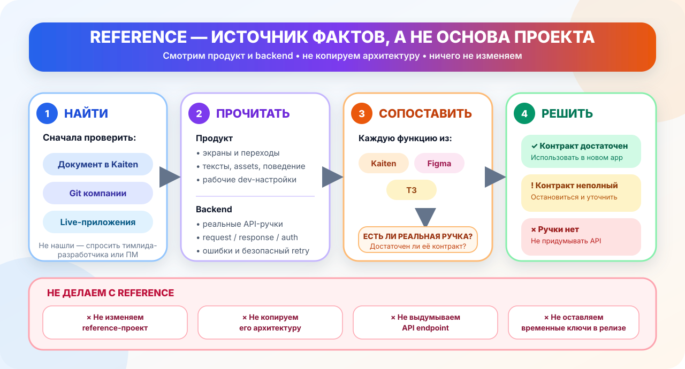
</picture>

> [!NOTE]
> **Reference-проект** — готовое приложение из такой же или похожей ниши,
> которое сделал коллега и сохранил в Git компании. Разработчик сначала сам
> ищет подходящий вариант в документе проекта, репозиториях и live-приложениях
> компании. Если подходящего варианта нет или выбор неоднозначен — спрашивает
> тимлида-разработчика или проектного менеджера.

<table>
  <tr>
    <td width="50%" valign="top">
      <h3>👀 Смотрим продукт</h3>
      <ul>
        <li>набор и порядок экранов;</li>
        <li>сценарии, переходы и поведение функций;</li>
        <li>тексты и assets;</li>
        <li>только согласованные публичные client-настройки для безопасной development-проверки.</li>
      </ul>
    </td>
    <td width="50%" valign="top">
      <h3>🔌 Смотрим backend</h3>
      <ul>
        <li>какие API-ручки реально вызываются;</li>
        <li>какие данные они принимают и возвращают;</li>
        <li>как устроена авторизация;</li>
        <li>как обрабатываются ошибки и безопасный повтор.</li>
      </ul>
    </td>
  </tr>
</table>

> [!IMPORTANT]
> Backend у похожих приложений обычно общий, но функционала reference может быть
> недостаточно для нового проекта. Поэтому разработчик обязан сопоставить
> **каждую функцию нового приложения** из Kaiten/Figma/технического задания с
> реальными API-ручками reference.

| Статус проверки | Что это значит | Действие разработчика |
|---|---|---|
| 🟢 **Контракт достаточен** | Нужная ручка есть и поддерживает функцию полностью | Использовать этот backend-контракт в новом приложении |
| 🟠 **Контракт неполный** | Ручка есть, но не хватает данных или действия | Остановиться и уточнить объём **до реализации** |
| 🔴 **Ручки нет** | Backend не умеет выполнять новую функцию | Не придумывать API и не убирать функцию молча |

> [!WARNING]
> **Если backend не совпал — задайте три вопроса и дождитесь решения:**
>
> 1. Эта функция действительно согласована и должна войти в приложение?
> 2. Можно ли оставить функционал на уровне reference-проекта?
> 3. Если функция обязательна, нужно ли подключить backend-разработчика и
>    добавить или расширить API-ручки?

> [!CAUTION]
> **Reference открывается только для чтения.** Его не исправляем, не используем
> как основу нового Xcode-проекта, не переносим случайную архитектуру и не
> создаём выдуманные endpoints или фиктивные ответы. Временные bundle, Adapty,
> product и placement-значения перед релизом заменяем данными нового приложения
> из Kaiten.

### Перед кодом определите страницы onboarding

<picture>
  <source media="(prefers-color-scheme: dark)" srcset="Documentation/Assets/README/onboarding-decision-flow-dark.svg">
  <source media="(prefers-color-scheme: light)" srcset="Documentation/Assets/README/onboarding-decision-flow-light.svg">
  
</picture>

> [!IMPORTANT]
> **Три слайда в `BroadAppTemplate` — только демонстрационный пример.**
> Платформа показывает столько страниц, сколько приложение передало в
> `OnboardingConfiguration.pages`. Отдельного `slidesCount` нет: один элемент
> массива — один слайд.

Сначала выпишите страницы по порядку из Kaiten, Figma/no-code материалов,
технического задания и reference. Для каждой нужны стабильный ID, заголовок,
текст и media. Если источники дают полный и одинаковый ответ — сразу создавайте
массив. Если количество или содержимое не указано либо противоречит друг другу,
до реализации задайте один прямой вопрос:

> Не удалось однозначно определить onboarding. Сколько должно быть слайдов и
> что находится на каждом: заголовок, текст, изображение и действие кнопки?

Стабильный технический ID каждой страницы агент создаёт сам из её смысла — это
не дополнительный вопрос разработчику. Если onboarding отключён, первого
видимого слайда нет, поэтому ATT из onboarding-flow не вызывается.

| Ситуация | Что использовать |
|---|---|
| Подходит стандартная композиция | `BroadOnboardingView`: готовые media/text/progress/button/footer, тема настраивается приложением |
| Нужна уникальная композиция | `BroadOnboardingFlowHost`: платформа ведёт страницы, завершение и ATT, а весь SwiftUI рисует приложение |
| Onboarding не нужен | `AppFlowConfiguration(onboarding: .disabled, ...)` |

<details open>
<summary><strong>📋 Copy-paste: обязательная инструкция агенту перед onboarding</strong></summary>
<br>

```text
Перед реализацией определи onboarding.

1. Изучи Kaiten, Figma/no-code материалы,
   техническое задание и reference.
2. Выпиши все найденные слайды по порядку.
3. Если количество или содержимое неоднозначно —
   сначала задай мне вопрос.
4. Не используй три демонстрационных слайда BroadAppTemplate
   как значение по умолчанию.
5. Количество страниц задавай только массивом
   OnboardingConfiguration.pages.
6. Если нужен уникальный дизайн, используй
   BroadOnboardingFlowHost и создай интерфейс приложения отдельно.
7. ATT разрешён только после фактического появления первого слайда.
   При отключённом onboarding ATT не вызывай.
8. Rate Us внутри onboarding запрещён.
```

</details>

Не скрывайте стандартный renderer через `.hidden()` и не копируйте ATT/lifecycle
в свой экран. Полные примеры обоих вариантов находятся в
[Onboarding & ATT](Documentation/OnboardingAndATT.md).

### Что конкретно уже готово в платформе

> [!TIP]
> **Здесь уже не нужно ничего искать в reference.** Разработчик подключает
> нужные модули Swift Package и использует их открытые интерфейсы.

| Модуль package | Что уже реализовано |
|---|---|
| `BroadCore` | Запуск приложения, кеш, работа без сети, ограничение ожидания, повтор запросов, журнал событий и общие состояния |
| `BroadMonetization` | Adapty, StoreKit, места показа, эксперименты, покупка/восстановление, проверка доступа, токены и RU Billing |
| `BroadUIFlows` | Маршруты приложения, onboarding, subscription/token paywall, support email, загрузка/ошибка/повтор и общий RU Billing UI |
| `BroadExtensions` | Независимые вспомогательные функции для Hex Color, шрифтов, клавиатуры и возврата свайпом |
| `BroadAppTemplate` | Интерактивный каталог flow, paywall, special offer, tokens, analytics, Contact Us и независимых Debug-хранилищ |

Внешние SDK подключаются только когда они нужны приложению. Например, готовый
чат Usedesk устанавливается через CocoaPods в app target и открывается из
Settings; [простая инструкция уже подготовлена](Documentation/Usedesk.md).

| Итог подготовки | Что должно быть известно до написания кода |
|---|---|
| 🎨 **Источник интерфейса** | Определён по метке карточки Kaiten: Figma либо согласованный no-code-дизайн |
| 📦 **Reference** | Найден и изучен только для чтения либо подтверждено, что он не нужен |
| 🔌 **Backend** | Каждая функция сопоставлена с достаточной ручкой или вынесена на уточнение |
| 🧩 **Платформа** | Понятно, какие модули и опциональные возможности нужны приложению |

<a id="choose-path"></a>
## 🚀 Один результат — два способа работы

<picture>
  <source media="(prefers-color-scheme: dark)" srcset="Documentation/Assets/README/developer-roadmap-dark.svg">
  <source media="(prefers-color-scheme: light)" srcset="Documentation/Assets/README/developer-roadmap-light.svg">
  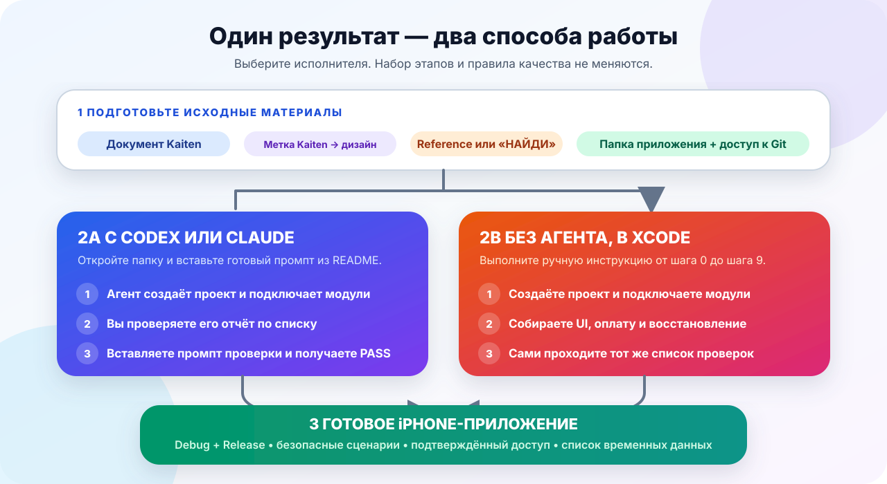
</picture>

> [!NOTE]
> **Как читать пошаговую инструкцию.** Выполните действие под заголовком шага,
> затем найдите строку **«Готово, если»** или **«Шаг закончен, если»**. Переходите
> дальше только когда условие выполнено. Ссылки «Полная инструкция» нужны для
> деталей — открывать все документы заранее не требуется.

<table>
  <tr>
    <td width="50%" valign="top">
      <h3 align="center">🤖 С Codex или Claude</h3>
      <p align="center"><strong>Подходит для обоих типов проекта</strong></p>
      <p><strong>Куда нажать:</strong> откройте Codex/Claude → выберите <code>Open Folder</code> или <code>Open Project</code> → укажите папку приложения → отправляйте prompts из Prompt Pack по одному.</p>
      <p align="center"><a href="#agent-setup"><strong>Открыть инструкцию с агентом →</strong></a></p>
    </td>
    <td width="50%" valign="top">
      <h3 align="center">🛠️ Вручную</h3>
      <p align="center"><strong>Если агент не используется</strong></p>
      <p><strong>Куда нажать:</strong> откройте Xcode → <code>File → New → Project… → iOS → App</code> → создайте проект → выполняйте вариант B от шага 0 до шага 9.</p>
      <p align="center"><a href="#manual-setup"><strong>Открыть ручную инструкцию →</strong></a></p>
    </td>
  </tr>
</table>

Оба способа приводят к одному результату: новое iPhone-приложение собирается в
`Debug` (сборка для ежедневной разработки) и `Release` (сборка с релизными
настройками), проходит безопасные сценарии без настоящего списания денег и не
открывает premium, пока StoreKit или сервер приложения не подтвердил доступ.

<details>
<summary><strong>Показать одинаковые этапы обоих вариантов</strong></summary>
<br>

Этапы одинаковые. Отличается только исполнитель:

| Этап | С Codex/Claude | Без агента |
|---|---|---|
| 1. Исходные данные | Агент читает метку карточки Kaiten, нужный источник интерфейса и reference | Разработчик открывает и сверяет те же источники сам |
| 2. Новый проект | Агент создаёт iPhone-проект | Разработчик создаёт iPhone App target в Xcode |
| 3. Архитектура | Агент подключает package и собирает зависимости | Разработчик повторяет структуру `BroadAppTemplate` по шагам |
| 4. Интерфейс и маршруты | Агент реализует утверждённые экраны и связывает маршрут | Разработчик создаёт экраны и подключает `BroadUIFlows` |
| 5. Монетизация | Агент настраивает Adapty, StoreKit, RU Billing, токены и эксперименты | Разработчик передаёт те же настройки и adapters вручную |
| 6. Надёжность | Агент подключает восстановление, pending и offline-сценарии | Разработчик подключает lifecycle/recovery и проверяет те же состояния |
| 7. Проверка приложения | Агент собирает Debug/Release, исправляет ошибки и пишет отчёт | Разработчик выполняет checklist и исправляет ошибки сам |
| 8. Проверка платформы | Нужна только при изменении исходников платформы | То же правило; обычное подключение package её не требует |

</details>

<a id="agent-setup"></a>
## 🤖 Вариант A: сделать приложение через Codex или Claude

<picture>
  <source media="(prefers-color-scheme: dark)" srcset="Documentation/Assets/README/agent-click-path-dark.svg">
  <source media="(prefers-color-scheme: light)" srcset="Documentation/Assets/README/agent-click-path-light.svg">
  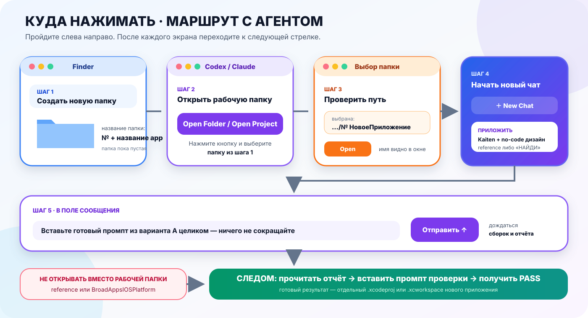
</picture>

### Три действия без поиска по странице

| Сначала | Затем | Перед сдачей |
|---|---|---|
| [**1. Проверить доступ к материалам →**](#agent-preflight) | [**2. Отправлять staged prompts по одному →**](#agent-staged-prompts) | [**3. Пройти visual review и acceptance →**](#agent-app-check) |

> [!IMPORTANT]
> **Порядок нельзя сжимать:** preflight → Integration Plan → skeleton → один
> vertical slice за раз → functional review → visual review → acceptance.

> [!TIP]
> **Сначала посмотрите на схему целиком.** Она сразу показывает весь маршрут:
> где создать папку, куда нажать в Codex/Claude, что приложить к чату и когда
> отправить проверочный промпт. Ниже тот же путь полностью разобран по шагам —
> текст сохраняет все детали, которые понадобятся во время работы.

> [!IMPORTANT]
> Здесь работает **агент разработки приложения**. Он создаёт конкретное
> приложение. Отдельный проверяющий агент платформы нужен только тогда, когда
> кто-то изменил исходники самой `BroadAppsIOSPlatform`; его запуск описан в
> [финальной проверке приложения](#agent-app-check) и в разделе
> [«Если вы изменили код платформы»](#automation).

| Кто / результат | Что именно |
|---|---|
| **Разработчик лично** | Открывает рабочую папку, даёт исходные ссылки, принимает app-owned решения и подтверждает `PLAN`, `SKELETON`, `FUNCTIONAL` и `VISUAL` checkpoints |
| **Агент** | Реализует только подтверждённый этап; не копирует platform logic и не угадывает отсутствующие backend/design contracts |
| **Итог** | Отдельный iPhone-проект, Debug/Release сборки и понятный список временных данных или `BLOCKED` |

### Если на карточке стоит `no-code`: кто и что делает

<picture>
  <source media="(prefers-color-scheme: dark)" srcset="Documentation/Assets/README/no-code-agent-workflow-dark.svg">
  <source media="(prefers-color-scheme: light)" srcset="Documentation/Assets/README/no-code-agent-workflow-light.svg">
  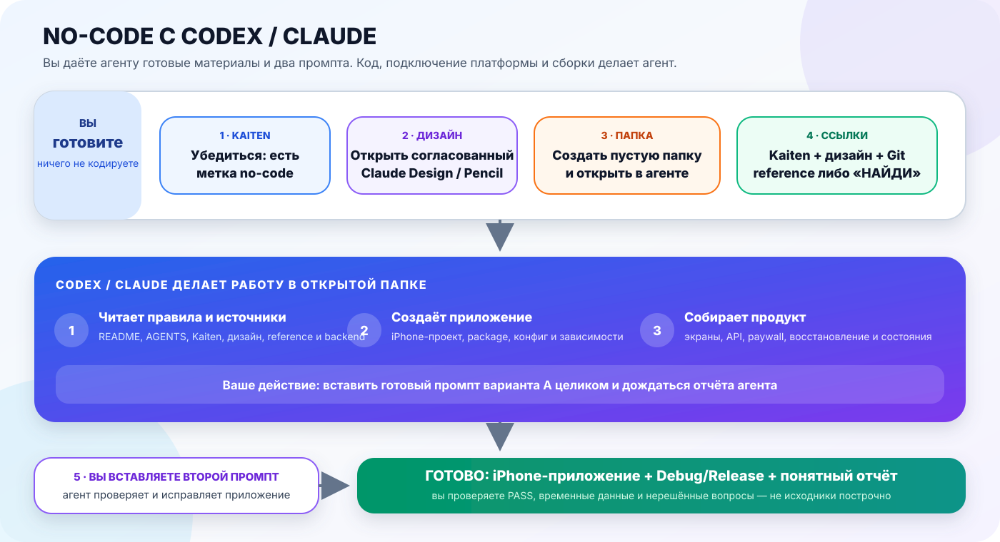
</picture>

> [!NOTE]
> **Главная мысль схемы:** разработчик не рисует интерфейс заново и не пишет
> platform logic вручную. Он передаёт источники и запускает короткие готовые
> prompts по одному. Codex/Claude сначала создаёт Integration Plan, затем
> безопасный каркас и только после подтверждения — один функциональный срез за
> раз. Так app-specific логику нельзя незаметно заменить догадкой агента.

| Вопрос | Короткий ответ |
|---|---|
| **Где работает агент?** | В отдельной пустой папке нового приложения |
| **Откуда берётся интерфейс?** | Из уже согласованного Claude Design/Pencil, указанного в материалах проекта |
| **Что копировать в чат?** | [Preflight prompt](#agent-preflight), затем prompts из [staged workflow](#agent-staged-prompts) строго по одному |
| **Что делает разработчик руками?** | Открывает материалы, отвечает на реальные блокеры и подтверждает checkpoints |
| **Что не делает разработчик?** | Не перепечатывает данные из Kaiten и не проверяет каждый созданный файл построчно |

<a id="agent-preflight"></a>
### 0. 🔎 Проверьте доступ до создания кода

Этот prompt ничего не создаёт. Он проверяет Kaiten по цепочке MCP →
авторизованный Chrome → экспорт, затем Figma по цепочке MCP → Chrome →
frames/screenshots, а также reference и backend. Полные критерии находятся в
[Agent Preflight](Documentation/AgentPreflight.md).

```text
Проверь доступ к исходным материалам до создания iPhone-приложения.

Проект: <НОМЕР И НАЗВАНИЕ>.
Kaiten: <ССЫЛКА ИЛИ ТОЧНОЕ НАЗВАНИЕ>.
Reference: <ССЫЛКА / ЛОКАЛЬНЫЙ ПУТЬ / НАЙДИ>.

Пока не создавай и не изменяй файлы приложения.

1. Прочитай AGENTS.md, README.md и Documentation/AgentPreflight.md платформы.
2. Для Kaiten попробуй по порядку: Kaiten MCP; авторизованный Kaiten в Chrome;
   полный экспорт из рабочей папки. Если ничего нет — остановись с BLOCKED.
3. Определи тип дизайна только по метке Kaiten. Для Figma попробуй Figma MCP;
   авторизованную Figma в Chrome; экспортированные frames/скриншоты. Для
   no-code открой согласованный Claude Design/Pencil или его экспорт. Если
   источник не виден — BLOCKED; не придумывай похожий интерфейс.
4. Найди reference в Kaiten, доступных Git-репозиториях или live-проектах.
   Reference не изменяй. При неоднозначности запроси решение тимлида или ПМ.
5. Сопоставь функции с backend: method, endpoint, request, response,
   обязательные поля, auth, ошибки и retry. Не придумывай endpoint.
6. Верни ровно этот статус и короткие доказательства:

Kaiten: READY / BLOCKED
Design source: READY / BLOCKED
Reference: READY / BLOCKED / N/A
Backend: READY / PARTIAL / BLOCKED
Monetization: READY / BLOCKED / N/A
Можно создать безопасный каркас: ДА / НЕТ
Можно реализовать все обязательные функции: ДА / НЕТ

Затем добавь [BLOCKED], чего именно нет, где это проверено, у кого запросить и
какую независимую работу можно продолжить. Не создавай код.
```

Даже при разрешённом каркасе заблокированную функцию реализовывать нельзя.
Следующий обязательный шаг — Integration Plan без Swift, а не build prompt.

### 1. 📂 Покажите агенту рабочую папку и исходные материалы

**Рабочая папка** — отдельная папка, в которой агент создаст новое приложение.
Это не папка reference-проекта и не папка самой платформы.

1. В Finder создайте пустую папку с номером и названием нового приложения.
2. В Codex или Claude нажмите `Open Folder` / `Open Project` и выберите её.
3. Убедитесь, что имя этой папки видно в окне агента, и только после этого
   начинайте новый чат.

Перед отправкой промпта подготовьте следующее:

| Что подготовить | Обязательно? | Что делать, если этого нет |
|---|---:|---|
| Папка нового приложения | Да | Создайте пустую папку и откройте её в Codex/Claude |
| Документ проекта в Kaiten | Да | Запросите у проектного менеджера точное название или ссылку |
| Метка проекта в карточке Kaiten | Да | `no-code` есть → Figma не нужна; метки нет → это проект с Figma |
| Figma | Только если на карточке нет `no-code` | Откройте ссылку из документа проекта; если ссылки или доступа нет, запросите их у проектного менеджера |
| Согласованный no-code-дизайн | Только если на карточке есть `no-code` | Приложите результат Claude Design/Pencil или укажите, где агент может его открыть |
| Reference-проект | Желательно | Напишите `НАЙДИ`; агент проверит Kaiten и доступные репозитории, а при неоднозначности попросит обратиться к тимлиду-разработчику или ПМ |
| Доступ к платформе | Да | Проверьте, что GitHub-аккаунт видит приватный Git-репозиторий ниже |

Платформа доступна по адресу:

```text
https://github.com/BroadApps-official/BroadCore.git
branch: vers_niiaz
```

#### Что агент проверяет перед началом

1. **Источник интерфейса.** Метка `no-code` ведёт к согласованному Claude
   Design/Pencil; без метки используется Figma. Недоступная ссылка становится
   `BLOCKED`.
2. **Reference.** Агент ищет его в Kaiten и доступных repositories. При
   неоднозначности решение принимает тимлид-разработчик или ПМ. Reference
   остаётся read-only.
3. **Правила платформы.** Агент читает `AGENTS.md`, `README.md` и нужные файлы
   `Documentation` до app-кода.

> [!NOTE]
> `AGENTS.md` находится в корне платформы. При локальной копии агент читает его
> напрямую; при одном SPM URL repository сначала нужно открыть или скачать.
> Для Xcode и Simulator агенту нужен разрешённый корпоративными правилами
> доступ к Mac.

> [!TIP]
> **✅ Шаг завершён, если:** агент видит папку нового приложения, может открыть
> платформу и получил ссылку или название документа Kaiten.

### 2. 🗂️ Откройте документ проекта в Kaiten

Отдельный «паспорт приложения» вручную составлять не нужно. Основной источник
данных команды находится в Kaiten:

```text
Документы → Документы по проектам → <номер и название проекта>
```

<table>
  <tr>
    <td width="36%" align="center" valign="top">
      <a href="Documentation/Assets/README/Kaiten/project-documents-folder.png">
        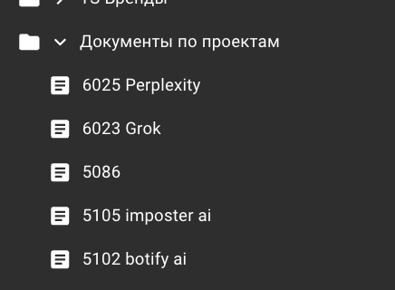
      </a>
      <br><strong>1. Найдите папку</strong>
      <br><sub>«Документы по проектам»</sub>
    </td>
    <td width="64%" align="center" valign="top">
      <a href="Documentation/Assets/README/Kaiten/project-document-team-data.png">
        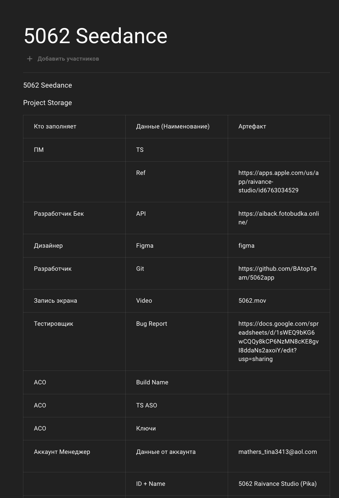
      </a>
      <br><strong>2. Откройте документ своего приложения</strong>
      <br><sub>В нём команда постепенно собирает все материалы</sub>
    </td>
  </tr>
</table>

В Kaiten постепенно появляются две группы данных:

- **для разработки:** техническое задание, reference, backend API, Figma,
  Git-репозиторий, запись экрана и список ошибок;
- **для приложения и выпуска:** название, `Bundle ID`, Apple/Team ID, ссылки,
  публичный ключ Adapty и продукты.

Материалы добавляют ПМ, backend-разработчик, дизайнер, iOS-разработчик,
тестировщик и аккаунт-менеджер — разработчику приложения не нужно собирать
параллельный документ вручную.

<details>
<summary><strong>Показать пример блока аккаунт-менеджера</strong></summary>
<br>
<div align="center">
  <a href="Documentation/Assets/README/Kaiten/project-document-account-data.png">
    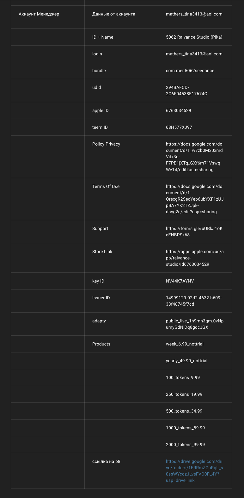
  </a>
</div>
</details>

> [!IMPORTANT]
> В начале разработки этот документ часто заполнен не полностью — это нормальная
> ситуация. Финальные bundle, Adapty и App Store данные нового приложения обычно
> появляются ближе к завершению работы.

> [!TIP]
> **✅ Шаг завершён, если:** понятно, где лежит документ текущего приложения и
> какие поля уже заполнены. Пустые TS/design/reference/backend поля блокируют
> реализацию соответствующих функций. Временно заменять можно только финальные
> публичные client-настройки в пределах правил ниже.

#### Как работать, пока финальные данные ещё не готовы

<picture>
  <source media="(prefers-color-scheme: dark)" srcset="Documentation/Assets/README/project-inputs-dark.svg">
  <source media="(prefers-color-scheme: light)" srcset="Documentation/Assets/README/project-inputs-light.svg">
  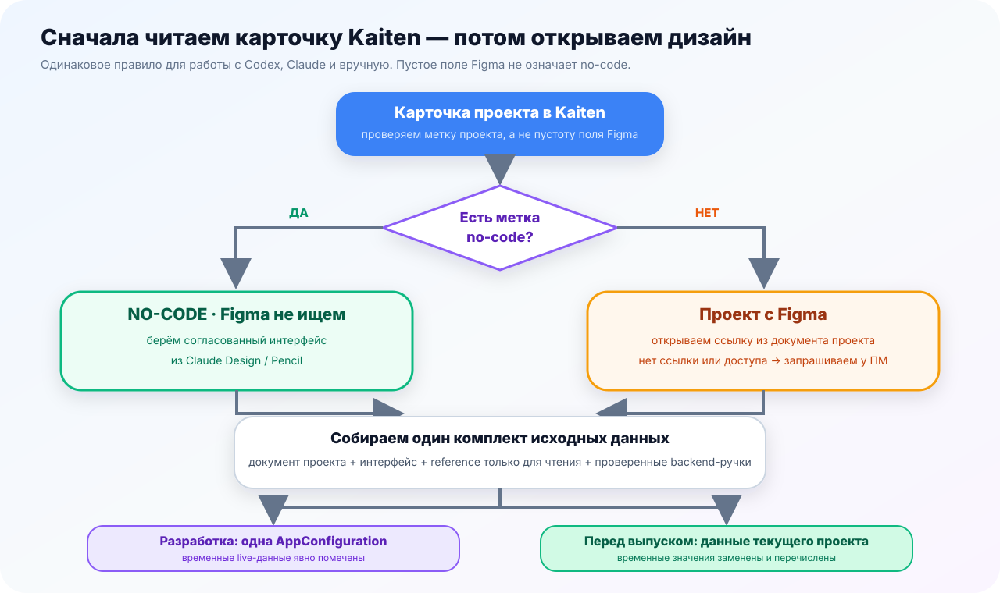
</picture>

| Этап | Какие данные использует приложение | Что важно |
|---|---|---|
| 🔵 **Начало разработки** | Уникальный локальный bundle и fixture-конфигурация; при отдельном согласовании — публичные client values reference | TS/design/backend уже доступны; все временные значения лежат в одном файле |
| 🟣 **Разработка UI** | Временный public Adapty SDK key и read-only placement/product ID, если их использование явно одобрено | Только load/show и fixture UI; без финансовых операций |
| 🟠 **Данные готовятся** | Аккаунт-менеджер заполняет документ нового приложения в Kaiten | Разработчик не создаёт второй «паспорт» и не перепечатывает поля вручную |
| 🟢 **Перед выпуском** | Только данные текущего приложения из Kaiten | Все временные значения заменены и перечислены в отчёте |

<table>
  <tr>
    <td width="50%" valign="top">
      <h3>🔎 Найти рабочий источник</h3>
      <p>Сначала разработчик сам ищет похожее live-приложение в документе
      проекта и Git компании. Если подходящего варианта нет или выбор
      неоднозначен, reference запрашивается у тимлида-разработчика или
      проектного менеджера.</p>
      <p>Агент может прочитать только явно согласованные публичные client
      values: public SDK key и read-only placement/product ID. Bundle нового
      приложения остаётся уникальным.</p>
    </td>
    <td width="50%" valign="top">
      <h3>🧩 Собрать безопасную development-конфигурацию</h3>
      <p>Временные значения нужны, чтобы продукты загружались и UI можно было
      собрать до появления данных нового приложения.</p>
      <p>Все значения лежат в одном конфигурационном файле и заменяются без
      изменения модулей платформы.</p>
      <p>Запрещено копировать bundle live-приложения, provisioning profiles,
      backend credentials, App Store keys/certificates, account/user данные и
      любые secret tokens.</p>
    </td>
  </tr>
  <tr>
    <td width="50%" valign="top">
      <h3>✅ Перед выпуском заменить</h3>
      <p>Агент или разработчик повторно открывает документ текущего проекта в
      Kaiten, заменяет временные значения и отдельно перечисляет, что именно
      было заменено.</p>
    </td>
    <td width="50%" valign="top">
      <h3>⛔ Не проводить настоящий платёж</h3>
      <p>Реальные purchase, restore и RU-платёж с временной конфигурацией не
      запускаются. Проверяются только загрузка данных, UI и безопасные fixture-
      сценарии.</p>
    </td>
  </tr>
</table>

Если у агента подключён Kaiten MCP, достаточно дать название или ссылку на
документ. Без Kaiten MCP разработчик передаёт экспорт документа либо ссылку на
него и открывает агенту доступ — вручную переносить каждое поле всё равно не
нужно.

Если агент пишет «не могу открыть Kaiten», сделайте одно из двух:

1. подключите Kaiten MCP и повторно дайте точное название документа; или
2. экспортируйте документ/скопируйте его целиком в отдельный файл и положите
   этот файл в рабочую папку приложения.

Не переносите каждое поле в чат по одному и не собирайте новый «паспорт»
вручную — агент должен читать единый документ проекта.

### 3. 💳 Сверьте базовые правила Adapty

Это стартовые правила для новых приложений. Если у конкретного проекта в Kaiten
указана дополнительная схема эксперимента или placement, добавьте её поверх
базовой конфигурации.

Если приложение создаёт агент, таблицу вручную перепечатывать не нужно: правила
уже входят в staged workflow и фиксируются в Integration Plan. Таблица нужна,
чтобы разработчик быстро проверил результат соответствующего stage.

| Что настраиваем | Базовое правило |
|---|---|
| Product ID без trial | `nottrial` пишется слитно, например `weekly_9.99_nottrial` |
| Paywall names | Используем только базовые имена `main`, `tokens`, `special_offer`; optional paywall создаётся только когда функция нужна проекту |
| Placement IDs | `onboarding`, `pro_icon`, `settings`, `main`, `CTR`, `special_offer` |
| Paywall для базовых placements | В Adapty указываем paywall `main`; отдельную проектную схему берём из документа проекта |
| Порядок продуктов | Показываем все продукты, которые вернул Adapty, без фильтрации и перестановки |

Для paywall `main` сразу создайте `Remote Config` — набор удалённых переключателей,
которые меняют доступные функции без выпуска новой версии приложения:

```json
{
  "ru_pay": false,
  "auto_revenue_view": false,
  "special_offer": false
}
```

> [!CAUTION]
> JSON выше — пример для **нового проекта, где функции ещё не
> подключены**. Не копируйте его поверх рабочего Remote Config.
> Если RU Billing уже заведён и должен работать, оставьте
> `ru_pay: true` в Adapty. Платформа не подменяет его app-default-значением.

Правило для самостоятельного placement `special_offer`:

- разрешающий `special_offer = true` берётся из payload этого placement;
- если loader фактически перешёл на fallback `main`, resolver читает payload
  полученного `main`;
- флаг только на `main` не включает успешно загруженный `special_offer`, если в
  его собственном payload gate отсутствует или выключен.

> [!IMPORTANT]
> Стандартного `AdaptyPaywallRepository` достаточно и для обычного paywall, и
> для Special Offer. Не делайте собственный Adapty REST. Продукты, variation и
> Remote Config приходят одним payload, поэтому purchase сохраняет правильную
> привязку к варианту эксперимента Adapty. Флаги Remote Config разрешают только
> показать функцию. Premium всё равно открывается лишь после новой подтверждённой
> проверки доступа со статусом `active`.

```text
Adapty.getPaywall
  → Adapty.getPaywallProducts
  → 1:1 mapping без словаря, сортировки или дедупликации
  → exact raw-product registry
  → Remote Config gate
  → resolver и UI

purchase / restore / RU return → entitlement refresh → active → premium
```

> [!NOTE]
> **Что здесь считается текущим ответом Adapty.** SDK Adapty может вернуть
> paywall прямо из сети или прозрачно взять его из собственного внутреннего
> кеша либо из заранее зарегистрированного Dashboard fallback. Во всех
> случаях это один ответ Adapty с теми же продуктами, variation и
> Remote Config. Этого достаточно для Special Offer без второго REST-запроса,
> но не для финансового `ru_pay`, который требует доказанной свежести.

<picture>
  <source media="(prefers-color-scheme: dark)" srcset="Documentation/Assets/README/remote-config-cache-flow-dark.svg">
  <source media="(prefers-color-scheme: light)" srcset="Documentation/Assets/README/remote-config-cache-flow-light.svg">
  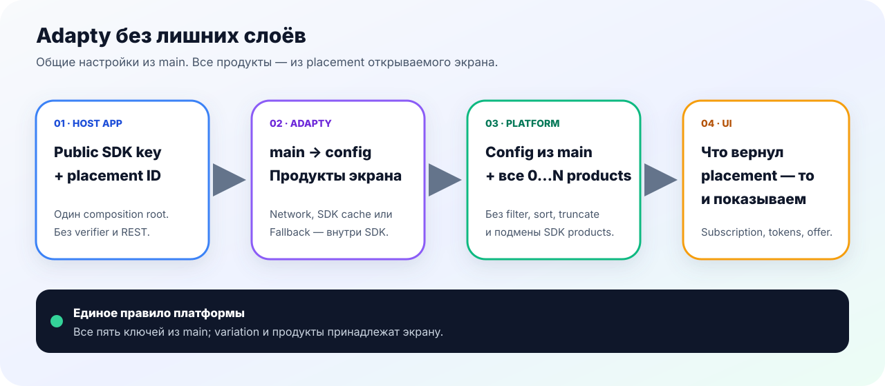
</picture>

| Откуда пришёл paywall | Обычные products | `special_offer` | `ru_pay` |
|---|---:|---:|---:|
| Текущий ответ SDK Adapty: сеть или внутренний кеш Adapty | Да | По своему `true` | **Нет** без `.verifiedFreshRemote` |
| Dashboard-generated fallback, зарегистрированный через Adapty SDK | Да | По `special_offer` из файла | **Нет** |
| Host-controlled verified-fresh remote payload | Да | По своему `true` | По `ru_pay = true` |
| Сохранённая копия из собственного кеша `BroadMonetization` | Да | **Нет** | **Нет** |

Это различие относится только к **показу функции**. Ни один Remote Config и ни
один кеш не подтверждают покупку, подписку или баланс токенов.

`false` — безопасное значение только для новой/отключённой feature.
Для уже подключённого RU Billing значение определяет product/backend
владелец и хранит в Adapty. Удаление приложения из App Store само по себе
не меняет Remote Config: для аварийного отключения переключите `ru_pay`
в Dashboard и/или закройте checkout на backend.

| Сборка | Откуда берётся `ru_pay` | Ручное переключение |
|---|---|---|
| Release | Только verified-fresh remote payload | Нет |
| Debug, `Как в Adapty` | Тот же strict provenance gate | Нет |
| Debug, `Включить` / `Выключить` | Временный process-local override | Да; только для UI/gate-проверки |

Debug force-on не меняет Adapty, не сохраняется между запусками и не
обходит host opt-in, российский контекст iPhone, catalog mapping,
backend authorization и entitlement refresh.

<a id="ru-billing-availability"></a>
#### Когда пользователь увидит RU Billing

Флаг `ru_pay` не включает СБП и карту для всех пользователей сразу. Всего
условий три: host app подключил RU Billing, текущий payload явно разрешил его и
iPhone имеет российский контекст. Для уже подключённой feature последние две
runtime-проверки выглядят так:

```text
Adapty Remote Config: ru_pay = true
                    И
регион iPhone = Россия ИЛИ первый системный язык = русский
```

Слово **«ИЛИ»** здесь важно: достаточно одного российского признака телефона.
Страна App Store-аккаунта в этой проверке не используется.

| `ru_pay` в Adapty | Регион iPhone | Первый системный язык | Что увидит пользователь |
|---|---|---|---|
| `true` | Россия | любой | Apple + доступные СБП/карта |
| `true` | любая другая страна | русский | Apple + доступные СБП/карта |
| `true` | любая другая страна | не русский | Только Apple |
| `false` или флага нет | Россия | русский | Только Apple |

> [!IMPORTANT]
> `ru_pay = true` обязателен. Регион России или русский язык сами по себе RU
> Billing не включают. Положительное разрешение также требует
> `.verifiedFreshRemote`. Внутренний кеш/Dashboard fallback Adapty и кеш
> `BroadMonetization` такое разрешение не выдают. Если флаг отсутствует,
> равен `false` или имеет неверный формат, платформа безопасно оставляет только
> оплату через Apple.

<details open>
<summary><strong>Исходное сообщение с правилами Adapty</strong></summary>
<br>
<div align="center">
  <a href="Documentation/Assets/README/Kaiten/adapty-rules.png">
    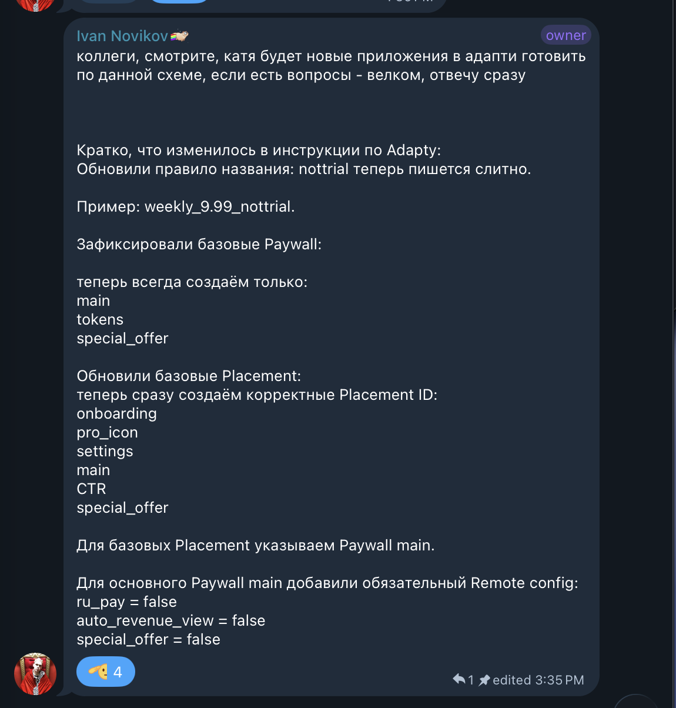
  </a>
</div>
</details>

> [!TIP]
> **✅ Шаг завершён, если:** вы понимаете, какие paywall и placement обязательны,
> `main` задан как резерв, а значения Remote Config сверены с фактически
> подключёнными функциями. Для RU Billing записано, кто управляет Dashboard-
> флагом и backend kill switch.

<a id="agent-staged-prompts"></a>
<a id="agent-build-prompt"></a>
### 4. 🧭 Отправляйте поэтапные prompts по одному

Один большой prompt на всё приложение больше не используется. Он позволял
агенту одновременно придумывать недостающую app-specific логику, строить
каркас, подключать backend и рисовать все экраны — ошибка одного предположения
затем распространялась по всему проекту.

Теперь порядок фиксирован:

| Этап | Что разрешено агенту | Чем заканчивается |
|---:|---|---|
| 0 | Только прочитать входные материалы | Preflight status |
| 1 | Создать только `Documentation/AppIntegrationPlan.md`, без Swift | `PLAN REVIEW REQUIRED` |
| 2 | Создать platform-based каркас без app-specific функций | `SKELETON REVIEW REQUIRED` |
| 3 | Реализовать ровно один подтверждённый вертикальный срез | `SLICE REVIEW REQUIRED` |
| 4 | Проверить функциональность без визуальной полировки | `FUNCTIONAL REVIEW REQUIRED` |
| 5 | Сверить экраны с точными source frames | `VISUAL REVIEW REQUIRED` |
| 6 | Пройти app-level acceptance и handoff | `READY FOR QA` или `APP CHECK · BLOCKED` |

Откройте [**готовый набор поэтапных промптов →**](Documentation/AgentPromptPack.md)
и копируйте только текущий этап. Каждый следующий prompt отправляется после
того, как разработчик прочитал результат и явно подтвердил checkpoint.

Перед первым Swift-файлом агент обязан создать в repository приложения
`Documentation/AppIntegrationPlan.md` по
[готовому шаблону](Documentation/Templates/AppIntegrationPlan.md). В нём видно,
что даёт платформа, что может сделать агент и какое app-owned решение обязан
подтвердить разработчик.

> [!IMPORTANT]
> Если неизвестны endpoint, backend hook, точный экран или правило исходника,
> агент ставит `BLOCKED` только этой функции. Он может продолжить независимый
> `READY`-срез после checkpoint, но не создаёт правдоподобную production-заглушку.

[Полное объяснение ownership и stop-правил →](Documentation/AppCreationWorkflow.md)

#### Что делать, если процесс не идеальный

| Ситуация | Правильное действие |
|---|---|
| Всё доступно | Последовательно пройти этапы 0–6 |
| Backend доступен частично | Заблокировать только зависимый срез; продолжить независимые `READY` после review |
| Нет source frame | Не рисовать production UI; получить source и вернуться к visual stage этого экрана |
| Feature не нужна | Поставить доказанный `N/A`, а не оставлять пустую строку |
| Blocker снят | Обновить evidence в Plan и повторить только остановленный stage |
| Новый чат или другой агент | Перечитать Plan, последний checkpoint и diff; не начинать заново |
| Приложение уже существует | Сначала описать current state/gaps; skeleton stage использовать как аудит существующих границ |
| Разработка без агента | Выполнять те же stages и checkpoints вручную |
| Менялась платформа | Дополнительно запустить platform gate; app acceptance всё равно остаётся отдельной |

> [!NOTE]
> `N/A` означает «функция подтверждённо вне scope». Если не хватает решения,
> дизайна или API, правильный статус — `BLOCKED`.


#### Семь этапов внутри двух больших итераций

<picture>
  <source media="(prefers-color-scheme: dark)" srcset="Documentation/Assets/README/app-delivery-iterations-dark.svg">
  <source media="(prefers-color-scheme: light)" srcset="Documentation/Assets/README/app-delivery-iterations-light.svg">
  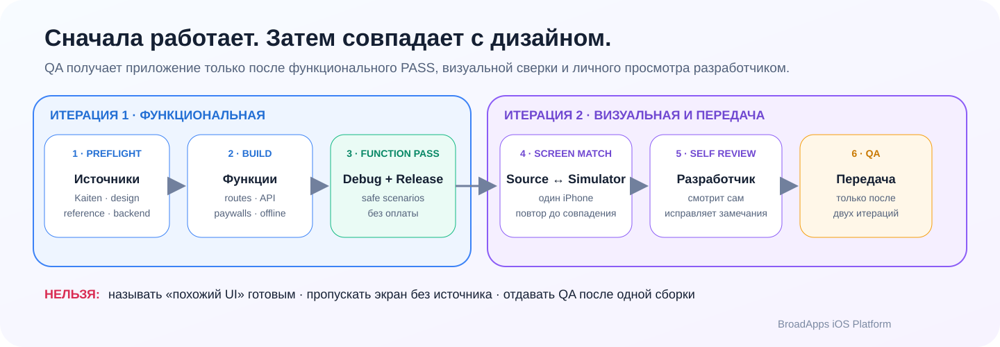
</picture>

Семь review-этапов выше группируются в две большие итерации: функциональную и
визуальную. Схема показывает gate передачи: успешная сборка завершает только
функциональную итерацию. Готовность к QA наступает после повторяемого сравнения
каждого экрана с его источником и личного просмотра разработчиком.

**Итерация 1 — функциональная.** До checkpoint должны быть подтверждены:

- Debug и Release сборки;
- все routes и доказанные API contracts;
- фактическое количество onboarding-страниц;
- отдельные subscription и token paywall;
- callback подтверждённого token balance;
- loading, empty, error и offline states.

Визуальная полировка ещё не завершена, поэтому приложение пока нельзя объявлять
готовым.

После неё агент обязан остановиться на checkpoint `FUNCTIONAL REVIEW REQUIRED`.
Разработчик сам открывает сборку, проверяет маршруты и либо подтверждает переход
к визуальной итерации, либо возвращает замечания. Молчание и одна успешная
сборка подтверждением не считаются.

**Итерация 2 — визуальная.** Она начинается только после явного подтверждения
functional checkpoint разработчиком:

1. открыть точный Figma/no-code frame каждого экрана;
2. запустить то же состояние на маленьком и большом iPhone Simulator;
3. сравнить композицию, typography, цвета, отступы, assets и UI states;
4. исправить расхождения и повторить screenshot comparison;
5. передать сборку на личный просмотр разработчику и только затем — QA.

После каждого staged prompt отвечайте только на реальные блокеры: отсутствующий
доступ, неоднозначный reference или решение по функции продукта. Bundle,
placement, product ID и ссылки не перепечатывайте, если они уже находятся в
Kaiten или доступном reference.

> [!TIP]
> **✅ Шаг завершён, если:** агент прочитал исходные материалы, начал работу в
> папке нового приложения и не просит повторно перепечатать данные, которые уже
> есть в Kaiten или reference.

### 5. 🧱 Проверьте, что сделал агент

| Контрольная точка | Что должно быть видно в результате агента |
|---|---|
| 📚 **Источники прочитаны** | Kaiten, TS, источник дизайна, reference и доступные конфиги изучены |
| 🗺️ **План принят до кода** | `Documentation/AppIntegrationPlan.md` содержит screen/API/ownership map, а разработчик подтвердил `PLAN REVIEW REQUIRED` |
| 🔌 **Продукт сверен** | Функции сопоставлены с backend-ручками; спорные места вынесены на решение |
| 🧩 **Основа собрана** | Создан iPhone-проект, подключён package, конфигурация отделена от UI, зависимости собраны в одном месте |
| 📱 **Сценарий работает** | Проверен один вертикальный срез за раз; соседние `BLOCKED`-области не замаскированы заглушками |
| 👋 **Onboarding не угадан** | Страницы совпадают с материалами; `pages.count` равен их реальному количеству; три example-слайда не использованы молча |
| ⏳ **Долгие действия не «зависают»** | Backend-кнопка сразу показывает spinner, блокирует double tap и завершается экраном или понятным Retry |
| 🧰 **Debug удобен и безопасен** | Из настроек можно очистить только Keychain service этого app; в Release инструмента нет |
| ✅ **Результат проверен** | Debug/Release собраны, безопасные сценарии пройдены, временные значения перечислены |

Перед переходом к проверке убедитесь, что агент показал:

- путь к созданному `.xcodeproj` или `.xcworkspace`;
- какие модули платформы подключены;
- какие fixture или явно согласованные публичные client identifiers использованы
  временно, откуда они взяты и что нужно заменить; чужие provisioning,
  account/auth данные здесь недопустимы;
- результаты сборок Debug и Release;
- список того, что осталось заменить перед выпуском.

Если хотя бы одного пункта нет, попросите агента дописать отчёт. Не пытайтесь
восстанавливать эту информацию по изменённым файлам самостоятельно.

> [!TIP]
> **✅ Шаг завершён, если:** в ответе есть путь к проекту, список подключённых
> модулей, результаты двух сборок и отдельный список временных значений.

<a id="agent-app-check"></a>
### 6. ✅ Запустите обязательную проверку перед сдачей

Не закрывайте задачу сразу после functional iteration. Используйте два последних
блока из [Agent Prompt Pack](Documentation/AgentPromptPack.md) **по отдельности**:

| Порядок | Что отправить | Когда продолжать |
|---:|---|---|
| 1 | Этап 5 «Визуальная итерация» | Только после подтверждённого `FUNCTIONAL REVIEW REQUIRED` |
| 2 | Этап 6 «Финальная acceptance» | Только после личной проверки `VISUAL REVIEW REQUIRED` разработчиком |

Не объединяйте эти prompts. Visual stage сравнивает каждый экран с точным
Figma/no-code source на маленьком и большом iPhone Simulator. Acceptance stage
повторно проверяет Debug/Release, safe fixtures, app-owned configuration,
runtime logs и Project Delivery. Настоящие purchase, restore и RU checkout не
выполняются, а Signing Team не требуется.

Если выяснилось, что functional checkpoint ещё не подтверждён, сначала
отправьте этап 4 из Prompt Pack и остановитесь на
`FUNCTIONAL REVIEW REQUIRED`.

Этап 6 проверяет **конкретное приложение**. Если разработчик менял ещё и
исходники платформы, нужна дополнительная platform-проверка:

| Где выполняется проверка платформы | Что запускать |
|---|---|
| Из Terminal, без уже открытого агента | `./Scripts/agent_review_and_fix.sh` — сам запускает Codex, исправляет платформу и сохраняет отчёт |
| Внутри текущего чата Codex/Claude | `bash Scripts/agent_gate.sh` — агент видит ошибку, исправляет её и повторяет gate |

#### Где именно появится результат

Здесь важно не смешивать две проверки:

| Что проверяется | Где смотреть | Как выглядит проблема |
|---|---|---|
| **Новое приложение** | В том же чате Codex/Claude; технические команды сборки видны во встроенном Terminal | Агент пишет `BLOCKED`, называет отсутствующий экран, документ, API-ручку или конфигурацию и объясняет, у кого это запросить |
| **Сама платформа** | В Terminal после `agent_gate.sh` или `agent_review_and_fix.sh` | Скрипт останавливается на конкретном этапе, показывает последние строки ошибки и путь к полному логу |

Например, если в новом приложении есть экран истории, а backend reference не
предоставляет нужную ручку, нормальный ответ агента выглядит так:

```text
APP CHECK · BLOCKED
✓ [1/5] Источники и дизайн прочитаны
✗ [2/5] Backend не покрывает функцию «История»

Нет: ручки для получения истории пользователя.
Ожидалось: функция указана в Figma и техническом задании.
Спросить: тимлида-разработчика или проектного менеджера — оставляем объём
reference либо подключаем backend-разработчика.
```

Это не техническая ошибка, которую агент должен скрыть заглушкой. После ответа
ответственного разработчик продолжает тот же чат, а агент завершает оставшиеся
этапы проверки.

<picture>
  <source media="(prefers-color-scheme: dark)" srcset="Documentation/Assets/README/terminal-gate-dark.svg">
  <source media="(prefers-color-scheme: light)" srcset="Documentation/Assets/README/terminal-gate-light.svg">
  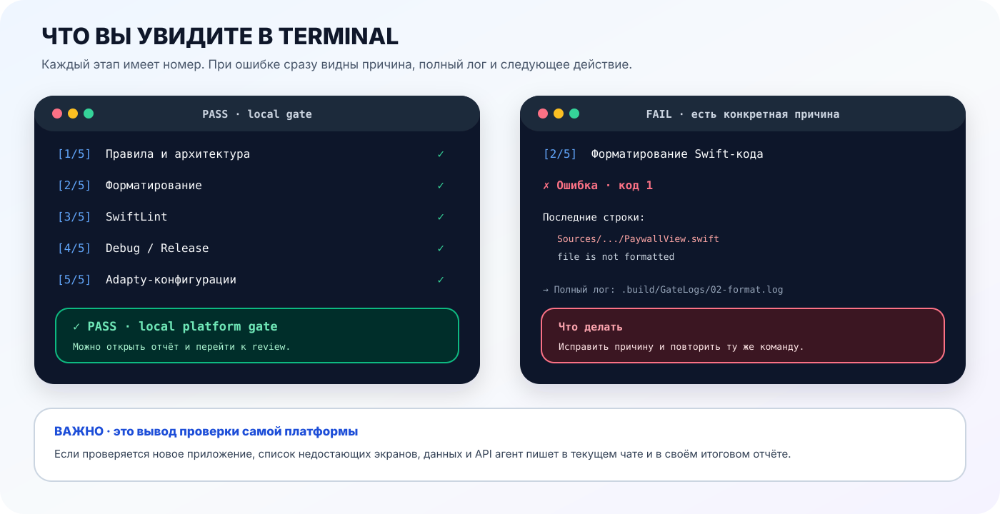
</picture>

У полного platform gate пять этапов. Подробный шум от `xcodebuild`, SwiftLint и
других инструментов сохраняется в `.build/GateLogs/`, а в Terminal остаётся
короткий прогресс. При падении автоматически показываются последние строки
ошибки — разработчику не нужно искать первопричину среди сотен строк.

```text
[2/5] Форматирование Swift-кода
✗ Форматирование Swift-кода — ошибка (код 1)

Последние строки ошибки:
    Sources/.../PaywallView.swift: file is not formatted

  → Полный лог: .build/GateLogs/02-format.log
  → Исправьте причину выше и повторите ту же команду.
```

> [!NOTE]
> **Для нового приложения:** отсутствующую функцию, дизайн или backend-ручку
> нельзя «починить» догадкой. Агент ставит `BLOCKED`, формулирует один вопрос
> владельцу решения и продолжает только независимую работу. Техническую ошибку
> внутри созданного проекта он исправляет и повторяет Debug/Release.

> [!WARNING]
> Не запускайте `agent_review_and_fix.sh` из уже работающего Codex/Claude:
> скрипт попытается создать второго агента. Внутри чата используется только
> `Scripts/agent_gate.sh`.

[Подробнее об автопроверке самой платформы →](Documentation/AgentAutomation.md)

> [!TIP]
> **✅ Вариант A завершён, если:** агент исправил найденные проблемы, Debug и
> Release собрались, безопасные сценарии пройдены, а в финальном ответе отдельно
> написано, какие временные данные нельзя оставлять перед выпуском.

<a id="manual-setup"></a>
<a id="installation"></a>
## 🛠️ Вариант B: собрать приложение вручную

> [!NOTE]
> **Без агента меняется исполнитель, но не требования.** Нужны те же источники,
> Integration Plan, checkpoints, Debug/Release и визуальная сверка.

Перед созданием проекта:

1. прочитайте метку карточки Kaiten: `no-code` → согласованный Claude
   Design/Pencil, без метки → Figma;
2. если источник дизайна недоступен, запросите его у ПМ и не рисуйте похожий UI;
3. найдите reference в Kaiten или Git компании; неоднозначный выбор подтвердите
   у тимлида-разработчика или ПМ;
4. используйте reference только как read-only источник продуктовых примеров.

Создайте новый iPhone-проект, подключите модули платформы и выполните шаги ниже.
Детали каждого контракта лежат в ссылках на соответствующем шаге.

> [!IMPORTANT]
> **До первого Swift-файла:** скопируйте
> [`AppIntegrationPlan.md`](Documentation/Templates/AppIntegrationPlan.md) в
> repository приложения как `Documentation/AppIntegrationPlan.md`. Заполните
> screen map, backend contracts, ownership и blockers.

**Что должно получиться:** такое же приложение, как в варианте A, но все
действия — создание проекта, подключение модулей, сборка зависимостей и проверки
— разработчик выполняет сам.

Ручной путь использует тот же
[поэтапный workflow](Documentation/AppCreationWorkflow.md):

1. Проверить доступ к Kaiten, источнику дизайна, reference и backend.
2. Заполнить и проверить `Documentation/AppIntegrationPlan.md`.
3. Собрать platform-based каркас без выдуманной app-specific логики.
4. Реализовать и проверить один вертикальный срез за раз.
5. Пройти общую функциональную проверку.
6. Точно перенести и сверить дизайн каждого экрана.
7. Самостоятельно просмотреть готовое приложение.
8. Передать QA.

### Если на карточке стоит `no-code`: ручной маршрут целиком

<picture>
  <source media="(prefers-color-scheme: dark)" srcset="Documentation/Assets/README/no-code-manual-workflow-dark.svg">
  <source media="(prefers-color-scheme: light)" srcset="Documentation/Assets/README/no-code-manual-workflow-light.svg">
  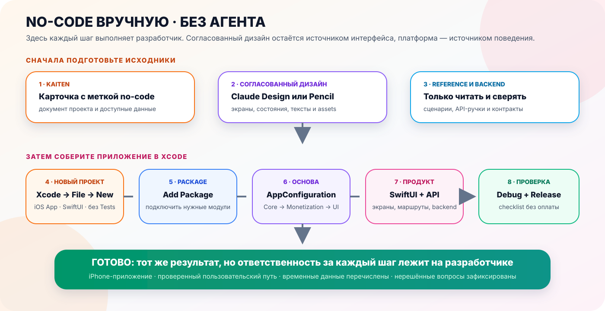
</picture>

> [!NOTE]
> **Главная мысль схемы:** `no-code` означает отсутствие Figma, а не отсутствие
> Swift-кода. Интерфейс уже согласован в Claude Design/Pencil, но разработчик сам
> создаёт проект в Xcode, подключает package, переносит утверждённые экраны,
> связывает backend и вручную проходит проверочный список.

| Где работать | Что именно сделать | Где это подробно описано |
|---|---|---|
| **Kaiten** | Открыть документ проекта, метку `no-code`, доступные данные и reference | Разделы «Перед началом» ниже |
| **Claude Design / Pencil** | Открыть согласованный интерфейс и выписать все экраны и состояния | Источник интерфейса проекта |
| **Xcode** | Создать iPhone App, подключить package и собрать зависимости | Шаги 0–2 |
| **Код приложения** | Реализовать UI, backend, запуск, монетизацию и восстановление | Шаги 3–7 |
| **Xcode + checklist** | Собрать Debug/Release и пройти безопасные сценарии | Шаги 8–9 |

<table>
  <tr>
    <td align="center" width="20%">🆕<br><strong>Проект</strong><br><sub>iPhone target</sub></td>
    <td align="center" width="20%">📦<br><strong>Package</strong><br><sub>Нужные модули</sub></td>
    <td align="center" width="20%">🏗️<br><strong>Основа</strong><br><sub>Конфиг и зависимости</sub></td>
    <td align="center" width="20%">🎨<br><strong>Продукт</strong><br><sub>Экраны и маршруты</sub></td>
    <td align="center" width="20%">✅<br><strong>Проверка</strong><br><sub>Debug + Release</sub></td>
  </tr>
</table>

> [!NOTE]
> В ручной инструкции `package` означает подключаемую платформу, `product` —
> отдельный модуль этой платформы, `target` — собираемое iPhone-приложение, а
> `scheme` — выбранный в Xcode сценарий сборки и запуска. Все остальные термины
> собраны в [словаре](#glossary).

Перед началом проверьте пять пунктов:

- известно точное название нового приложения;
- открыт документ текущего приложения в Kaiten;
- тип проекта определён по метке карточки Kaiten, а источник интерфейса открыт;
- найден подходящий reference либо отправлен запрос тимлиду-разработчику или ПМ;
- функции нового проекта сопоставлены с реальными backend-ручками reference.

### Перед началом. Возьмите данные из Kaiten

<picture>
  <source media="(prefers-color-scheme: dark)" srcset="Documentation/Assets/README/project-inputs-dark.svg">
  <source media="(prefers-color-scheme: light)" srcset="Documentation/Assets/README/project-inputs-light.svg">
  
</picture>

Откройте `Документы → Документы по проектам → <ваше приложение>`:

- используйте уже заполненные bundle, Adapty, products и ссылки — не создавайте
  второй список;
- пока финального блока нет, допускается fixture либо явно согласованные public
  SDK/placement/product values reference только для load/show;
- запишите каждое временное значение, которое нужно заменить;
- не копируйте чужие bundle, provisioning или credentials.

Создайте в новом приложении одно место для таких значений, например
`AppConfiguration.swift`. Не разносите bundle, Adapty key, placements, product
ID и URL по SwiftUI-экранам. Тогда временные значения можно будет заменить без
переписывания интерфейса.

> [!TIP]
> **✅ Готово, если:** вы знаете источник каждого значения и отдельно пометили
> все временные fixture/согласованные public client values; bundle,
> provisioning, credentials и account data похожего live-приложения не
> использовались.

### Перед началом. Сверьте backend нового проекта с reference

<picture>
  <source media="(prefers-color-scheme: dark)" srcset="Documentation/Assets/README/reference-workflow-dark.svg">
  <source media="(prefers-color-scheme: light)" srcset="Documentation/Assets/README/reference-workflow-light.svg">
  
</picture>

Не ограничивайтесь экранами reference. Найдите в его коде backend-клиенты,
конфигурацию API и модели запросов/ответов. Выпишите только фактические данные:

| Функция нового приложения | Ручка в reference | Хватает ли контракта |
|---|---|---|
| Например: история генераций | `GET /...` или «нет ручки» | Да / нет, не хватает поля или действия |

Затем пройдите по каждой функции из Kaiten, Figma и технического задания. Даже
если backend у проектов общий, нельзя автоматически считать, что набора ручек
reference достаточно для более функционального нового приложения.

Если ручки нет или её контракт неполный, до реализации отправьте
тимлиду-разработчику или проектному менеджеру короткое описание расхождения и
получите одно из решений:

1. оставить функционал на уровне reference;
2. подтвердить новую функцию и привлечь backend-разработчика;
3. получить уже существующую ручку/контракт, который не был найден в reference.

Не придумывайте API, не подменяйте его fixture-ответом и не удаляйте функцию из
проекта без такого решения.

> [!TIP]
> **✅ Готово, если:** у каждой функции есть достаточная backend-ручка либо
> зафиксированный вопрос тимлиду-разработчику или ПМ, а спорная разработка ещё
> не начата.

### Шаг 0. 🆕 Создайте новый iPhone-проект

В Xcode выберите `File → New → Project… → iOS → App` и заполните форму:

| Поле Xcode | Что указать |
|---|---|
| Product Name | Номер и название текущего проекта |
| Interface | `SwiftUI` |
| Language | `Swift` |
| Include Tests | Не включать |
| Team | `None`; обязательный процесс не требует платного аккаунта или Signing Team |
| Organization Identifier | Основа уникального `Bundle ID` текущего проекта; до финальных данных используйте уникальный локальный development ID, не bundle reference |

После создания нажмите на синий файл проекта в левой панели и выберите app
target. Затем:

- в `Signing & Capabilities` оставьте `Team = None` и проверьте уникальный
  `Bundle Identifier` текущего приложения;
- в `General → Minimum Deployments` установите `iOS 17.0`;
- в `Build Settings` найдите `Targeted Device Family` и оставьте только `iPhone`
  (`TARGETED_DEVICE_FAMILY = 1`);
- в списке targets убедитесь, что не созданы отдельные iPad, Mac, Mac Catalyst
  или visionOS targets.

> [!TIP]
> **✅ Готово, если:** пустое SwiftUI-приложение собирается и запускается на
> iPhone Simulator.

### Шаг 1. 📦 Подключите Swift Package — саму платформу

В Xcode: `File → Add Package Dependencies…`

```text
https://github.com/BroadApps-official/BroadCore.git
```

В окне добавления зависимости вставьте URL → в `Dependency Rule` выберите
`Branch` → укажите `vers_niiaz` → нажмите `Add Package`. Репозиторий приватный,
поэтому GitHub-аккаунту разработчика нужен доступ к `BroadApps-official`.

Если рабочее приложение описано через `Package.swift`:

```swift
dependencies: [
    .package(
        url: "https://github.com/BroadApps-official/BroadCore.git",
        branch: "vers_niiaz"
    )
]
```

Для локальной разработки вместо URL выберите `Add Local…` и укажите папку
`BroadAppsIOSPlatform`.

> [!TIP]
> **✅ Готово, если:** Xcode показывает package `BroadCore` без красной ошибки
> загрузки зависимости.

### Шаг 2. 🧩 Добавьте модули package в iPhone target

В Xcode нажмите на синий файл проекта в левой панели → выберите app target →
откройте `General` → найдите `Frameworks, Libraries, and Embedded Content` →
нажмите `+`. Добавьте нужные модули из списка package `BroadCore`:

| Модуль | Когда нужен |
|---|---|
| `BroadCore` | Всегда: запуск, кеш, повтор запросов, журнал событий и общие модели |
| `BroadMonetization` | Adapty, StoreKit, данные paywall, покупка/восстановление, проверка доступа и RU Billing |
| `BroadUIFlows` | Onboarding, paywall, загрузка/ошибка/повтор и маршруты SwiftUI |
| `BroadExtensions` | Опционально: Hex Color, шрифты, закрытие клавиатуры и возврат свайпом |

У target должно остаться `TARGETED_DEVICE_FAMILY = 1`, deployment target — iOS 17+.
Не копируйте исходники package в app target.

> [!TIP]
> **✅ Готово, если:** нужные продукты видны в `Frameworks, Libraries, and
> Embedded Content`, а приложение всё ещё собирается для iPhone Simulator.

### Шаг 3. 🧭 Возьмите из примера структуру соединения модулей

Сначала один раз запустите пример по инструкции
[«BroadAppTemplate: зачем запускать пример»](#showcase). После этого откройте
четыре файла ниже рядом со своим проектом и повторите только способ соединения
частей. Цвета, тексты и расположение экранов берите из источника, определённого
по метке карточки Kaiten: Figma либо согласованного no-code-дизайна.

| Файл template | Что из него понять |
|---|---|
| [`AppConfiguration.swift`](Examples/BroadAppTemplate/BroadAppTemplate/Infrastructure/Configuration/AppConfiguration.swift) | Где лежат тексты, URL, placements и переключатели функций конкретного приложения |
| [`AppCompositionRoot.swift`](Examples/BroadAppTemplate/BroadAppTemplate/Application/AppCompositionRoot.swift) | Где один раз собираются Core → Monetization → UIFlows |
| [`BroadAppTemplateApp.swift`](Examples/BroadAppTemplate/BroadAppTemplate/Application/BroadAppTemplateApp.swift) | Как готовый root View получает dependencies |
| [`AppFlowRootView.swift`](Examples/BroadAppTemplate/BroadAppTemplate/Presentation/AppFlow/AppFlowRootView.swift) | Как маршруты платформы связываются с экранами конкретного приложения |

> [!TIP]
> **✅ Готово, если:** вы можете показать, в каком файле нового приложения лежат
> настройки, где собираются зависимости и где маршруты платформы превращаются
> в реальные экраны.

### Шаг 4. 🏗️ Соберите зависимости в одном месте

<picture>
  <source media="(prefers-color-scheme: dark)" srcset="Documentation/Assets/README/composition-root-dark.svg">
  <source media="(prefers-color-scheme: light)" srcset="Documentation/Assets/README/composition-root-light.svg">
  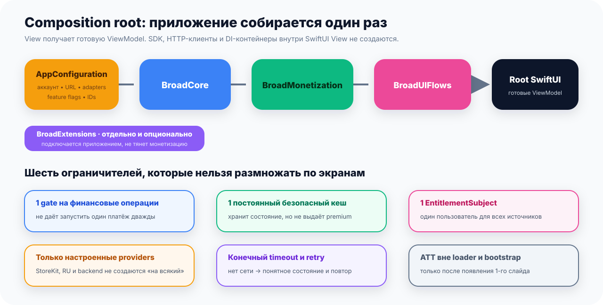
</picture>

`Composition root` — это один объект, который создаётся при запуске приложения
и соединяет настройки, сервисы и экраны. Проще: это единственное место, где
разрешено «собирать приложение из деталей».

| Порядок | Слой | Что передаётся дальше |
|---:|---|---|
| 1 | ⚙️ **Настройки приложения, аккаунт и backend-adapters** | Данные и реализации конкретного приложения |
| 2 | 🔵 **BroadCore** | Готовые запуск, кеш, ошибки и базовые сервисы |
| 3 | 🟢 **BroadMonetization** | Готовые операции продуктов, доступа и оплаты |
| 4 | 🩷 **BroadUIFlows** | ViewModel и маршруты общих экранов |
| 5 | 📱 **Root SwiftUI** | Показывает уже собранное приложение |

Создайте один `MonetizationOperationGate` на весь срок жизни приложения, один
постоянный кеш, один стабильный `EntitlementSubject`, только реально настроенные
источники проверки доступа и один маршрут аналитики. Готовые assembly и
ViewModel передаются во View через `init`; SDK, HTTP-клиент и DI-контейнер не
создаются внутри SwiftUI View.

Простыми словами:

- один объект блокирует повторный запуск одной и той же финансовой операции;
- один постоянный кеш хранит безопасное состояние между запусками;
- один идентификатор пользователя используется всеми способами проверки доступа;
- StoreKit/RU/backend подключаются только если действительно настроены;
- экраны получают готовые ViewModel и сами не создают SDK или HTTP-клиенты.

В этом же месте настройте запуск приложения через `BroadCore`:

- обязательные шаги запуска имеют конечный timeout;
- необязательные SDK могут продолжить запускаться в фоне;
- кеш используется для последнего безопасного отображения, но не подтверждает
  покупку или баланс;
- отсутствие сети показывает понятное состояние с кнопкой повторной проверки;
- ATT не входит в запуск и никогда не вызывается на loader.

Готовый порядок bootstrap, SDK, кеша и offline-состояний
показан в разделе [«Запуск и кеш»](#startup-cache).

[Полный composition с кодом →](Documentation/GettingStarted.md) ·
[Границы архитектуры →](Documentation/Architecture.md)

> [!TIP]
> **✅ Готово, если:** зависимости создаются в одном месте, а внутри SwiftUI View
> нет инициализации Adapty, StoreKit, HTTP-клиентов или DI-контейнера.

<a id="app-configuration"></a>
### Шаг 5. ⚙️ Заполните настройки конкретного приложения

#### Куда складывать константы

> [!IMPORTANT]
> **Одного глобального `AppConstants` в новом приложении быть не должно.** Это
> не забытый файл, а принятое архитектурное решение: ключ Adapty, URL, цвет и
> длительность анимации меняются по разным причинам и не должны превращаться в
> одну общую «коробку со всем».

<picture>
  <source media="(prefers-color-scheme: dark)" srcset="Documentation/Assets/README/configuration-map-dark.svg">
  <source media="(prefers-color-scheme: light)" srcset="Documentation/Assets/README/configuration-map-light.svg">
  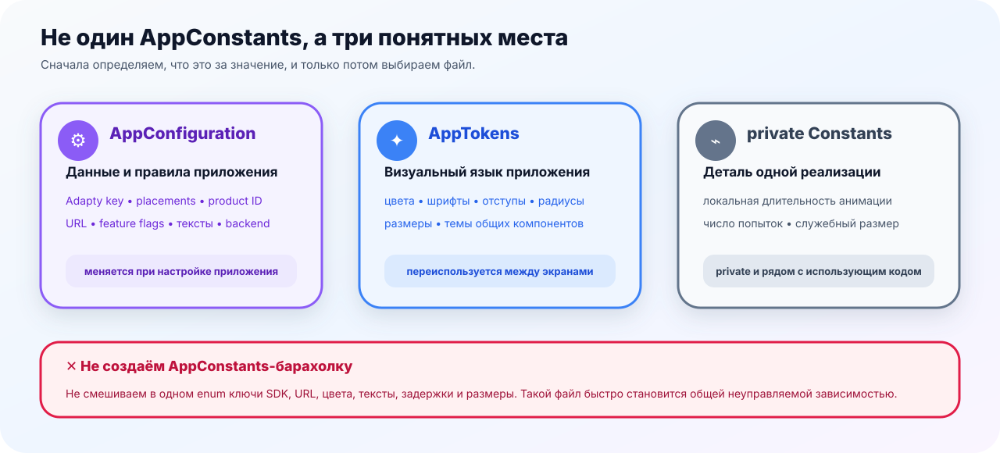
</picture>

| Что за значение | Куда положить | Примеры |
|---|---|---|
| Меняет настройку или поведение конкретного приложения | [`AppConfiguration.swift`](Examples/BroadAppTemplate/BroadAppTemplate/Infrastructure/Configuration/AppConfiguration.swift) | public Adapty key, placement/product ID, URL, backend-конфигурация, feature flags, тексты onboarding/paywall |
| Описывает повторяемый внешний вид приложения | [`AppTokens.swift`](Examples/BroadAppTemplate/BroadAppTemplate/Core/DesignSystem/AppTokens.swift) | цвета, шрифты, отступы, радиусы, размеры, тема paywall |
| Нужна только одной реализации и не имеет смысла вне неё | `private enum Constants` рядом с использующим кодом | длительность локальной анимации, внутренний размер, число попыток |
| Уже принадлежит типу или модулю платформы | Оставить рядом с этим типом внутри платформы | стандартный timeout, минимальный hit area, системный cache limit |

`AppConfiguration` можно разделять на вложенные группы или extensions, если он
стал большим, но источник каждого значения всё равно остаётся один. SwiftUI View
получает готовую конфигурацию или ViewModel и не читает ключи, URL и product ID
из строковых литералов.

> [!TIP]
> **Быстрое правило:** пришло из Kaiten/API и влияет на приложение →
> `AppConfiguration`; пришло из интерфейса и повторяется на экранах →
> `AppTokens`; относится только к одному файлу → локальный `private Constants`.

Минимальный placement registry:

```swift
let placements = AdaptyPlacementRegistry(
    main: AdaptyPlacementID(rawValue: "main"),
    mappings: [
        .onboarding: AdaptyPlacementID(rawValue: "onboarding"),
        .proIcon: AdaptyPlacementID(rawValue: "pro_icon"),
        .settings: AdaptyPlacementID(rawValue: "settings"),
        .ctr: AdaptyPlacementID(rawValue: "CTR"),
        .specialOffer: AdaptyPlacementID(rawValue: "special_offer")
    ]
)
```

После создания registry:

- дополнительные Adapty ID берутся из документа проекта;
- `main` остаётся обязательным общим fallback;
- настоящие IDs не записываются внутри View;
- onboarding pages, paywall copy/theme/legal links, Apple catalog и optional
  RU/tokens/special-offer adapters передаются через composition root.

#### Как задать onboarding без ограничения по количеству

```swift
let onboardingPages: [OnboardingPageConfiguration] = [
    welcomePage,
    featurePage,
    examplesPage,
    readyPage
]

let onboarding = OnboardingConfiguration(
    pages: onboardingPages,
    continueTitle: "Продолжить",
    completionTitle: "Начать",
    progressAccessibilityLabel: "Прогресс онбординга"
)
```

Не передавайте число `4` отдельно. Четыре элемента в `onboardingPages` уже
означают четыре слайда. Добавление пятого элемента автоматически добавит пятый
индикатор и перенесёт завершение на него.

То есть экран просит логическое место показа — например, `settings`. Registry
сам подставляет настоящий placement ID из настроек приложения. Если конкретный
placement недоступен, загрузка повторяется через `main`.

Дальше последовательно настройте остальные части монетизации:

1. Выберите `SubscriptionPurchaseManager`, если есть только подписки, либо
   отдельно добавьте `TokenPurchaseManager`, если приложение продаёт токены.
2. Передайте public Adapty key, premium access level и product ID из Kaiten.
   Временно допустимы fixture либо явно согласованные публичные client values
   reference только для load/show; provider/backend credentials запрещены.
3. Для paywall `main` передайте Remote Config с ключами `ru_pay`,
   `auto_revenue_view` и `special_offer`:
   - для новой неподключённой feature начните с `false`;
   - для уже заведённого RU Billing сохраните product-решение
     `ru_pay` из Adapty; не заменяйте его Swift-default-значением;
   - RU Billing разрешён только при `ru_pay = true` из текущего ответа SDK и
     российском регионе iPhone **или** русском первом системном языке;
   - локальная копия `BroadMonetization` RU Billing не включает;
   - placement `special_offer` получает собственный Remote Config с
     `special_offer = true`;
   - стандартный resolver не требует offer duration/server clock:
     его timer — циклическая визуальная метаданная;
   - gate из `main` используется только при фактическом fallback loader-а на
     `main`.
4. Не фильтруйте, не сортируйте и не объединяйте продукты, которые вернул
   Adapty. UI показывает 0, 1 или любое количество строк в исходном порядке.
5. Если RU Billing не нужен, не регистрируйте его adapters и источник доступа.
6. Если special offer не нужен, оставьте конфигурацию `nil` — это нормальный
   вариант.
7. Для обычных и cross-placement экспериментов используйте результат Adapty;
   не создавайте второй случайный распределитель внутри приложения.
8. Все показы, выборы, покупки, восстановления и результаты проверки доступа
   отправляйте через один analytics pipeline.

> [!WARNING]
> **Перед QA проверьте настоящий каталог только через безопасный load/show:**
>
> - сверьте requested/resolved placement;
> - найдите в payload каждый ожидаемый product ID;
> - если ожидается, например, `offer_week_4.99_nottrial`, но его нет, поставьте
>   `BLOCKED` для Adapty/App Store Connect — не подставляйте hardcoded продукт;
> - настоящую purchase/restore выполняйте только в отдельно разрешённой
>   компанией приёмке.

Минимальный Remote Config для `main`, если все три feature ещё отключены:

```json
{
  "ru_pay": false,
  "auto_revenue_view": false,
  "special_offer": false
}
```

Если RU Billing уже настроен и разрешён, verified-fresh payload содержит
`"ru_pay": true`. Переключаемый локальный режим для этого флага есть
только в Debug-каталоге примера; Release сохраняет strict provenance gate.

Проверка выполняется внутри платформы дважды: перед показом СБП/карты и ещё раз
перед открытием внешней оплаты. Разработчик не пишет свою проверку языка или
региона в SwiftUI-экране. [Подробная схема →](#ru-billing-availability)

| Контур | Полная инструкция |
|---|---|
| Onboarding и ATT | [Onboarding & ATT](Documentation/OnboardingAndATT.md) |
| Paywall UI | [Paywall UI](Documentation/PaywallUI.md) |
| Adapty, StoreKit и purchase/restore | [Monetization](Documentation/Monetization.md) |
| Subscriptions / tokens | [Purchase Managers](Documentation/PurchaseManagers.md) |
| Entitlement sources | [Entitlements](Documentation/Entitlements.md) |
| RU Billing | [RU Billing](Documentation/RUBilling.md) |
| Special offer | [Special Offer](Documentation/SpecialOffer.md) |
| Analytics | [Analytics](Documentation/Analytics.md) |
| Usedesk из Settings | [Usedesk](Documentation/Usedesk.md) |

> [!TIP]
> **✅ Готово, если:** все значения конкретного приложения находятся в его
> конфигурации, `main` задан как резерв, а SwiftUI-экраны не содержат строковых
> placement ID и Adapty key.

### Опциональный шаг 5A. 💬 Подключите Usedesk, если он нужен проекту

Сначала получите подтверждение ПМ. Затем запросите `Company ID`, `Channel ID`,
необходимость Базы знаний и push, а также authenticated backend-ручки для user
chat token.

Готовый интерфейс Usedesk устанавливается через CocoaPods в app target. После
`pod install` открывайте `.xcworkspace`, а не `.xcodeproj`. В Settings добавьте
отдельную строку `Онлайн-чат`; SDK открывается только после нажатия пользователя.

История чата должна переживать переустановку: загружайте user chat token с
backend текущего app account, а новый token из callback сначала сохраняйте в
account-scoped Keychain cache и синхронизируйте туда же. При временной ошибке
оставляйте pending sync; локальный `UserDefaults`, Keychain без account scope и
device ID не подходят как единственный источник истории.

[Полная пошаговая инструкция, Podfile, код сервиса и готовый промпт →](Documentation/Usedesk.md)

> [!TIP]
> **✅ Готово, если:** `Настройки → Онлайн-чат` открывает нужный канал, после
> переустановки история возвращается для того же аккаунта, а другой аккаунт её
> не видит.

### Шаг 6. 🎨 Свяжите платформу с реальными экранами

Соберите один понятный маршрут:

<table>
  <tr>
    <td align="center">🚀<br><strong>Запуск</strong></td>
    <td align="center">👋<br><strong>Onboarding</strong></td>
    <td align="center">💳<br><strong>Paywall</strong></td>
    <td align="center">🔐<br><strong>Проверка доступа</strong></td>
    <td align="center">🏠<br><strong>Основной экран</strong></td>
  </tr>
</table>

- количество и содержимое onboarding задаёт само приложение массивом `pages`;
- стандартную композицию можно взять через `BroadOnboardingView`, а для
  уникального расположения элементов использовать `BroadOnboardingFlowHost` и
  полностью свой SwiftUI;
- loader, error/retry, paywall и выбор способа оплаты берутся из
  `BroadUIFlows` и настраиваются цветами, текстами и ссылками приложения;
- после покупки или восстановления сначала повторно проверяется доступ, и только
  потом маршрут меняется на основной экран;
- paywall должен безопасно выглядеть при 0, 1 и любом количестве продуктов;
- кнопка `Restore` остаётся по центру между `Условия` и `Политика`;
- нажатие на продукт не затемняет и не уменьшает карточку.

Отдельно проверьте правила экранов:

- ATT вызывается только после того, как первый onboarding-слайд уже появился;
- Rate Us можно использовать в приложении, но нельзя добавлять в onboarding;
- loader ничего не покупает, не запрашивает ATT и имеет конечное ожидание;
- error показывает понятное сообщение и безопасную кнопку «Повторить»;
- RU Billing открывает выбор способа оплаты только после выбора тарифа;
- обязательные согласия, email для чека и возврат из внешней оплаты не
  смешиваются с legal-ссылками самого paywall.

Способ соединения маршрутов смотрите в
[`AppFlowRootView.swift`](Examples/BroadAppTemplate/BroadAppTemplate/Presentation/AppFlow/AppFlowRootView.swift),
а полный контракт — в [AppFlow](Documentation/AppFlow.md).

> [!TIP]
> **✅ Готово, если:** чистая установка показывает onboarding, его завершение
> происходит на последнем элементе `pages` и ведёт по выбранной paywall policy;
> обычный `main` не выдаёт premium без подтверждённого доступа.

### Шаг 7. 🛡️ Подключите восстановление после возврата и переустановки

Этот шаг нужен, чтобы приложение правильно завершало незаконченные операции
после запуска, возвращения из браузера оплаты или повторной установки.

- при launch/login вызовите `RecoverCustomerAccessUseCase` для того же account;
- при возвращении приложения передавайте состояние `.active` в проверку
  незавершённой Apple-операции;
- если RU Billing включён, передавайте foreground return в `RUPaymentReturnCoordinator`;
- открывайте premium-раздел только после нового подтверждённого `.active`.

После повторной установки источником данных должны оставаться:

- StoreKit/Adapty для Apple-подписки и lifetime-покупки;
- backend-баланс того же аккаунта для токенов;
- RU backend того же аккаунта для RU-подписки или lifetime.

При внезапном обрыве сети неизвестный результат остаётся незавершённым.
Возвращение сети может повторить только безопасную проверку состояния — оно не
должно автоматически начинать новую покупку, списание токенов или RU-оплату.

[Восстановление после переустановки →](Documentation/AccountRecovery.md) ·
[Обрыв сети в любой момент →](Documentation/NetworkInterruptions.md)

> [!TIP]
> **✅ Готово, если:** возврат приложения в активное состояние запускает только
> проверку уже начатой операции, но не начинает новую покупку или списание.

### Шаг 8. ✅ Обязательно проверьте приложение

Для безопасных сценариев добавьте в Debug-конфигурацию переключатель на
локальные демонстрационные адаптеры по примеру `BroadAppTemplate`. В Release этот
переключатель и демонстрационные данные не должны включаться.

> [!IMPORTANT]
> **Проверьте отклик каждой кнопки, которая ждёт backend или SDK.** Сразу после
> нажатия — ещё до перехода на loader или следующий экран — пользователь должен
> увидеть spinner. На время запроса повторный тап блокируется. Ошибка и отсутствие
> сети обязательно завершают ожидание и показывают понятное действие: повторить
> или закрыть экран.

> [!WARNING]
> **Debug Keychain cleaner:**
>
> - удаляет только явно перечисленные `service` текущего приложения;
> - всегда запрашивает подтверждение;
> - не затрагивает pending payments, cache или files;
> - полностью отсутствует в Release.

[Готовая реализация и пример подключения →](Documentation/DebugToolsAndAsyncActions.md)

Перед UI-прогоном каждого реального endpoint выполните contract smoke по
обезличенному production-shape fixture или версионированной schema:

1. декодируются все обязательные поля;
2. отсутствие обязательного поля даёт контролируемую ошибку;
3. каждое нужное поле действительно доходит до UI.

> [!IMPORTANT]
> Успешная компиляция и локальная кнопка-заглушка не доказывают подключение
> backend.

1. Debug Simulator build рабочего приложения.
2. Release Simulator build рабочего приложения.
3. Чистый первый запуск: onboarding → paywall → разрешённое закрытие либо
   демонстрационная покупка/восстановление → основной экран; premium появляется
   только после подтверждённого `active`.
4. Все три initial-paywall policy и entitlement active/inactive/unresolved.
5. Paywall с 0/1/2/12 продуктами, пустым списком, ошибкой, незавершённой
   операцией и отсутствием сети.
6. Закрытие обычного subscription paywall крестиком без покупки → resolver →
   special offer/main; confirmed purchase/restore первого paywall → main без
   offer; отдельно absent/false/true/main fallback/platform cache.
7. Token paywall остаётся отдельным; Contact Us без Mail показывает fallback;
   один analytics pipeline видит создание, live-update, refresh и clear событий.
8. Live Adapty catalog — только load/show; без реальных purchase/restore. Запишите
   requested/resolved placement, remote gate и наличие каждого ожидаемого
   product ID; fixture не является доказательством Dashboard.
9. Проверка: timeout или `unresolved` могут открыть обычный `main`, чтобы не
   оставить пользователя в вечном loader, но premium остаётся закрытым и
   доступен Retry. Незавершённая платёжная операция остаётся `pending`, не
   открывает premium и не запускается повторно автоматически.
10. Каждая кнопка с backend/SDK сразу показывает spinner, не запускает второй
   запрос по повторному тапу и корректно заканчивает ожидание при error/offline.
11. Debug-очистка Keychain спрашивает подтверждение, удаляет только app-owned
   `service` и полностью отсутствует в Release.

После пунктов 1–11 зафиксируйте `FUNCTIONAL REVIEW REQUIRED` и лично откройте
сборку до визуальной полировки. Затем сравните каждый экран с source frame на
маленьком и большом iPhone Simulator. После исправлений повторите сравнение и
личный просмотр. Только тогда functional и visual статусы могут стать `READY`.

Debug проще всего проверить обычной кнопкой Run в Xcode. Для Release откройте
`Product → Scheme → Edit Scheme… → Run → Build Configuration`, временно выберите
`Release`, выполните Build, затем верните `Debug` для ежедневной разработки.

Live Adapty проверяется только до загрузки и отображения каталога. Не нажимайте
кнопки, которые начинают настоящий purchase, restore или RU-платёж.

Термины в этом списке означают:

- `fixture` — безопасные демонстрационные данные без настоящего платежа;
- `pending` — результат платежа пока неизвестен;
- `unresolved` — StoreKit/backend не смогли подтвердить ни активный, ни
  неактивный доступ;
- `verified premium` — premium-возможности внутри main открылись только после
  нового подтверждения доступа.

[Полный quick start с кодом и командами →](Documentation/GettingStarted.md) ·
[Перенос существующего проекта →](Documentation/MigrationGuide.md)

> [!TIP]
> **✅ Готово, если:** Debug и Release собираются, безопасные сценарии пройдены,
> настоящие платежи не запускались, а неопределённый результат не открыл
> premium и не превратился в ложный `inactive`.

### Шаг 9. 🔍 Проверьте, меняли ли вы саму платформу

Если вы только подключили package и писали код нового приложения, проверка
заканчивается шагом 8. Скрипты платформы не проверяют чужой app target.

Если вы вручную изменяли файлы внутри `BroadAppsIOSPlatform`, откройте Terminal
в её корне и выполните:

```bash
bash Scripts/agent_gate.sh
```

Это проверка **без агента**: она ничего не исправляет. Если gate нашёл ошибку:

1. исправьте первую настоящую причину;
2. после изменения Swift-кода выполните `bash Scripts/format.sh`;
3. снова запустите `bash Scripts/agent_gate.sh`;
4. повторяйте до строки `BroadApps iOS Platform agent gate passed.`

Если нужны автоматические исправления, используйте вариант с Codex/Claude выше
или запустите `./Scripts/agent_review_and_fix.sh` из Terminal.

> [!TIP]
> **✅ Вариант B завершён, если:** приложение собрано в Debug и Release,
> безопасные сценарии пройдены, premium не открывается без подтверждённого
> доступа, а разрешённые временные public client values собраны в одном месте и
> перечислены перед передачей задачи.

<a id="paywall-loader"></a>
## ⏳ Loader на paywall: ожидание без моргания

Loader нужен в двух разных ситуациях: когда каталог тарифов ещё загружается и
когда после нажатия уже выполняется финансовая операция. В обоих случаях
пользователь должен понимать, что приложение работает, но не видеть скачок,
исчезновение или затемнение нажатой карточки.

<table>
  <tr>
    <td width="50%" align="center" valign="top">
      
      <br><strong>Другое приложение · обычная Adapty/Apple-ветка</strong>
      <br><sub>Берём только приём loader: контент сохранён, поверх него blur и отдельная «ромашка»</sub>
    </td>
    <td width="50%" align="center" valign="top">
      
      <br><strong>Apple / Adapty-ветка в 5115Copilot</strong>
      <br><sub>5115 служит reference для RU Billing, но этот ролик показывает обычную Apple-покупку без перехода в RU flow</sub>
    </td>
  </tr>
</table>

> [!IMPORTANT]
> **Эталон здесь — поведение, а не конкретная картинка:** paywall остаётся под
> loader, spinner рисуется отдельным слоем, а карточки и CTA не мигают, не
> уменьшаются и не меняют opacity от нажатия. Цвет blur, вид spinner и фон
> настраивает конкретное приложение.

> [!WARNING]
> **Пробный период из первого ролика не переносим.** Он принадлежит другому
> приложению и показан только потому, что запись хорошо демонстрирует loader.
> В наших текущих приложениях trial не используется. Тарифы, цены, тексты и
> переключатель пробного периода с этого экрана не являются частью платформы.
> Если Adapty всё же вернул такой продукт, приложение не скрывает его локальным
> фильтром: сначала показывает ответ провайдера, а ошибочную настройку исправляют
> в Adapty.

### Что именно должен сделать разработчик

| Момент | Что остаётся на экране | Что можно нажать |
|---|---|---|
| Первая загрузка, сохранённого каталога ещё нет | Стабильный loader и понятный текст | Закрытие — если оно разрешено настройками этого paywall |
| Обновление уже показанного каталога | Последние продукты и выбранная карточка; поверх — loader | Повторные финансовые действия заблокированы |
| Покупка или восстановление выполняется | Тот же paywall под blur и отдельный spinner | Повторный purchase/restore заблокирован; двойного списания нет |
| Ошибка или timeout | Blur снимается, данные не исчезают без причины | Понятные «Повторить» или «Закрыть» |

Чтобы не было моргания:

1. Не уничтожайте и не создавайте заново весь paywall при каждом `loading`.
2. Если контент уже был получен, сохраните список, порядок продуктов и выбор.
3. Покажите progress отдельным overlay; не используйте press-анимацию с
   `opacity`, `scale`, `brightness` или затемняющей подложкой на самой кнопке.
4. Заблокируйте повторное действие через общий operation gate, а не изменением
   внешнего вида карточки.
5. После ответа снимите loader одним переходом в `content` или `error/retry`.

Те же правила обязательны для **токен-пейвола**: меняются товары и результат
операции, но loader, защита от повторного тапа и отсутствие мерцания остаются
такими же. Loader никогда не вызывает ATT и сам не запускает покупку.

[Готовый no-press стиль и состояния paywall →](Documentation/PaywallUI.md#никаких-мерцаний-при-tappurchase) ·
[Общее состояние loading с сохранением предыдущих данных →](Documentation/LoadableState.md)

<a id="token-paywall"></a>
## 🪙 Токен-пейвол: покупка расходуемых пакетов

**Токен** — расходуемая единица внутри приложения: например, одна генерация,
проверка или другое платное действие. **Токен-пейвол** — отдельный экран, на
котором пользователь выбирает пакет таких единиц. Это не подписка: пакет можно
израсходовать, а актуальный остаток хранит backend конкретного приложения.

<table>
  <tr>
    <td width="42%" align="center" valign="top">
      <a href="Documentation/Assets/README/References/5115-token-paywall-dark.png">
        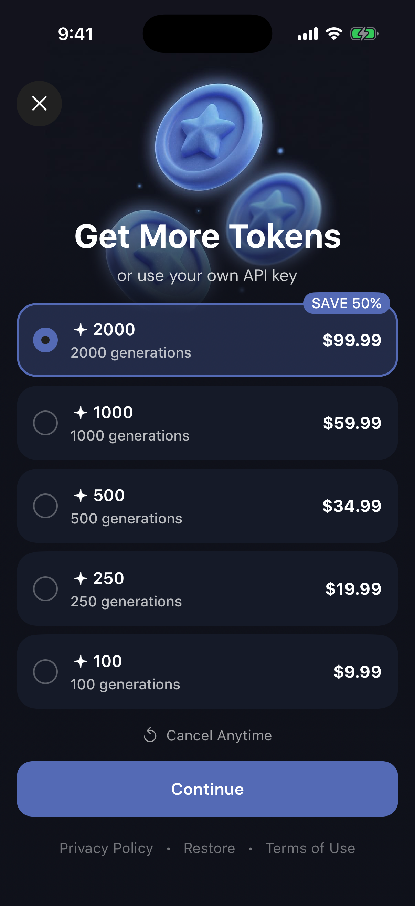
      </a>
      <br><strong>Живой пример из 5115Copilot</strong>
      <br><sub>Скриншот с iPhone Simulator; покупка не запускалась</sub>
    </td>
    <td width="58%" valign="top">
      <h3>Что разработчик должен увидеть здесь</h3>
      <ul>
        <li><strong>Один экран — любое количество пакетов.</strong> На примере их пять; при 0 показываем безопасное пустое состояние, при 1…N — все полученные карточки.</li>
        <li><strong>Все продукты провайдера.</strong> Их не фильтруем, не объединяем и не меняем порядок.</li>
        <li><strong>Одинаковые устойчивые карточки.</strong> Длинные названия и локализованные цены не ломают вёрстку.</li>
        <li><strong>Кнопка действия остаётся доступной.</strong> При длинном списке продукты прокручиваются, а CTA не теряется.</li>
        <li><strong>Выбор без мерцания.</strong> Карточка не затемняется и не уменьшается как обычная кнопка.</li>
      </ul>
      <p><strong>Важно:</strong> тексты, изображение, пять пакетов, цены, скидка и возможность использовать свой API key принадлежат конкретному приложению 5115. Их не копируют как обязательный стандарт платформы.</p>
    </td>
  </tr>
</table>

В самом 5115 этот экран открывается по нажатию на счётчик токенов у
авторизованного premium-пользователя. Такой вход удобен для этого продукта, но
не зашит в платформу: конкретное приложение само решает, откуда открыть
токен-пейвол.

### Когда этот экран нужен

| Ситуация в приложении | Что делать |
|---|---|
| Только premium-подписка | Токен-пейвол и `TokenPurchaseManager` не подключать |
| Подписка и расходуемые токены | Подписку оставить в `SubscriptionPurchaseManager`, токены подключить отдельным `TokenPurchaseManager` |
| Только токены | Подключить только `TokenPurchaseManager` и backend-баланс |

Как открывается token paywall:

1. пользователь нажимает баланс либо запускает действие, для которого токенов
   недостаточно;
2. экран запрашивает логический placement `tokens`;
3. app configuration подставляет настоящий Adapty placement ID;
4. при недоступности placement используется fallback `main`, но аналитика
   сохраняет исходный контекст `tokens`.

<table>
  <tr>
    <td align="center">1️⃣<br><strong>Открыть</strong><br><sub>Баланс или платная функция</sub></td>
    <td align="center">2️⃣<br><strong>Загрузить</strong><br><sub>Placement <code>tokens</code></sub></td>
    <td align="center">3️⃣<br><strong>Показать</strong><br><sub>Empty state или все 1…N пакетов</sub></td>
    <td align="center">4️⃣<br><strong>Оплатить</strong><br><sub>Apple или RU flow</sub></td>
    <td align="center">5️⃣<br><strong>Сверить</strong><br><sub>Подтверждение backend</sub></td>
    <td align="center">6️⃣<br><strong>Показать</strong><br><sub>Новый серверный баланс</sub></td>
  </tr>
</table>

> [!IMPORTANT]
> **Токены нельзя начислять по нажатию на «Продолжить», закрытию платёжного
> окна или локальному сообщению об успехе.** Перед оплатой сохраняется pending
> intent, после неё backend атомарно начисляет токены только один раз для
> конкретного transaction/checkout ID и возвращает полный актуальный баланс.
> Только этот серверный ответ обновляет UI.

> [!WARNING]
> Если интернет пропал, операция остаётся `pending`. Кнопка «Повторить» и
> возвращение сети только сверяют уже начатую операцию — они не запускают
> второе списание автоматически.

После удаления приложения локальное состояние исчезает. Чтобы токены вернулись,
пользователь входит в тот же аккаунт, а приложение запрашивает у backend полный
текущий balance snapshot. Для этого recovery клиент не отправляет список
transaction/checkout ID: эти ID нужны только backend-защите начисления от
дублей. Кнопка StoreKit `Restore` сама по себе не восстанавливает расходуемые
токены; она предназначена для поддерживаемых Apple-покупок.

[Подключение менеджеров подписки и токенов →](Documentation/PurchaseManagers.md) ·
[Восстановление баланса после переустановки →](Documentation/AccountRecovery.md) ·
[Общий контракт монетизации →](Documentation/Monetization.md)

<a id="visual-reference"></a>
## 💳 RU Billing: последовательность экранов

Здесь показан обычный последовательный сценарий RU-покупки. Этот блок нужен,
чтобы разработчик сразу видел все шаги: где выбирается тариф, когда
появляются способы оплаты, какие согласия обязательны, где вводится email и как
открывается внешняя платёжная форма. Внешний стиль конкретного приложения может
отличаться.

Эти экраны появляются только после общей проверки платформы:
`ru_pay = true` **и** (`регион iPhone = Россия` **или** `первый системный язык =
русский`). Если проверка не пройдена, пользователь остаётся в обычном Apple
purchase-flow и окно выбора СБП/карты не открывается.

> [!NOTE]
> В Debug флаг `ru_pay` можно временно включить/выключить в каталоге
> примера. Это тест UI, а не production-источник. Release не содержит
> этой Debug-секции, default store заблокирован в режиме `Как в Adapty`,
> а `ru_pay` всегда приходит из Adapty.

<table>
  <tr>
    <td align="center">1️⃣<br><strong>Тариф</strong><br><sub>Выбрать продукт</sub></td>
    <td align="center">2️⃣<br><strong>Способ</strong><br><sub>Apple, СБП или карта</sub></td>
    <td align="center">3️⃣<br><strong>Согласия</strong><br><sub>Проверить обязательные</sub></td>
    <td align="center">4️⃣<br><strong>Чек</strong><br><sub>Email — если нужен</sub></td>
    <td align="center">5️⃣<br><strong>Оплата</strong><br><sub>Открыть внешнюю форму</sub></td>
    <td align="center">6️⃣<br><strong>Проверка</strong><br><sub>Подтвердить на backend</sub></td>
  </tr>
</table>

### 1. Сначала тариф, затем способ оплаты

<table>
  <tr>
    <td align="center" width="50%">
      <a href="Documentation/Assets/README/References/5115-paywall-dark.png">
        
      </a>
      <br><strong>1. Выбрать тариф</strong>
      <br><sub>Все продукты провайдера: например, год и неделя</sub>
    </td>
    <td align="center" width="50%">
      <a href="Documentation/Assets/README/References/5115-payment-methods-dark.png">
        
      </a>
      <br><strong>2. Выбрать способ оплаты</strong>
      <br><sub>После «Продолжить»: СБП, банковская карта или Apple</sub>
    </td>
  </tr>
</table>

> Это два последовательных экрана. В окне выбора оплаты нет отдельных строк
> «Политика конфиденциальности» и «Публичная оферта».

### 2. Согласия, чек и внешняя оплата

<table>
  <tr>
    <td align="center" width="33%" colspan="2">
      <a href="Documentation/Assets/README/References/5115-payment-ready-dark.png">
        
      </a>
      <br><strong>Готово к оплате</strong>
      <br><sub>Все обязательные согласия видны</sub>
    </td>
    <td align="center" width="33%" colspan="2">
      <a href="Documentation/Assets/README/References/5115-consent-alert-dark.png">
        
      </a>
      <br><strong>Нет согласия</strong>
      <br><sub>Короткое и понятное объяснение</sub>
    </td>
    <td align="center" width="33%" colspan="2">
      <a href="Documentation/Assets/README/References/5115-receipt-email-dark.png">
        
      </a>
      <br><strong>Почта для чека</strong>
      <br><sub>Отдельный шаг; клавиатура ничего не перекрывает</sub>
    </td>
  </tr>
  <tr>
    <td align="center" width="50%" colspan="3">
      <a href="Documentation/Assets/README/References/5115-cloudpayments-light.png">
        
      </a>
      <br><strong>Банковская карта</strong>
      <br><sub>Внешняя форма, чек на email, безопасное закрытие</sub>
    </td>
    <td align="center" width="50%" colspan="3">
      <a href="Documentation/Assets/README/References/5115-hosted-checkout-light.png">
        
      </a>
      <br><strong>Внешняя оплата</strong>
      <br><sub>Сумма, назначение и одно понятное действие</sub>
    </td>
  </tr>
</table>

<a id="showcase"></a>
<a id="example-и-ручные-сценарии"></a>
## BroadAppTemplate: зачем запускать пример

`BroadAppTemplate` — **технический пример подключения**, а не готовый дизайн.
Запускайте его, чтобы:

- понять, как четыре модуля package соединяются в одном приложении;
- открыть интерактивные карточки app flow, subscription/token paywall, special
  offer, RU Billing, loader/error, analytics, Contact Us и Debug-хранилищ;
- пройти `запуск → onboarding → initial paywall → крестик без покупки →
  optional special offer → main`;
- сравнить три app-owned политики initial paywall: один раз после onboarding,
  каждый холодный запуск при inactive access и disabled;
- проверить отдельный token balance/paywall: placement `.tokens`, fixture
  fulfillment, pending/retry и обновление баланса только после backend snapshot;
- независимо очистить app-owned Keychain, flow progress, content cache и
  in-memory analytics с объяснением scope и необходимости перезапуска;
- увидеть live typed analytics, создать события без покупки, обновить и очистить
  их с понятным результатом;
- проверить Contact Us: обязательный Simulator fallback с alert/Copy и
  отдельный сценарий пустого support email; системный composer остаётся
  скомпилированной веткой для доступного компании способа запуска и не требует
  Signing Team в platform gate;
- проверить локальные данные и настоящий каталог Adapty как два отдельных режима;
- воспроизвести 0/1/2/12 продуктов, пустой список, ошибку, незавершённую
  операцию и отсутствие сети;
- сравнить своё подключение с рабочим примером.

> [!IMPORTANT]
> Первый обычный запуск example показывает три страницы только для краткой
> демонстрации. Сценарии ниже отдельно показывают 1, 2, 4, длинный onboarding,
> отключённый onboarding, битую конфигурацию и полностью свой интерфейс — без
> изменения кода `BroadUIFlows`.

`Fixture` в этом разделе означает заранее подготовленный безопасный ответ:
приложение ведёт себя так, будто получило продукты или результат операции, но
реальные деньги и настоящий пользовательский доступ не затрагиваются.

> [!IMPORTANT]
> Скриншоты example показывают технические состояния платформы. Полный состав
> экранов RU-покупки смотрите в разделе
> [«RU Billing: последовательность экранов»](#visual-reference).

### Запуск

```bash
./Scripts/generate_example.sh
open Examples/BroadAppTemplate/BroadAppTemplate.xcodeproj
```

Выберите схему `BroadAppTemplate` и iPhone Simulator. Для полной проверки package и example:

```bash
./Scripts/agent_gate.sh
```

Чтобы видеть только безопасные runtime-события example, оставьте приложение
запущенным и во втором Terminal выполните:

```bash
bash Scripts/stream_example_logs.sh
```

Если запущено несколько iPhone Simulator:

- helper покажет их UDID и готовую команду повторного запуска;
- для host app передайте его постоянный subsystem первым аргументом;
- основной результат смотрите в UI или Debug Status;
- Console используйте для порядка `[BOOTSTRAP]`, `[FLOW]`, `[EXPERIMENTS]`,
  `[TOKENS]` и `[ANALYTICS]`;
- payload, email, token, receipt/JWS и raw SDK error в Console быть не должно.

Для настоящего AppFlow закрытие initial paywall даёт
`[FLOW] ... from=initial-paywall to=special-offer`. Открытие той же пары из
карточки каталога не меняет глобальный AppFlow route: там ожидаются
`[EXPERIMENTS]` и `[ANALYTICS]`, но не отдельный `[FLOW]` переход.

| Режим | Когда нужен | Что безопасно делает |
|---|---|---|
| `BroadAppTemplate` | Ежедневная разработка | Локальные данные; покупка/восстановление не трогают реальные финансы |
| Live Adapty schemes | Проверка настоящего каталога продуктов | Только подключение SDK, загрузка и показ; финансовая операция не запускается |

<table>
  <tr>
    <td align="center" width="33%" colspan="2">
      <a href="Documentation/Assets/README/Screenshots/onboarding-ru-v2.png">
        
      </a>
      <br><strong>1. Первый запуск</strong>
      <br><sub>Onboarding и правильный момент ATT</sub>
    </td>
    <td align="center" width="33%" colspan="2">
      <a href="Documentation/Assets/README/Screenshots/paywall-showcase-ru-v2.png">
        
      </a>
      <br><strong>2. Продукты провайдера</strong>
      <br><sub>Исходный порядок, длинные названия и всегда видимая кнопка</sub>
    </td>
    <td align="center" width="33%" colspan="2">
      <a href="Documentation/Assets/README/Screenshots/main-ru-v2.png">
        
      </a>
      <br><strong>3. Доступ подтверждён</strong>
      <br><sub>Premium-состояние внутри main появляется только после новой проверки доступа</sub>
    </td>
  </tr>
</table>

<details>
  <summary><strong>🧪 Параметры запуска безопасных сценариев</strong></summary>

| Аргумент | Что проверить |
|---|---|
| `-paywall-empty` | 0 продуктов, повтор, восстановление и закрытие |
| `-paywall-one-product` | 1 продукт выбирается автоматически |
| `-paywall-two-products` | 2 продукта остаются в исходном порядке |
| `-paywall-many-products` | 12 продуктов, нижние кнопки остаются доступными |
| `-paywall-failure` | Понятная ошибка без технического текста SDK |
| `-token-paywall-main-fallback` | `.tokens` недоступен; token UI принимает резервный `main` только когда все продукты consumable и сохраняет requested context `.tokens` |
| `-purchase-pending` | Незавершённая операция не выдаёт premium |
| `-entitlement-unknown` | Неопределённый доступ не превращается в «доступа нет» |
| `-tracking-disabled` | Проверка интерфейса без системного окна ATT |
| `-onboarding-one-page` | Стандартный onboarding из одной страницы |
| `-onboarding-two-pages` | Стандартный onboarding из двух страниц |
| `-onboarding-three-pages` | Явный демонстрационный вариант из трёх страниц |
| `-onboarding-four-pages` | Стандартный onboarding из четырёх страниц |
| `-onboarding-long` | Длинный onboarding: динамический progress и scroll |
| `-onboarding-custom-ui` | Четыре страницы в app-owned SwiftUI через `BroadOnboardingFlowHost` |
| `-onboarding-disabled` | Onboarding отключён через `AppFlowConfiguration` |
| `-onboarding-invalid` | Пустая конфигурация безопасно завершается без UI и ATT |
| `-special-offer-enabled` | После закрытия обычного paywall provider-like fixture с `special_offer = true` открывает кампанию |
| `-special-offer-disabled` | Явный `special_offer = false` оставляет кампанию закрытой |
| `-special-offer-platform-cache` | Даже `special_offer = true` из кеша `BroadMonetization` не открывает кампанию |
| `-special-offer-main-fallback` | Placement кампании недоступен, резервный `main` корректно открывает её и сохраняет источник показа |
| `-special-offer-looping-timer` | Таймер идёт 24:00:00 → 00:00:00 → 24:00:00 и не закрывает offer |
| `-ru-pay-provider-enabled` | Verified-fresh fixture с `ru_pay = true` и российский контекст iPhone показывают Apple, СБП и карту |
| `-ru-pay-provider-disabled` | Явный `ru_pay = false` из provider-like payload оставляет только Apple |
| `-ru-pay-adapty-fallback-rejected` | `ru_pay = true` из Adapty managed fallback не включает RU methods без доказанной свежести |
| `-ru-pay-platform-cache` | Даже `ru_pay = true` из кеша `BroadMonetization` оставляет только Apple |

> [!NOTE]
> Эти Remote Config-сценарии работают на локальных демонстрационных данных. Они
> проверяют настоящие use cases платформы, но не входят в Adapty Dashboard, не
> запускают StoreKit и не создают RU-платёж. В Special Offer сначала закройте
> обычный subscription paywall и дождитесь resolver; в RU-сценарии выберите
> продукт и нажмите `Продолжить`, чтобы сравнить список способов оплаты.

[Все параметры запуска и демонстрационная аналитика →](Examples/BroadAppTemplate/README.md)
</details>

<a id="usedesk"></a>
## 💬 Usedesk: онлайн-чат из Settings

Usedesk добавляется только в те приложения, где его подтвердил ПМ. Разработчику
не нужно угадывать способ подключения:

| Шаг | Что происходит |
|---|---|
| 1. Получить данные | Аккаунт-менеджер или ПМ присылает `Company ID`, `Channel ID` и опциональные настройки |
| 2. Подключить GUI | В app target добавляется CocoaPods `UseDesk_SDK_Swift`; после `pod install` проект открывается через `.xcworkspace` |
| 3. Добавить вход | В Settings появляется отдельная строка `Онлайн-чат` |
| 4. Сохранить историю | Backend текущего app account — источник token; account-scoped Keychain — cache и pending sync |

<p align="center">
  <a href="Documentation/Assets/README/Usedesk/pm-data-sanitized.png">
    
  </a>
</p>

> [!IMPORTANT]
> Поле `Token` из сообщения ПМ, user chat token конкретного пользователя и
> секретный API token — разные значения. Для обычного чата используется
> `api_token: nil`. User chat token хранится на backend аккаунта, чтобы история
> вернулась после переустановки; Keychain хранит только копию точного аккаунта и
> незавершённую синхронизацию. Device ID не заменяет пользователя. Не вставляйте
> присланный token в Swift-код, пока ПМ не подтвердил его назначение.

> [!NOTE]
> **Путь пользователя всегда один:** `Настройки → Онлайн-чат → загрузка token
> текущего аккаунта → экран Usedesk`. Чат не запускается в loader и не
> открывается автоматически.

<table>
  <tr>
    <td align="center" width="50%">
      <a href="Documentation/Assets/README/Usedesk/settings-online-chat-highlighted.png">
        
      </a>
      <br><strong>1. Нажать Online Chat</strong>
      <br><sub>Это отдельная строка в Settings, не email-поддержка</sub>
    </td>
    <td align="center" width="50%">
      <a href="Documentation/Assets/README/Usedesk/chat-screen.png">
        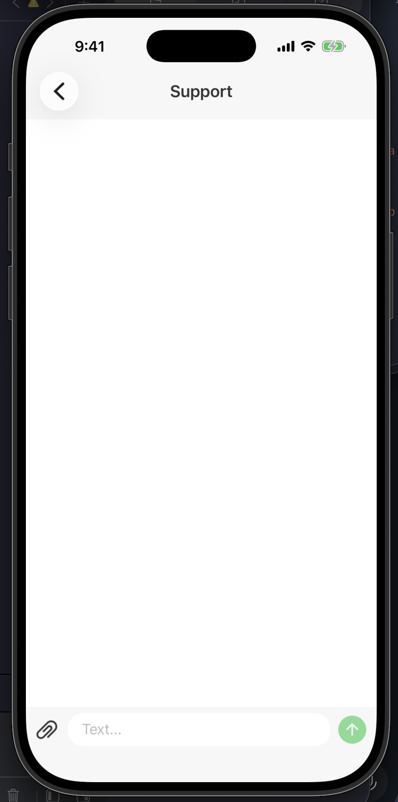
      </a>
      <br><strong>2. Откроется Usedesk</strong>
      <br><sub>Готовый UI чата с полем сообщения и прикреплением файла</sub>
    </td>
  </tr>
</table>

Это рабочий пример пути пользователя. Цвета и остальной Settings UI
берутся из конкретного приложения; общим остаётся сам переход и готовый
экран чата.

Usedesk не инициализируется в loader и не открывается автоматически. Если SDK
не установлен, данных нет или сеть оборвалась, Settings остаётся доступным и
показывает понятную ошибку с ручным повтором.

[Открыть полную инструкцию Usedesk: данные, Podfile, код, backend и checklist →](Documentation/Usedesk.md)

<a id="architecture"></a>
## 🧭 Четыре модуля без магии

Приложение подключает не один огромный модуль, а только нужные части:

| Модуль | Зачем он нужен |
|---|---|
| 🔵 `BroadCore` | Безопасный запуск, кеш, работа без сети, повтор запросов и журнал событий |
| 🟢 `BroadMonetization` | Получение продуктов, покупки, восстановление, проверка premium, токены, RU Billing и эксперименты |
| 🩷 `BroadUIFlows` | Готовые состояния запуска, onboarding, загрузка/ошибка/повтор, paywall и RU-интерфейс |
| 🟣 `BroadExtensions` | Независимые небольшие помощники: Hex Color, шрифты, закрытие клавиатуры и swipe-back |

<picture>
  <source media="(prefers-color-scheme: dark)" srcset="Documentation/Assets/README/architecture-dark.svg">
  <source media="(prefers-color-scheme: light)" srcset="Documentation/Assets/README/architecture-light.svg">
  
</picture>

> [!NOTE]
> **Как читать схему:** приложение показывает UI через `BroadUIFlows`, операции
> оплаты передаёт в `BroadMonetization`, а общие запуск, кеш и ошибки остаются в
> `BroadCore`. `BroadExtensions` не зависит от остальных модулей.

<details>
  <summary><strong>📁 Где что лежит</strong></summary>

<pre>
BroadAppsIOSPlatform
├── 🔵 <a href="Sources/BroadCore">Sources/BroadCore</a>                 запуск, кеш, ATT, журнал событий
├── 🟢 <a href="Sources/BroadMonetization">Sources/BroadMonetization</a>         Adapty, StoreKit, проверка доступа, RU Billing
├── 🩷 <a href="Sources/BroadUIFlows">Sources/BroadUIFlows</a>              маршруты, onboarding, paywall, общий UI
├── 🟣 <a href="Sources/BroadExtensions">Sources/BroadExtensions</a>            независимые вспомогательные функции
├── 🟠 <a href="Examples/BroadAppTemplate">Examples/BroadAppTemplate</a>          запускаемый пример подключения
├── 📘 <a href="Documentation">Documentation</a>                       полные контракты и инструкции
├── 🤖 <a href="AgentChecks">AgentChecks</a>                         правила и статус автопроверки
└── 🛠️ <a href="Scripts">Scripts</a>                             форматирование, анализ, сборка и проверки
</pre>
</details>

[Полная архитектура →](Documentation/Architecture.md)

<a id="startup-cache"></a>
## ⚡️ Запуск SDK и кеш: что происходит до первого экрана

<picture>
  <source media="(prefers-color-scheme: dark)" srcset="Documentation/Assets/README/startup-cache-dark.svg">
  <source media="(prefers-color-scheme: light)" srcset="Documentation/Assets/README/startup-cache-light.svg">
  
</picture>

> [!IMPORTANT]
> **Библиотеки уже находятся в сборке.** На старте не нужно «подгружать
> package». Нужно правильно инициализировать сервисы и не заставлять
> первый экран ждать то, что ему не нужно.

| Что делаем | Простое правило |
|---|---|
| 🧩 **Собираем dependencies** | Конфиг, logger, cache, identity, adapters и use cases создаются один раз в composition root |
| 🔴 **Ждём `critical`** | Только шаги, без которых нельзя безопасно выбрать первый route; каждый имеет timeout |
| 🟢 **Открываем UI** | `ready` или безопасный `degraded`; необязательные SDK больше не держат loader |
| 🟣 **Запускаем `background`** | Analytics, telemetry и некритичный prewarm идут параллельно уже после открытия UI |
| 💾 **Читаем content cache** | Показываем fresh/stale snapshot, пробуем network refresh; offline не удаляет последние валидные данные |

В пакете уже есть типизированный версионный cache и готовые кеши для
paywall, RU-каталога, StoreKit storefront и entitlement. Кеш paywall
разделён по app-account и placement, имеет TTL и предельный возраст
stale-данных.

> [!WARNING]
> Cache ускоряет и сохраняет UI, но не доказывает premium, token balance
> или RU-оплату. ATT, Rate Us, Usedesk, purchase и restore никогда не
> запускаются на loader.

[Готовая пошаговая сборка, код и checklist →](Documentation/StartupAndCaching.md) ·
[Контракт bootstrap →](Documentation/Bootstrap.md) ·
[Детали cache/offline →](Documentation/CachingAndOffline.md)

<a id="debug-feedback"></a>
## 🧰 Debug Keychain и мгновенный отклик backend-кнопок

<picture>
  <source media="(prefers-color-scheme: dark)" srcset="Documentation/Assets/README/debug-feedback-dark.svg">
  <source media="(prefers-color-scheme: light)" srcset="Documentation/Assets/README/debug-feedback-light.svg">
  
</picture>

| Ситуация | Что уже даёт платформа |
|---|---|
| Старый token мешает проверить новый вход | `BroadAppTemplate` содержит `DebugKeychainCleaner`: он очищает только перечисленные app-owned `service` и отсутствует в Release |
| Нажали «Сгенерировать» или «Найти» | Публичный `BroadActionButton` сразу показывает `ProgressView` при `isInFlight == true` |
| Backend ещё отвечает | Кнопка заблокирована от второго тапа; ViewModel владеет Task, timeout и результатом |
| Ответ получен | Success переводит дальше, а offline/error убирает spinner и показывает понятный Retry |

> [!IMPORTANT]
> `isInFlight = true` устанавливается **до** создания Task и первого `await`.
> Даже если следующим шагом будет отдельный экран загрузки, маленькая ромашка
> на исходной кнопке сразу показывает пользователю, что тап принят.

В `BroadAppTemplate` откройте значок инструментов на main. В
`Debug-настройках` действия разделены по владельцам данных:

- backend-loader показывает результат рядом со своей кнопкой;
- Keychain очищает только app-owned credentials;
- flow progress, content cache и in-memory analytics имеют отдельные кнопки и
  собственный счётчик результата;
- ни одно действие не удаляет payment pending или данные соседней секции.

[Готовое подключение и код ViewModel →](Documentation/DebugToolsAndAsyncActions.md) ·
[Общие loading-состояния →](Documentation/LoadableUI.md) ·
[Правила безопасности →](Documentation/Security.md)

<a id="monetization"></a>
## 💳 Шесть правил, которые нельзя сломать

| Правило | Что это означает в приложении |
|---|---|
| 🧭 **`main` — резерв любого placement** | Настоящие Adapty ID лежат в конфигурации приложения, а не внутри экранов |
| 📚 **Показываем все продукты** | Не фильтруем, не сортируем и не объединяем одинаковые SKU; сохраняем порядок Adapty |
| 🔐 **Сначала подтверждаем доступ** | Ответ purchase/restore сам по себе не открывает premium; нужна новая проверка StoreKit или backend |
| 🎁 **Special offer опционален** | Отсутствующая конфигурация (`nil`) — нормальный сценарий, а не ошибка |
| 🪪 **ATT только после первого слайда** | В loader запроса нет; Rate Us разрешён в приложении, но не внутри onboarding |
| ✨ **Платёжные карточки не мерцают** | Нажатие не затемняет и не уменьшает карточку; обработка показывается отдельным состоянием |

<div align="center">
  
</div>

[Монетизация →](Documentation/Monetization.md) ·
[Адаптивный paywall →](Documentation/PaywallUI.md) ·
[Эксперименты →](Documentation/Experiments.md) ·
[Аналитика →](Documentation/Analytics.md)

<a id="automation"></a>
## ✅ Если вы изменили код платформы

Этот раздел нужен только разработчику, который менял файлы внутри
`BroadAppsIOSPlatform`. Если вы подключили package без его изменения,
достаточно проверки конкретного приложения из варианта A или B выше.

<table>
  <tr>
    <td width="50%" valign="top">
      <h3>🔎 Gate</h3>
      <p><strong>Проверяет, но не исправляет.</strong></p>
      <p>Одна команда последовательно запускает правила, анализ и сборки.</p>
    </td>
    <td width="50%" valign="top">
      <h3>🤖 Проверяющий агент</h3>
      <p><strong>Запускает gate и исправляет причину.</strong></p>
      <p>После правки снова запускает тот же gate до честного PASS.</p>
    </td>
  </tr>
</table>

> [!IMPORTANT]
> Здесь речь о **проверяющем агенте платформы**. Он проверяет сам
> `BroadAppsIOSPlatform`. Агент из раздела [«Сделать приложение через Codex или
> Claude»](#agent-setup) выполняет другую работу — создаёт конкретное приложение
> на готовой платформе.

### Выберите одну строку и выполните её

| Как вы работаете | Что сделать |
|---|---|
| Создаёте приложение через Codex/Claude и меняли платформу | Отправить [prompt финальной проверки варианта A](#agent-app-check) — он проверит и приложение, и изменённую платформу |
| Работаете только над платформой в Codex/Claude | Написать: «Прочитай AGENTS.md, запусти `bash Scripts/agent_gate.sh`, исправь найденные platform-owned ошибки и повторяй gate до PASS» |
| Нужна полностью автоматическая проверка из Terminal | Выполнить `./Scripts/agent_review_and_fix.sh` |
| Работаете без агента | Выполнить `bash Scripts/agent_gate.sh`, исправить первую ошибку и запустить команду снова |

Выберите **ровно одну** строку. Несколько вариантов одновременно запускать не
нужно.

> [!TIP]
> **Успех выглядит однозначно:** последняя строка проверки —
> `BroadApps iOS Platform agent gate passed.`

<details>
<summary><strong>Показать подробности: что проверяется, prompts и отчёты</strong></summary>
<br>

### Сначала поймите, нужна ли эта проверка

| Что вы меняли | Что проверять |
|---|---|
| Только код нового приложения | Соберите target приложения в Debug/Release и выполните безопасные демонстрационные сценарии. Проверяющий агент платформы не нужен |
| Любой файл внутри `BroadAppsIOSPlatform` | Обязательно запустите один из вариантов platform-проверки ниже |

### Два скрипта — две разные задачи

| Скрипт | Когда запускать | Что произойдёт |
|---|---|---|
| `./Scripts/agent_review_and_fix.sh` | Из Terminal, когда нужен автоматический поиск и исправление ошибок | Скрипт запускает Codex с готовым заданием, разрешает исправления только внутри платформы, повторно проверяет результат и сохраняет отчёт |
| `bash Scripts/agent_gate.sh` | Внутри уже открытого Codex/Claude либо вручную без автоматических исправлений | Запускает правила, проверку стиля и сборки; сам код не меняет |

Оба скрипта запускаются **из корня `BroadAppsIOSPlatform`**. В Xcode они сами по
себе не стартуют.

Простое различие: `agent_gate.sh` только показывает проблему;
`agent_review_and_fix.sh` сам открывает Codex, чтобы проблему исправить.

### Что именно проверяет агент

| Область | Что должно остаться правильным |
|---|---|
| Архитектура | Границы `BroadCore`, `BroadMonetization`, `BroadUIFlows` и `BroadExtensions`; Clean Architecture + MVVM + SOLID |
| Onboarding | ATT только после появления первого слайда; Rate Us не находится внутри onboarding |
| Paywall | 0/1/любое количество продуктов, исходный порядок без фильтрации, всегда доступные кнопки, загрузка/ошибка/повтор и отсутствие мерцания при нажатии |
| Adapty | Typed placements, обязательный fallback на `main`, обычные и cross-placement experiments |
| Доступ и покупки | Покупка, восстановление и незавершённая операция не открывают premium без новой подтверждённой проверки доступа |
| RU Billing и tokens | Безопасные контракты, optional adapters, восстановление через тот же app account и backend ledger |
| Плохая сеть | Отсутствие сети/timeout не становятся ложным успехом или отказом в доступе; неизвестный платёж остаётся незавершённым |
| Качество проекта | Стиль кода, SwiftFormat, SwiftLint, privacy manifest, документация, ссылки и изображения README |
| Сборка | Swift Package и iPhone example в Debug/Release, плюс две live-конфигурации Adapty без запуска финансовых операций |

Настоящие purchase, restore и RU-платёж не выполняются. StoreKit sandbox, test
targets, iPad, `.ipa` и provisioning в эту локальную проверку не входят.
Отсутствие Signing Team не является blocker: обязательная матрица использует
iPhone Simulator и generic unsigned compile.

### Где лежат правила проверяющего агента

| Файл | Простое объяснение |
|---|---|
| [`AGENTS.md`](AGENTS.md) | Что агент обязан соблюдать и что ему запрещено менять |
| [`AgentChecks/AUTOMATION_PROMPT.md`](AgentChecks/AUTOMATION_PROMPT.md) | Готовое задание, которое автоматический скрипт передаёт Codex |
| [`Scripts/agent_gate.sh`](Scripts/agent_gate.sh) | Полный набор проверок: contracts, architecture, privacy, docs, style и сборки |
| [`Scripts/agent_review_and_fix.sh`](Scripts/agent_review_and_fix.sh) | Запуск Codex, исправление, независимая перепроверка и сохранение отчёта |
| [`AgentChecks/AutomationReports/latest.md`](AgentChecks/AutomationReports/README.md) | Локальный отчёт последнего запуска: что найдено и исправлено |

### Вариант 1 — одна команда, свой промпт не нужен

Это рекомендуемый способ после изменений внутри платформы.

Первый раз на новом Mac проверьте окружение:

```bash
./Scripts/agent_review_and_fix.sh --doctor
```

Если написано `Doctor passed`, запустите:

```bash
./Scripts/agent_review_and_fix.sh
```

Дальше всё происходит автоматически:

| Этап | Что делает automation |
|---|---|
| 📋 **Правила** | Передаёт Codex готовый prompt и ограничения из `AGENTS.md` |
| 🔎 **Первая проверка** | Запускает полный gate и показывает настоящую первопричину |
| 🛠️ **Исправление** | Меняет только platform-owned файлы и не ослабляет проверку |
| 🔁 **Повтор** | Снова запускает gate до PASS |
| 🧾 **Контроль** | Независимо повторяет gate и сохраняет понятный отчёт |

Собственный промпт здесь не нужен: он уже лежит в
`AgentChecks/AUTOMATION_PROMPT.md`, а границы работы — в `AGENTS.md`. Последний
отчёт появится в `AgentChecks/AutomationReports/latest.md`.

### Вариант 2 — запустить проверяющего агента вручную

Этот способ подходит, если вы уже открыли repository в Codex или Claude и хотите
видеть всю работу в текущем чате. Рабочей папкой должен быть корень
`BroadAppsIOSPlatform`.

Codex сам учитывает `AGENTS.md`. Claude нужно явно попросить прочитать этот файл.
Скопируйте агенту следующий промпт:

```text
Проверь BroadAppsIOSPlatform после моих изменений и, если найдёшь проблему,
исправь её.

Сначала прочитай AGENTS.md, README.md, AgentChecks/STATUS.md и относящуюся
к изменённым файлам документацию. Работай только внутри BroadAppsIOSPlatform.
Не изменяй reference-проекты и любые файлы за пределами BroadAppsIOSPlatform.

Что сделать:
1. Запусти bash Scripts/agent_gate.sh.
2. Если gate упал, найди настоящую первопричину. Не отключай и не ослабляй проверки.
3. Исправь только platform-owned файлы минимальными изменениями.
4. После изменения Swift-кода запусти bash Scripts/format.sh.
5. Повторяй bash Scripts/agent_gate.sh до полного PASS.
6. Не запускай настоящие purchase, restore или RU-платежи.
7. Не добавляй tests и iPad/Mac targets.

В конце простым русским языком напиши:
- Итог: PASS или BLOCKED;
- что проверил;
- что нашёл;
- что исправил;
- какие файлы изменил;
- команды и результаты;
- что осталось;
- следующий шаг.
```

Внутри уже запущенного агента используйте именно `Scripts/agent_gate.sh`.
Не просите его запускать `agent_review_and_fix.sh`: иначе один агент попробует
запустить второго агента внутри себя.

### Вариант 3 — проверить вручную, без агента

Если автоматические исправления не нужны, из корня платформы выполните:

```bash
bash Scripts/agent_gate.sh
```

Команда ничего не меняет. Она только последовательно запускает все проверки и
сборки. Успешный результат заканчивается строкой:

```text
BroadApps iOS Platform agent gate passed.
```

Если команда остановилась раньше, смотрите первый блок с ошибкой, исправляйте
причину и запускайте её снова. После ручного изменения Swift-кода сначала
выполните `bash Scripts/format.sh`.

### Как читать результат

| Результат | Что это значит | Что делать дальше |
|---|---|---|
| `PASS` | Все локальные правила и сборки прошли | Изучить список изменений и передавать на review |
| `BLOCKED` | Есть конкретная внешняя причина, которую агент не может устранить безопасно | Открыть `latest.md` и выполнить указанный следующий шаг |
| Команда завершилась с ошибкой без отчёта | Агент/CLI не стартовал или оборвался | Запустить `--doctor`, затем посмотреть `latest.pending.md` и вывод Terminal |

[Полная инструкция по автоматической проверке и частым ошибкам →](Documentation/AgentAutomation.md)

</details>

<a id="reliability"></a>
## 🛡️ Надёжность и особые случаи

> [!NOTE]
> Эти правила проверяются после сборки основного сценария. Они не мешают
> подключить package, но обязательны перед передачей приложения.

<a id="recovery"></a>
### Удалили приложение — покупки не должны пропасть

| Что восстанавливаем | Источник после новой установки |
|---|---|
| Подписка или lifetime-покупка Apple | StoreKit и Adapty повторно подтверждают доступ |
| Токены Apple или RU | Backend возвращает баланс того же аккаунта приложения |
| RU-подписка или lifetime | RU backend возвращает покупку того же авторизованного пользователя |

> [!IMPORTANT]
> Локальный кеш может ускорить показ интерфейса, но не доказывает покупку и не
> хранит единственную копию баланса. Для токенов и RU-покупок пользователь после
> переустановки должен войти в тот же аккаунт приложения.

[Полное восстановление и контракт backend →](Documentation/AccountRecovery.md)

<a id="network-loss"></a>
### Интернет может пропасть в любой момент

> [!WARNING]
> - отсутствие сети или timeout не превращаются в «доступа нет» или «операция успешна»;
> - неизвестный результат оплаты остаётся `pending`, пока StoreKit/backend не даст точный ответ;
> - появление сети не запускает автоматически новую покупку, списание токенов,
>   RU-оплату или отмену подписки;
> - кнопка «Повторить» снова проверяет состояние, но не начинает новое списание.

[Сценарии обрыва сети и checklist →](Documentation/NetworkInterruptions.md)

### Опциональные ветки

| Опциональная возможность | Безопасное поведение, если она не нужна |
|---|---|
| 🇷🇺 RU Billing | Не регистрируется и не участвует в проверке доступа |
| 🎁 Special offer | Конфигурация отсутствует; это не ошибка |
| 🪙 Токены | Отдельный менеджер не подключается к subscriptions-only приложению |
| 🔌 Внешний сервис | Его отсутствие не блокирует определение доступа навсегда |

<a id="glossary"></a>
## 📖 Словарь: что означают термины

Термины ниже не обозначают дополнительные задачи. Это короткие названия уже
описанных действий и частей проекта.

### Xcode и устройство проекта

| Термин | Простое объяснение |
|---|---|
| Swift Package / SPM package | Подключаемый к Xcode пакет с кодом платформы. Здесь это repository `BroadCore` |
| CocoaPods | Второй менеджер зависимостей iOS; нужен, например, для готового GUI Usedesk |
| Podfile | Короткий файл со списком CocoaPods-зависимостей app target |
| `.xcworkspace` | Файл проекта, который нужно открывать после `pod install`, чтобы Xcode увидел приложение и Pods вместе |
| Product / модуль package | Часть package, которую можно подключить отдельно: `BroadCore`, `BroadMonetization`, `BroadUIFlows` или `BroadExtensions` |
| Target | То, что Xcode собирает. В этой инструкции app target — само iPhone-приложение |
| Scheme | Выбранный сценарий запуска и сборки в верхней панели Xcode, например `BroadAppTemplate` |
| Bundle ID | Уникальный идентификатор приложения, например `com.company.app`; берётся из Kaiten |
| Dependency / зависимость | Объект или сервис, который нужен другому объекту для работы |
| Composition root | Одно место, где при запуске создаются и соединяются настройки, сервисы и экраны |
| Configuration / конфиг | Набор значений конкретного приложения: ключи, ID, ссылки и переключатели функций |
| Debug | Сборка для ежедневной разработки, логов и безопасных демонстрационных данных |
| Release | Сборка с релизными настройками; в ней демонстрационные данные не должны включаться |
| SDK | Готовая библиотека внешнего сервиса, например Adapty |
| API | Правила, по которым приложение общается с сервером |
| API-ручка / endpoint | Конкретный адрес и действие backend, например загрузить профиль или создать генерацию |
| Backend | Сервер приложения, который хранит данные и выполняет операции |
| ViewModel | Объект с состоянием и действиями экрана; SwiftUI View только показывает его данные |
| Adapter / адаптер | Небольшой слой, который переводит API конкретного приложения в общий контракт платформы |
| Lifecycle | События жизни приложения: запуск, уход в фон и возврат на экран |

### Экраны, монетизация и проверка

| Термин | Простое объяснение |
|---|---|
| Onboarding | Первые информационные слайды, которые пользователь видит при первом запуске |
| Paywall | Экран выбора тарифа и перехода к оплате |
| Token paywall / токен-пейвол | Отдельный paywall с расходуемыми пакетами; новый баланс показывает только после подтверждения backend |
| Placement | Место, из которого открыт paywall: onboarding, settings, main и другие |
| Product ID | Идентификатор конкретной подписки, lifetime-покупки или набора токенов |
| Remote Config | Удалённые переключатели функций, которые можно изменить без новой версии приложения |
| Payload / ответ провайдера | Один набор данных paywall: продукты, variation и Remote Config, которые пришли вместе |
| Текущий ответ SDK Adapty | Paywall, который сейчас вернул SDK: напрямую из сети или из внутреннего кеша самого Adapty |
| Внутренний кеш Adapty | Кеш внутри SDK Adapty. Платформа не загружала эту копию сама, поэтому продукты и Remote Config остаются одной поставкой Adapty |
| Dashboard fallback Adapty | JSON, скачанный из Dashboard и зарегистрированный SDK до activation. Это provider payload для paywall/Special Offer, но не freshness proof для `ru_pay` |
| Кеш `BroadMonetization` / кеш платформы | Сохранённая самой платформой копия для безопасного показа обычного paywall без сети; она не может включить `special_offer` или `ru_pay` |
| Access level / entitlement | Подтверждённый ответ о том, имеет ли пользователь premium-доступ |
| Purchase / restore | Новая покупка / восстановление ранее совершённой Apple-покупки |
| Pending | Операция началась, но её окончательный результат пока неизвестен |
| Fixture | Безопасные демонстрационные данные без настоящего списания денег |
| Live configuration | Настройки, которые загружают настоящий каталог Adapty; финансовая операция при проверке всё равно не запускается |
| Cache / кеш | Последние безопасные локальные данные для быстрого показа; кеш не доказывает покупку |
| Timeout | Ограничение ожидания: после него интерфейс должен показать понятное состояние, а не висеть бесконечно |
| Retry | Повтор безопасной загрузки или проверки; не означает повторное списание денег |
| Experiment | Настроенное в Adapty распределение пользователей между вариантами paywall |
| Analytics pipeline | Один общий путь отправки событий показа, выбора, покупки и проверки доступа |
| Gate | Команда полной проверки платформы; она проверяет правила и сборки, но сама не исправляет код |
| PASS / BLOCKED | Всё проверено успешно / продолжение невозможно без конкретного внешнего решения |
| Reference | Готовое приложение похожей ниши, которое смотрят как пример и не изменяют |
| Usedesk user chat token | Идентификатор переписки одного пользователя; backend app account — источник, account-scoped Keychain — локальный cache, device ID не является заменой |

<a id="documentation"></a>
## 📚 Карта документации

README отвечает на вопрос «куда нажать и с чего начать». В файлах ниже лежат
полные технические контракты и редкие граничные ситуации.

| Хочу сделать | Открыть |
|---|---|
| Сверить слои, use cases, UI и checklist перед передачей | [Памятка разработчика](README.dev.md) |
| Правильно запустить SDK и подключить кеш контента | [Запуск SDK и кеш](Documentation/StartupAndCaching.md) |
| Добавить Debug-очистку Keychain и loader backend-кнопки | [Debug и async-действия](Documentation/DebugToolsAndAsyncActions.md) |
| Подключить платформу вручную | [Getting Started](Documentation/GettingStarted.md) |
| Проверить все сценарии интерактивного example | [Приёмка BroadAppTemplate](Documentation/TemplateAcceptance.md) |
| Посмотреть фактический QA handoff текущего template | [QA handoff](AgentChecks/QAHandoff.md) |
| Проверить Kaiten/Figma/reference/backend до Integration Plan | [Agent Preflight](Documentation/AgentPreflight.md) |
| Создавать app по этапам с checkpoints | [App Creation Workflow](Documentation/AppCreationWorkflow.md) · [Prompt Pack](Documentation/AgentPromptPack.md) |
| Зафиксировать app-owned экраны, API и blockers до кода | [Шаблон Integration Plan](Documentation/Templates/AppIntegrationPlan.md) |
| Дать агенту правильную автопроверку | [Agent Automation](Documentation/AgentAutomation.md) |
| Понять слои и зависимости | [Architecture](Documentation/Architecture.md) |
| Настроить маршруты приложения | [AppFlow](Documentation/AppFlow.md) |
| Настроить запуск, кеш и работу без сети | [Bootstrap](Documentation/Bootstrap.md) · [Caching & Offline](Documentation/CachingAndOffline.md) |
| Собрать общий слой монетизации | [Monetization](Documentation/Monetization.md) |
| Выбрать только подписки или подписки + токены | [Purchase Managers](Documentation/PurchaseManagers.md) |
| Подключить отдельный consumable token paywall | [Token Paywall](Documentation/TokenPaywall.md) |
| Настроить места показа, удалённые ключи и эксперименты | [Remote Config](Documentation/RemoteConfig.md) · [Experiments](Documentation/Experiments.md) |
| Настроить подтверждение premium-доступа | [Entitlements](Documentation/Entitlements.md) · [Monetization Domain](Documentation/MonetizationDomain.md) |
| Подключить RU-сервер и последовательность экранов | [RU Billing](Documentation/RUBilling.md) |
| Включить специальное предложение | [Special Offer](Documentation/SpecialOffer.md) |
| Подключить аналитику | [Analytics](Documentation/Analytics.md) |
| Добавить Contact Us с системным письмом и fallback | [Support Email](Documentation/SupportEmail.md) |
| Добавить безопасные typed-логи | [Logging](Documentation/Logging.md) |
| Добавить онлайн-чат Usedesk в Settings | [Usedesk](Documentation/Usedesk.md) |
| Настроить onboarding и ATT | [Onboarding & ATT](Documentation/OnboardingAndATT.md) |
| Собрать адаптивный paywall | [Paywall UI](Documentation/PaywallUI.md) |
| Подключить общие вспомогательные функции | [BroadExtensions](Documentation/Extensions.md) |
| Восстановить покупки после переустановки | [Account Recovery](Documentation/AccountRecovery.md) |
| Обработать внезапный обрыв сети | [Network Interruptions](Documentation/NetworkInterruptions.md) |
| Перенести существующий проект | [Migration Guide](Documentation/MigrationGuide.md) |
| Проверить безопасность | [Security](Documentation/Security.md) |
| Понять, что уже реализовано | [Карта возможностей](Documentation/Traceability.md) |

## Перед завершением задачи

> [!IMPORTANT]
> **Перед передачей приложения:** соберите Debug и Release, пройдите безопасные
> демонстрационные сценарии и замените fixture/разрешённые временные public
> client values на данные текущего проекта из Kaiten. Убедитесь, что bundle,
> provisioning, credentials и account data не копировались из reference.

> [!TIP]
> **Если меняли саму платформу:** задача завершена только после строки
> `BroadApps iOS Platform agent gate passed.`

Платформа опубликована в ветке
[`vers_niiaz`](https://github.com/BroadApps-official/BroadCore/tree/vers_niiaz).
История изменений находится в [CHANGELOG](CHANGELOG.md).
